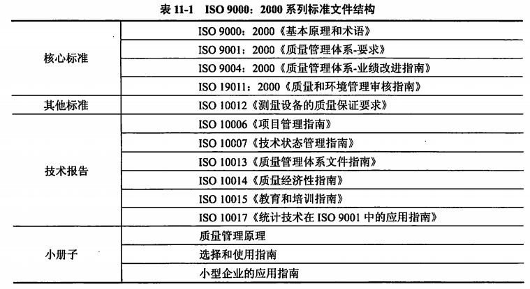

- 基础标准
  > 1. [[（GB/T 13502-1992）信息处理 程序构造及其表示的约定]]
  > 2. [[（GB/T 14085-1993）信息处理系统 计算机系统配置图符号及约定]]
  > 3. 软件工程术语标准 GB/T 11457-89
  > 4. 软件工程标准分类法 GB/T 15538-95
- 开发标准
  > 1. 软件开发规范 GB 8566-88
  > 2. 计算机软件单元测试 GB/T 15532-95
  > 3. 软件维护指南 GB/T 14079-93
- 文档标准
  > 1. 计算机软件产品开发文件编制指南 GB 8567-88
  > 2. 计算机软件需求说明编制指南 GB/T 9385-88
  > 3. 计算机软件测试文件编制指南 GB/T 9386-88
- 管理标准
  > 1. 计算机软件配置管理计划规范 GB/T 12505-90
  > 2. 计算机软件质量保证计划规范 GB/T 12504-90
  > 3. 计算机软件可靠性和可维护性管理 GB/T 14394-93
  > 4. 信息技术、软件产品评价、质量特性及其使用指南 GB/T 16260-96
- ISO 9000：2000系列标准文件结构
  {:height 312, :width 559}
-