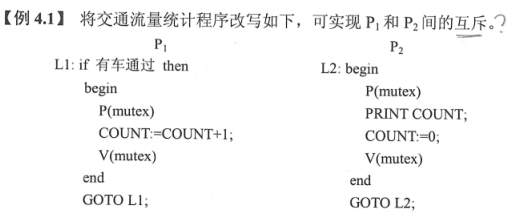
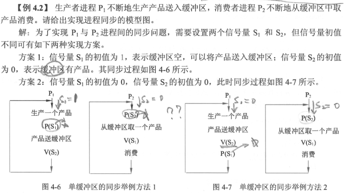
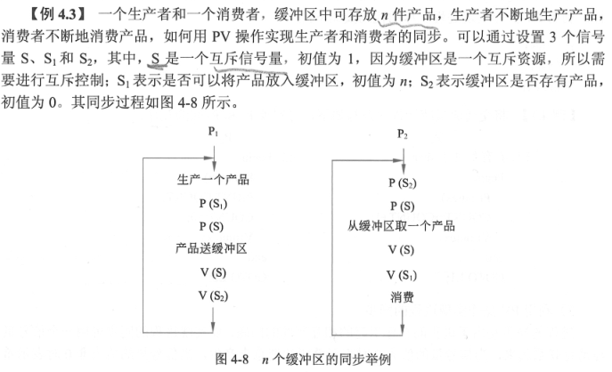

- ## 整型信号量与PV操作
	- 信号量是一个整型变量，根据控制对象的不同被赋予不同的值。信号量分为如下两类：
	  > 1. ==公用信号量==。实现进程间的互斥，初值为1或资源的数目。
	  > 2. ==私用信号量==。实现进程间的同步。初值为0或某个正整数。
	- 信号量S的物理意义：S>=0表示某资源的可用数，若S<0，则其绝对值表示阻塞队列中等待该资源的进程数。
	- 对于系统中的每个进程，其工作的正确与否不仅取决于它自身的正确性，而且与它在执行中能否与其他相关进程正确地实施同步互斥有关。PV操作是实现进程同步与互斥的常用方法。P操作与V操作是==低级通信原语==，在执行期间不可分割。其中，==P操作==表示申请一个资源，==V操作==表示释放一个资源。
	- **P操作**的定义：S:=S-1，若S >=0，则执行P操作的进程继续执行；若S <0，则置该进程为阻塞状态（因为无可用资源），并将其插入阻塞队列。Semaphore表示所定义的变量是信号量。
	  ```
	  Procedure P(Var S:Semaphore)
	      Begin
	          S:=S-1
	          If S<0 then W(S) {执行P操作的进程插入等待队列}
	      END;
	  ```
	- **V操作**定义：S:=S+1，若S>0，则执行V操作的进程继续执行；若S<=0，则从阻塞状态唤醒一个进程，并将其插入就绪队列，然后执行V操作的进程继续。
	  ```
	  Procedure V(Var S:Semaphore)
	      Begin
	          S:=S+1;
	          If S<=0 then R(S) {从阻塞队列中唤醒一个进程}
	      End;
	  ```
- ## 利用PV操作实现进程的互斥
	- 令信号量mutex的初值为1，当进入临界区时执行P操作，退出临界区时执行V操作。这样，利用PV操作实现进程互斥的代码段如下：
	  ```
	  P(mutex)
	      临界区
	  V(mutex)
	  ```
	- {:height 191, :width 446}
- ## 利用PV操作实现进程的同步
	- 进程的同步是由于进程间合作引起的相互制约的问题，要实现进程的同步可用一个==信号量==与==消息==联系起来，当信号量的值为0时表示希望的消息未产生，当信号量的值为非0时表示希望的消息已经存在。假定用信号量S表示某条消息，进程可以通过调用P操作测试消息是否到达，调用V操作通知消息已准备好。最典型的同步问题是单缓冲区的生产者和消费者的同步问题。
	- {:height 331, :width 580}
	- {:height 360, :width 588}