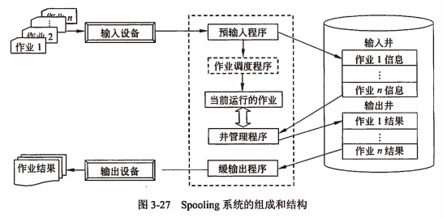

- Spooling（Simultaneous Peripheral Operations On Line，外围设备联机操作），常简称为Spooling系统或假脱机系统。所谓Spooling技术，实际上是用一类物理设备模拟另一类物理设备的技术，是使独占使用的设备变成多台虚拟设备的一种技术，也是一种速度匹配技术。
- Spooling系统是由“预输入程序”、“缓输出程序”和“井管理程序”以及输入和输出井组成的。其中，**输入井**和**输出井**是为了存放从输入设备输入的信息以及作业执行的结果，系统在辅助存储器上开辟的存储区域。Spooling系统的组成和结构：
  