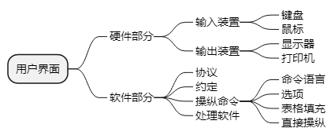

title:: 操作系统知识/作业管理/用户界面
alias:: 用户界面

- **用户界面**（user interface）是计算机中实现用户与计算机通信的软件、硬件部分总称。用户界面也称用户接口，或人机界面。
- 用户界面的**硬件部分**包括用户向计算机输入数据或命令的输入装置，以及由计算机输出供用户观察或处理的输出装置。
  用户界面的**软件部分**包括用户与计算机相互通信的协议、约定、操纵命令及其处理软件。
- 目前常用的输入输出装置有键盘、鼠标、显示器和打印机等。常用的==人机通信方法==有命令语言、选项、表格填充及直接操纵等。
  
- 从计算机用户界面的发展过程来看，用户界面可分为如下阶段：
	- > 1. **控制面板式用户界面**。这是计算机发展早期，用户通过控制台开关、板键或穿孔纸带向计算机送入命令或数据，而计算机通过指示灯及打印机输出运行情况或结果。这种界面的特点是人去适应现在看来十分笨拙的计算机。
	  2. **字符用户界面**。字符用户界面是基于字符型的。用户通过键盘或其他输入设备输入字符，由显示器或打印机输出字符。字符用户界面的优点是功能强、灵活性好、屏幕开销少；缺点是操作步骤繁琐，学会操作也较费时。
	  3. **图形用户界面**。随着文字、图形、声音和图像等多媒体技术的出现，使各种图形用户界面应运而生，用户既可使用传统的字符，也可使用图形、图像和声音同计算机进行交互，操作将更加自然、更加方便。现代界面的关键技术是==超文本==。超文本的“超”体现在它不仅包括文本，还包括图像、音频和视频等多媒体信息，即将文本的概念扩充到超文本，超文本的最大特点是具有==指向性==。
	  4. **新一代用户界面**。**虚拟现实技术** #虚拟现实技术(VR) 将用户界面发展推向一个新阶段：人将作为参与者，以自然的方式与计算机生成的虚拟环境进行通信。==以用户为中心、自然、高效、高带宽、非精确、无地点限制==等是新一代用户界面的特征。==多媒体、多通道及智能化==是新一代用户界面的技术支持。语音、自然语言、手势、头部跟踪、表情和视线跟踪等新的、更加自然的交互技术，将为用户提供更方便的输入技术。计算机将通过多种感知通道来理解用户的意图，实现用户的要求。计算机不仅以二维屏幕向用户输出，而且以==真实感==（立体视觉、听觉、嗅觉和触觉等）的计算机仿真环境向用户提供真实的体验。