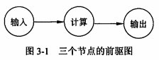
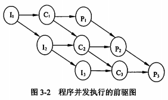
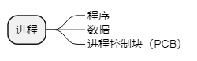
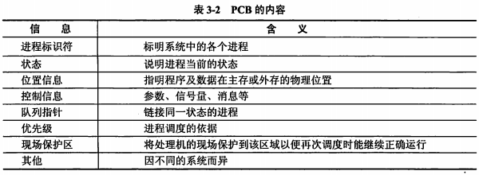
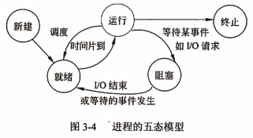
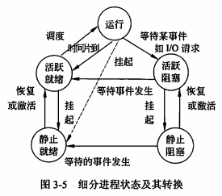

title:: 操作系统知识/处理机管理/处理机基本概念
alias:: 处理机基本概念

- ## 程序与进程
	- ### 程序顺序执行的特征
		- **前趋图**是一个有向无循环图，图由节点和节点间的有向边组成，节点代表各程序段的操作，而节点间的有向边表示两程序段操作之间存在的前趋关系（“→”）。
		- 
	- ### 程序并发执行的特征
		- 对于上述有三个程序段的作业类，虽然每个作业有前趋关系的各程序段或不同作业的程序段可以分别在CPU各输入输出部件上并行执行，但是同一个作业内没有前趋关系的程序段或不同作业的程序段可以分别在CPU和各输入输出部件上执行。
		- 
		- 程序并发执行时的特征如下：
		  > 1. 失去了程序的封闭性
		  > 2. 程序和机器的执行程序的活动不再一一对应
		  > 3. 并发程序间的相互制约性
- ## 进程的组成
	- 进程是程序的一次执行，该程序可以和其他程序并发执行。
	- 进程通常是由程序、数据和进程控制块（PCB）组成的。
	  
	- ### 进程控制块
		- 进程控制块是进程存在的唯一标志。
		- 
	- ### 程序
		- 程序部分描述了进程需要完成的功能。假如一个程序能被多个进程同时共享执行，那么这一部分就应该以可再入（纯）码的形式编制，它是程序执行时不可修改的部分。
	- ### 数据
		- 数据部分包括程序执行时所需的数据及工作区。这部分只能为一个进程所专用，是进程的可修改部分。
- ## 进程的状态及其状态间的切换
	- ### 三态模型
		- **运行**：当一个进程在处理机上运行时。对于单处理机系统，处于运行状态的进程只有一个。
		- **就绪**：一个进程获得了除处理机外的一切所需资源，一旦得到处理机即可运行，则称此进程处于就绪状态。
		- **阻塞**：也称等待或睡眠状态，一个进程正在等待某一事件发生（例如请求I/O而等待I/O完成等）而暂时停止运行，这时即使把处理机分配给进程也无法运行，故称该进程处于阻塞状态。
	- ### 五态模型
		- 
		- 新建态对应于进程刚刚被创建时没有被提交的状态，并等待系统完成创建进程的所有必要信息。因为创建进程时分为两个阶段，第一个阶段为一个新进程创建必要的管理信息，第二个阶段让该进程进入就绪状态。由于有了新建态操作系统，往往可以根据系统的性能和主存容量的限制推迟新建态进程的提交。
		- 进程终止也可分为两个阶段，第一个阶段等待操作系统进行善后处理，第二个阶段释放主存。
	- ### 具有挂起状态的进程状态及其转换
		- 
		- 由于进程的不断创建，系统资源特别是主存资源已不能满足进程运行的要求。这时，就必须将某些进程挂起，放到磁盘对换区，暂时不参加调度，以平衡系统负载。或者是系统出现故障，或者是用户调试程序，也可能需要将进程挂起检查问题。
		  > 1. **活跃就绪**。是指进程在主存并且可被调度的状态。
		  > 2. **静止就绪**。是指就绪进程被对换到辅存时的状态，是不能被直接调度的状态，只有当主存中没有活跃就绪态进程，或者是挂起态进程具有更高的优先级，系统将把挂起就绪态进程调回主存并转换为 活跃就绪。
		  > 3. **活跃阻塞**。是指进程在主存，一旦等待的事件产生便进入活跃就绪状态。
		  > 4. **静止阻塞**。是指阻塞进程对换到辅存时的状态，一旦等待的事件产生便进入静止就绪状态。