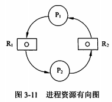
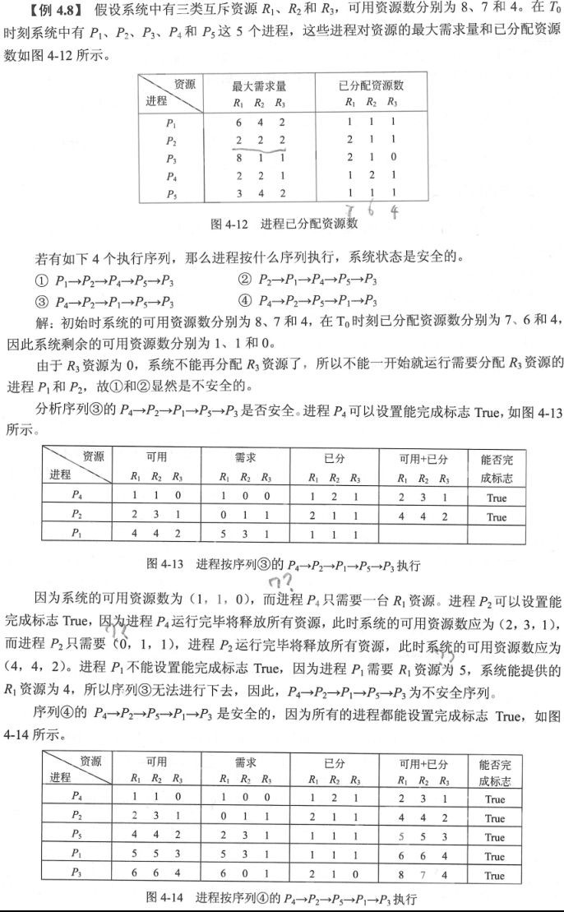

filters:: {"索引" false}
title:: 操作系统知识/处理机管理/死锁
alias:: 死锁

- 在计算机系统中有许多互斥资源（如磁带机、打印机和绘图仪等）或软件资源（如进程表、临界区等），若两个进程同时使用打印机，或同时进入临界区必然会出现问题。所谓**死锁**，是指两个以上的进程互相都要求对方已经占有的资源导致无法继续运行下去的现象。
- ## 死锁举例
	- ### 进程推进顺序不当引起的死锁
	- ### 同类资源分配不当引起死锁
	- ### PV操作使用不当引起死锁
- ## 死锁产生的原因及4个必要条件
	- 产生死锁的原因为**竞争资源**及**进程推进顺序非法**。当系统中有多个进程所共享的资源，不足以同时满足它们的需求时，引起它们==对资源的竞争==导致死锁。==进程推进顺序非法==，进程在运行的过程中，请求和释放资源的顺序不当，导致进程死锁。
	- 产生死锁的4个必要条件是互斥条件、请求保持条件、不可剥夺条件和环路条件。
	  
	- **进程资源有向图**由方框、圆圈和有向边三部分组成。其中方框表示资源，圆圈表示进程。请求资源：○→□，箭头由进程指向资源；分配资源：○←□箭头由资源指向进程。
	  
	- 当发生死锁时，在进程资源有向图中必构成环路，其中每个进程占有了下一个进程申请的一个或多个资源。
- ## 死锁的处理
	- 死锁的处理策略主要有4种：鸵鸟策略（即不理睬策略）、预防策略、避免策略和检测与解除死锁。
	  
	- ### 死锁预防
		- 死锁预防是采用某种策略限制并发进程对资源的请求，破坏死锁产生的4个必要条件之一，使系统在任何时刻都不满足死锁的必要条件。预防死锁的两种策略如下。
		- > 1. **预先静态分配法**。破坏了“不可剥夺条件”。预先分配所需资源，保证不等待资源。该方法的问题是降低了对资源的利用率，降低进程的并发程度；有时可能无法预先知道所需的资源。
		  > 2. **资源有序分配法**。破坏了“环路条件”。把资源分类按顺序排列，保证不形成环路。该方法存在的问题是限制进程对资源的请求；由于资源的排序占用系统开销。
	- ### 死锁避免
		- ==死锁预防==是设法破坏产生死锁的4个必要条件之一，严格防止死锁的产生。==死锁避免==则不那么严格地限制产生死锁的必要条件。最著名的死锁避免算法是Dijkstra提出的银行家算法。死锁避免算法需要很大的系统开销。
		- **银行家算法**对于进程发出的每一个系统可以满足的资源请求命令加以检测，如果发现分配资源后，系统进入不安全状态，则不予分配；若分配资源后系统仍处于安全状态，则实施分配。与死锁预防策略相比提高了资源的利用率，但检测分配资源后系统是否安全增加了系统开销。
		- 所谓**安全状态**，是指系统能按某种顺序如<P1,P2,…,Pn>来为每个进程分配其所需资源，直至最大需求，使每个进程都可顺序完成。通常称<P1,P2,…,Pn>序列为**安全序列**。若系统不存在这样一个安全序列，则称系统处于**不安全状态**。
		- {:height 933, :width 575}
	- ### 死锁检测
		- 解决死锁的另一条途径是使用死锁检测方法，这种方法对资源的分配不加限制，即允许死锁产生。但系统定时地运行一个死锁检测程序，判断系统是否发生死锁，若检测到有死锁，则设法加以解除。
	- ### 死锁解除
		- 死锁解除通常采用如下方法：
		  > 1. ==资源剥夺法==。从一些进程那里强行剥夺足够数量的资源分配给死锁进程。
		  > 2. ==撤销进程法==。根据某种策略逐个地撤销死锁进程，直到解除死锁为止。