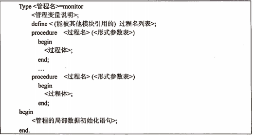

filters:: {"索引" false}
title:: 操作系统知识/处理机管理/管程
alias:: 管程

- ## 管程的引入
	- 为了解决分散编程带来的困难，1974年和1975年汉森(Brinsh Hansen)和霍尔(Hoare)提出了另一种同步机制——管程(monitor)。其基本思路是采用==资源集中管理==的方法，将系统中的资源用某种数据结构抽象地表示出来。由于==临界区==是访问共享资源的代码段，建立一个管程管理进程提出的访问请求。
	- 采用这种方式对共享资源的管理就可以借助数据结构及在其上实施操作的若干过程来进行，对共享资源的申请和释放可以通过过程在数据结构上的操作来实现。
	- 管程是由一些共享数据、一组能为并发进程所执行的作用在共享数据上的操作的集合、初始代码以及存取权组成。管程提供了一种可以允许多进程安全、有效地共享抽象数据类型的机制，管程实现同步机制由“条件结构（condition construct）”所提供。为实现进程互斥同步，必须定义一些条件变量，例如var notempty、notfulll：condition，这些条件变量只能被wait和signal操作所访问。`notfull.wait`操作意味着调用该操作的进程将被挂起，使另一个进程执行；而`notfull.signal`操作仅仅是启动一个被挂起的进程，如无挂起进程则`notfull.signal`操作相当于空操作，不改变notfull状态，这不同于V操作。
- ## TODO 管程的结构
	- 
- ## TODO 利用管程解决生产者-消费者问题
	- 