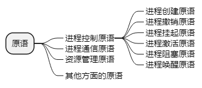

filters:: {"索引" false}
title:: 操作系统知识/处理机管理/进程的控制
alias:: 进程的控制

- 操作系统设置了一套控制机构，该机构的主要功能包括创建一个新进程，撤销一个已经运行完的进程，改变进程的状态，实现进程间的通信。
- 进程控制是由操作系统内核（Kernel） #系统内核 中的原语实现的。内核是计算机系统硬件的^^首次延伸^^，是基于硬件的第一层软件扩充，它为系统对进程进行控制和管理提供了良好的环境。
- **原语**（Primitive）是指由若干条机器指令组成的，用于完成特定功能的程序段。原语的特点是在执行时不能被分割，即原子操作要么都做，要么都不做。内核中所包含的原语主要有**进程控制原语**、**进程通信原语**、**资源管理原语**以及其他方面的原语。属于进程控制方面的原语有**进程创建原语**、**进程撤销原语**、**进程挂起原语**、**进程激活原语**、**进程阻塞原语**以及**进程唤醒原语**等。
  
- 不同的操作系统内核所包含的功能不同，但大多数操作系统的内核都包含**支撑功能**和**资源管理**的功能。