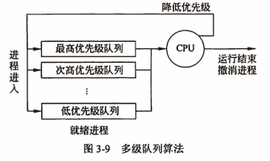

filters:: {"索引" false}
title:: 操作系统知识/处理机管理/进程调度
alias:: 进程调度

- 进程调度方式是指当有更高优先级的进程到来时如何分配CPU。调度方式分为可剥夺和不可剥夺两种。==可剥夺式==是指当有更高优先级的进程到来时，强行将正在运行进程的CPU分配给高优先级的进程；==不可剥夺式==是指当有更高优先级的进程到来时，必须等待正在运行进程自动释放占用的CPU，然后将CPU分配给高优先级的进程。
- ## 三级调度
	- ### 高级调度
		- 又称“长调度”或“作业调度”或“接纳调度”，它决定处于输入池中的哪个**后备作业**可以调入主系统做好运行的准备，成为一个或一组就绪进程。系统中一个作业^^只需经过一次^^高级调度。
	- ### 中级调度
		- 又称“中程调度”或“对换调度”，它决定处于**交换区**中的就绪进程哪个可以调入内存，以便直接参与对CPU的竞争。在内存资源紧张时，为了将进程调入内存，必须将内存中处于阻塞状态的进程调出到交换区，以便为调入进程腾出空间。这相当于使处于内存的进程和处于盘交换区的进程交换了位置。
	- ### 低级调度
		- 又称“短程调度”或“进程调度”，它决定处于**内存中**的就绪进程哪个可以占用CPU。低级调度是操作系统中^^最活跃、最重要^^的调度程序，对系统的影响很大。
- ## 调度算法
	- ### 先来先服务 FCFS
		- FCFS按照作业提交或进程成为就绪状态的先后次序分配CPU，即进程调度总是将就绪队列队首的进程投入运行。FCFS的特点是比较^^有利于长作业^^，而不利于短作业；有利于^^CPU繁忙^^的作业，而不利于I/O繁忙的作业。FCFS算法主要用于**宏观调度**。
	- ### 时间片轮转
		- 时间片轮转算法主要用于微观调度，其设计目标是^^提高资源利用率^^。通过时间片轮转，提高进程并发性和响应时间特性，从而提高资源利用率。时间片的长度可从几个ms到几百ms，选择的方法一般有如下几种。
		  > 1. 固定时间片。分配给每个进程相等的时间片，使所有进程都公平执行，是一种实现简单又有效的方法
		  > 2. 可变时间片。根据进程不同的要求对时间片的大小实时修改，可以更好地提高效率。
	- ### 优先级调度
		- 优先级调度算法是让每一个进程都拥有一个优先数，数值大的表示优先级高，系统在调度时总选择优先数大的占用CPU。
		  > 1. 静态优先级。进程的优先级在创建时确定，直到进程终止都不会改变。根据以下因素确定优先级：进程类型（系统进程优先级较高）、对资源的需求（对CPU和内存需求较少的进程优先级较高）、用户要求（紧迫程度和付费多少）。
		  > 2. 动态优先级。在创建进程时赋予一个优先级，在进程运行过程中还可以改变，以便获得更好的调度性能。例如，在就绪队列中，随着等待时间增长，优先级将提高。这样，对于优先级较低的进程在等待足够的时间后，其优先级提高到可被调度执行。进程每执行一个时间片，就降低其优先级，从而当一个进程持续执行时，其优先级会降低到让出CPU。
	- ### 多级反馈调度
		- 多级反馈队列算法是时间片轮转算法和优先级算法的综合与发展。
		  
		- 其优点有三个方面：
		  > 1. 照顾了短进程以提高系统吞吐量、缩短了平均周转时间；
		  > 2. 照顾I/O型进程以获得较好的I/O设备利用率和缩短响应时间；
		  > 3. 不发估计进程的执行时间，动态调节优先级。
		- 多级反馈队列高度算法实现思路如下：
		  > 1. 设置多个就绪队列。队列1，队列2，……，队列n分别赋予不同的优先级，队列1的优先级>=队列2的优先级>=……>=队列n的优先级。每个队列执行时间片的长度也不同，规定优先级越低则时间片越长，如逐级加倍。
		  > 2. 新进程进入内存后，先投入队列1 的末尾，按FCFS算法调度：若某进程在队列1的一个时间片内未能执行完，则降低投入到队列2的末尾，同样按FCFS算法调度；如此下去，当进程降低到最后的队列，则按“时间片轮转”算法调度直到完成。
		  > 3. 仅当较高优先级的队列为空，才调度较低优先级队列中的进程执行。如果进程执行时有新进程进入较高优先级的队列，则抢先执行新进程，并把被抢先的进程投入原队列的末尾。
- ## 进程优先级确定
	- > 1. 对==I/O型==进程，让其进入最高优先级队列，以及时响应需要I/O交互的进程。通常执行一个小的时间片，在该时间片内要求可处理完一次I/O请求的数据，然后转入到阻塞队列。
	  > 2. 对==计算型==进程，每次执行完时间片后进入更低级队列。最终采用最大时间片来执行，减少调度次数。
	  > 3. 对I/O次数不多，而==主要是CPU处理==的进程。在I/O完成后，放回优先I/O请求时离开的队列，以免每次都回到最高优先级队列后再逐次下降。
	  > 4. 为适应一个进程==在不同时间段的运行特点==，I/O完成时，提高优先级；时间片用完时，降低优先级。