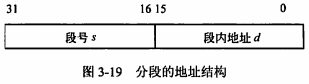
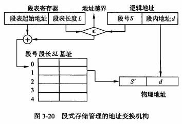

filters:: {"索引" false}
title:: 操作系统知识/存储管理/分段存储管理
alias:: 分段存储管理

- 在分段存储管理方式中，作业的地址空间被划分为若干个段，每个段是一组完整的逻辑信息，如有主程序段、子程序段、数据段及堆栈段等，每个段都有自己的名字，都是从0开始编址的一段连续的地址空间，各段 <u>长度是不等</u> 的。分段系统的地址结构中，逻辑地址由段号（名）和段内地址两部分组成。在该地址结构中，允许一个作业最多有==64KB==个段，每个段的最大长度为==64KB==。
- 
- 在分段式存储管理系统中，为每个段分配一个连续的分区，而进程中的各个段可以离散地分配到主存的不同分区中。在系统中为每个进程建立一张段映射表，简称为“**段表**”。每个段在表中占有一个表项，在其中记录了该段在主存中的起始地址（又称为“ <u>基址</u> ”）和段的长度。进程在执行时，通过查段表来找到每个段所对应的主存区。段表实现了从逻辑段到物理主存区的映射。
- 
- 为了实现从逻辑地址到物理地址的变换功能，系统中设置了段表寄存器，用于存放段表始址和段表长度。在进行地址变换时，系统将逻辑地址中的段号S与段表长度L进行比较。若S>=L，表示段号太大，访问越界，于是产生越界中断信号；若未越界，则根据段表的始址和该段的段号，计算出该段对应段表项的位置，从中读出该段在主存中的起始地址，然后再检查段内地址d是否超过该段的段长SL。若超过，即d>=SL，同样发出越界中断信号；若未越界，则将该段的基址S’与段内地址d相加，得到要访问的主存物理地址。