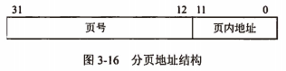
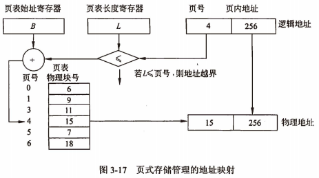
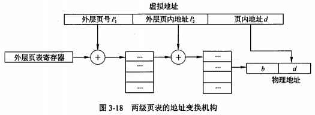

filters:: {"索引" false}

- 尽管分区管理方案是解决多道程序共享主存的可行方案，但是该方案的主要问题是，用户程序必须装入连续的地址空间中，若无满足用户要求的连续空间时，需要进行分区靠拢操作，这是以耗费系统时间为代价的。为此，引入了分页存储管理方案。
- ## 纯分页存储管理
	- ### 分页原理
		- 将一个进程的地址空间划分成若干个 <u>大小相等</u> 的区域，称为**页**。相应地，将主存空间划分成与页相同大小的若干个物理块，称为**块**或页框。在为进程分配主存时，将进程中若干页分别装入多个不相邻的块中。
	- ### 地址结构
		- 分页系统的地址结构由两部分组成：前一部分为页号P；后一部分为偏移量W，即页内地址。图中的地址长度为32位，其中0\~11位为==页内地址==（每页的大小为4KB），12\~31位为==页号==，所以允许地址空间的大小最多为1MB个页。
		- 
	- ### 页表
		- 在将进程的每一页离散地分配到主存的多个物理块中后，系统应能保证在主存中找到每个页面所对应的物理块。为此，系统为每个进程建立了一张 <u>页面映射表</u>，简称**页表**。每个页在页表中占一个表项，记录该页在主存中对应的物理块号。进程在执行时，通过查找页表就可以找到每页所对应的物理块号。页表的作用是实现从页号到物理块号的地址映射。
		- 
		- ==地址变换机构==的基本任务是利用页表把用户程序中的逻辑地址变换成主存中的物理地址，实际上就是将用户程序中的页号变换成主存中的物理块号。为了实现地址变换功能，在系统中设置 <u>页表寄存器</u>，用来存放页表的始址和页表的长度。在进程未执行时，每个进程对应的页表的始址和长度存放在进程的PCB中，当该进程被调度时，就将它们装入页表寄存器。在进行地址变换时，系统将页号与与页表长度进行比较，如果页号大于等于页表寄存器中的页表长度L（页号从0开始），则==访问越界==，产生==越界中断==。若未出现越界，则根据页表寄存器中的页表始址和页号计算出该页在页表项中的位置，得到该页的物理块号，将此物理块号装入物理地址寄存器中。与此同时，将有效地址（逻辑地址）寄存器中页内地址直接装入物理地址寄存器的块内地址字段中，这样便完成了从p逻辑地址到物理地址的变换。
- ## 快表
	- 页式存储管理至少需要两次访问主存。例如，第一次是访问页表，得到的是数据的物理地址；第二次是存取数据。若数据是间接地址，还需要再进行地址变换，再存取数据，显然访问主存的次数大于2。为了提高访问主存的速度，可以在地址映射机构中增加一组高速寄存器，用来保存页表。这种方法需要大量的硬件开销，经济上是不可行的。另一种方法是在地址映射机构中增加一个小容量的==联想存储器==，联想存储器由一组高速存储器组成，称之为**快表**，用来保存当前访问频率高的少数活动页的页号及相关信息。
	- 联想存储器存放的只是当前进程最活跃的少数几页，因此，用户程序要访问数据时，根据该数据所在逻辑页号在联想存储器中找出对应的物理页号，然后与页内地址拼接形成物理地址；若找不到相应的逻辑页号，则地址映射仍通过主存的页表进行，得到物理地址后，须将物理块号填入联想存储器的空闲单元中，若无空闲单元，则根据淘汰算法淘汰某一行，再填入新得到的页号。事实上，查找联想存储器和查找主存页表是 <u>并行</u>  进行的，一旦在联想存储器中找到相符的逻辑页号时，就停止查找主存页表。
- ## 两级页表机制
	- 80386的逻辑地址有\(2^{32}\)个，若页面大小为4kb（\(2^{12}\)B），则页表项达1Mb个，每个页表项占用4B，故每个进程的页表占用4MB主存空间，并且还要求是连续的，显然这是不现实的。为了减少页表所占用的连续的主存空间，在80386中采用了两级页表机制。基本方法是将页表进行分页，每个页面的大小与主存物理块的大小相同，并为它们进行编号，可以离散地将各个页面分别存放在不同的物理块中。为此需要建立一张页表，称为==外层页表==（页表目录），即第一级页表，其中的每个表目是存放某个页表的物理地址。第二级是页表，其中的每个表目所存放的是页的物理块号。
	- 