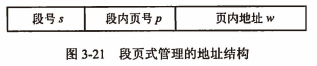
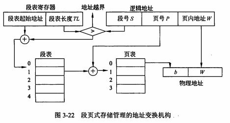

filters:: {"索引" false}
title:: 操作系统知识/存储管理/段页式存储管理
alias:: 段页式存储管理

- ==分页==的过程是由操作系统完成的，对用户是透明的，所以用户不必关心分页的过程，其缺点是不易实现共享；==段==是信息的逻辑单位，其优点是易于实现段的共享，即允许若干个进程共享一个或多个段，而且对段的保护也十分简单。
- 如果对两种存储管理方式“各取所长”，则可以形成一种新的存储管理方式的系统——**段页式系统**。这种新系统既具有分页系统能有效地提高主存利用率的优点，又具有分段系统能很好地满足用户需要的长处，显然是一种比较有效的存储管理方式。
- 段页式系统的基本原理是先将整个主存划分成大小相等的存储块（**页架**），将用户程序按程序的逻辑关系分为若干个段，并为每个段赋予一个段名，再将每个段划分成若干页，以页架为单位离散分配。在段页式系统中，其地址结构由段号、段内页号和页内地址三部分组成。
  
- 在段页式系统中，为了实现从逻辑地址到物理地址的变换，系统中必须同时配置段表和页表。由于将段中的页进行离散地分配，段表中的内容不再是段的主存始址和段长，而是页表始址和页表长度。在段页式系统中，有一个段表寄存器，用于存放段表始址和段表长度TL，其地址变换机构如下：
- 
- 在段页式系统中逻辑地址到物理地址的变换过程如下：
  > 1. 根据段号S查段表，得到页表的起始地址；
  > 2. 根据页号P查页表，得到物理块号b；
  > 3. 将物理块号b拼页内地址W得到物理地址；