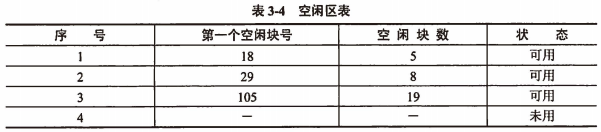

title:: 操作系统知识/文件管理/存取方法和存储空间的管理
alias:: 存取方法和存储空间的管理

- ## 文件的存取方法
	- 文件的存取方法是指读写文件存储器上的一个物理块的方法，通常有顺序存取和随机存取两种方法。**顺序存取**是指对文件中的信息按顺序依次读写的方式；**随机存取**是指对文件中的信息可以按任意的次序随机地读写文件中的信息。
	- ### 顺序存取法
		- 在提供记录式文件结构的系统中，顺序存取法就是严格按物理记录排列的顺序依次读取。如果当前读取的是Ri记录，下一次要读取的记录自动地确定为Ri+1。在只提供无结构的流式文件中，顺序存取法是按读写的位移（offset）从当前位置开始读写，每读完一段信息，读写位移自动加上这段信息的长度，以便读下一段信息。
	- ### 直接存取法
		- 直接存取法允许用户随意存取文件中任意一个物理记录。对于无结构的流式文件，采用直接存取法，必须事先将读写偏移移动到待读写信息的位置上，然后再进行读写。
	- ### 按键存取法
		- 按键存取法是直接存取法的一种，它不是根据记录的编号或地址来存取文件中的记录，而是根据文件中各记录的某个数据项内容来存取记录的，这种数据项称之为“**键**”。
- ## 文件存储空间的管理
	- 外存具有大容量的存储空间，被多用户共享，用户执行程序经常要在磁盘上存储文件和删除文件，因此，文件系统必须对磁盘空间进行管理。外存空闲究竟管理的数据结构通常称为磁盘分配表（disk allocation table）。常用的空闲空间的管理方法有位示图、空闲区表和空闲块链三种。
	- ### 空闲区表
		- 将外存空间上一个连续未根本区域称为“空闲区”。操作系统为磁盘外存上所有空闲区建立一张空闲表，每个表项对应一个空闲区，空闲表中包含序号、空闲区的第一个块号、空闲块的块数和状态等信息。它适用于==连续文件结构==。
		- 
	- ### 位示图
		- 这种方法是在外存上建立一张位示图（bitmap），记录文件存储器的使用情况。每一位对应文件存储器上的一个物理块，取值0和1分别表示空闲和占用。文件存储器上的物理块依次编号为0、1、2、…。假如系统中字长为32位，那么在位示图中的第一个字对应文件存储器上的0、1、2、…、31号物理块；第二个字对应文件存储器上的32、33、34、…、63号物理块，依此类推。
		- 这种方法的主要特点是位示图的大小由磁盘空间的大小（物理块总数）决定，位示图的描述能力强，适合各种物理结构。
	- ### 空闲块链
		- 每个空闲物理块中有指向下一个空闲物理块的指针，所有空闲物理块构成一个链表，链表的头指针放在文件存储器的特定位置上（如管理块中）。不需要磁盘分配表，节省空间。每次申请空闲物理块只需根据链表的头指针取出第一个空闲物理块，根据第一个空闲物理块的指针可找到第二个空闲物理块，依此类推即可。
	- ### 成组链接法
		- 在UNIX系统中，将空闲块分成若干组，每100个空闲块为1<u>组</u>，每组的第一个空闲块登记了下一组空闲块的物理盘块号和空闲块总数。假如一个组的第一个空闲块号等于0的话，意味着该组是最后一级，无下一组空闲块。