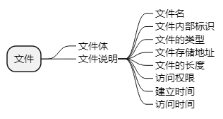
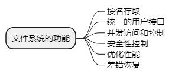

filters:: {"索引" false}
title:: 操作系统知识/文件管理/文件与文件系统
alias:: 文件与文件系统

- ## 文件
	- **文件**（file）是具有符号名的、在逻辑上具有完整意义的一组相关信息项的集合。例如，一个源程序、一个目标程序、编译程序、一批待加工的数据和各种文档等都可以各自组成一个文件。
	- **信息项**是构成文件内容的基本单位，可以是一个字符，也可以是一个记录，记录可以等长，也可以不等长。一个文件包括文件体和文件说明。**文件体**是文件真实的内容；**文件说明**是操作系统为了管理文件所用到的信息，包括文件名、文件内部标识、文件的类型、文件存储地址、文件的长度、访问权限、建立时间和访问时间等。
	  
	- 文件是一种==抽象机制==，它隐蔽了硬件和实现细节，提供了将信息保存在磁盘上而且便于以后读取的手段，使用户不必了解信息存储的方法、位置以及存储设备实际操作方式便可存取信息。因此，在文件管理中的一个非常关键的问题在于文件的命名。**文件名**是在进程创建文件时确定的，以后这个文件将独立于进程存在直到它被删除。当其他进程要使用文件时必须指出该文件名，操作系统根据文件名对其进行控制和管理。不同的操作系统文件命名规则有所不同，即文件名字的格式和长度因系统而异。
- ## 文件系统 #文件系统
	- 由于计算机系统处理的信息量越来越大，所以不可能将所有的信息保存到主存中。特别是在多用户系统中，既要保证各用户文件存放的位置不冲突，又要防止任一用户对外存储器（简称外存）空间占而不用；既要保证各用户文件在未经许可的情况下不被窃取和破坏，又要允许在特定的条件下多个用户共享某些文件。因此，需要设立一个公共的信息管理机制来负责统一管理外存和外存上的文件。
	- 所谓文件管理系统，就是操作系统中实现文件统一管理的一组软件和相关数据的集合，专门负责管理和存取文件信息的软件机构，简称文件系统。文件系统的功能包括：
		- > 1. **按名存取**，即用户可以“按名存取”，而不是“按地址存取”；
		  > 2. **统一的用户接口**，在不同设备上提供同样的接口，方便用户操作和编程；
		  > 3. **并发访问和控制**，在多道程序系统中支持对文件的并发访问和控制；
		  > 4. **安全性控制**，在多用户系统中的不同用户对同一文件可有不同的访问权限；
		  > 5. **优化性能**，采用相关技术提高系统对文件的存储效率、检索和读/写性能；
		  > 6. **差错恢复**，能够验证文件的正确性，并具有一定的差错恢复能力。
		  
- ## 文件的类型
	- 文件分类的目的是对不同文件进程管理，提高系统效率；提高用户界面友好性。当然，根据文件的存取方法和物理结构不同还可以将文件分为不同的类型，这在文件的逻辑结构和文件的物理结构中介绍。
	- > 1. 按文件性质和用途可将文件分为系统文件、库文件和用户文件
	  > 2. 按信息保存期限可将文件分为临时文件、档案文件和永久文件
	  > 3. 按文件的保护方式分类可将文件分为只读文件、读/写文件、可执行文件和不保护文件
	  > 4. UNIX系统将文件分为普通文件、目录文件和设备文件（特殊文件）
	- 目前常用的文件系统类型有：FAT、Vfat、NTFS、Ext2和HPFS等