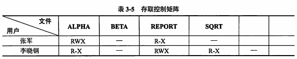
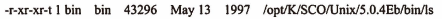

title:: 操作系统知识/文件管理/文件的共享和保护
alias:: 文件的共享和保护

- ## 文件的共享
	- 文件共享是指不同用户进程使用同一文件，它不仅是不同用户完成同一任务所必须的功能，而且还可以节省大量的主存空间，减少由于文件复制而增加的访问外存的次数。文件共享有多种形式，采用==文件名和文件说明分离==的目录结构有利于实现文件共享。
	- ### 硬链接
		- 文件的硬链接是指两个**文件目录表目**指向同一个**索引节点**的链接，该链接也称基于索引节点的链接。换句话说，硬链接是指不同文件名与同一个文件实体的链接。文件硬链接不利于文件主删除它拥有的文件，因为文件主要删除它拥有的共享文件，必须首先删除（关闭）所有的硬链接，否则就会造成共享该文件的用户的目录表指针悬空。
		- `ls`命令放在/bin子目录下，可在/usr/bin子目录下设置一个DOS兼容的命令`dir`，执行该命令相当于执行`ls`命令。使用命令`ln`可给一个已存在文件增加一个新文件名，即文件链接数增加 1，此种链接是不能跨越文件系统的。为了共享文件，只是在两个不同目录下取了不同的文件名ls和dir，但它们具有相同的索引节点。UNIX这种文件的结构称为==树型带勾链的目录结构==。在文件的索引节中，di_nlink变量表示链接到该索引节点上的链接数；在用命令`ls -l`长列表显示时，文件的第2项数据项表示链接数。
	- ### 符号链接
		- 符号链接在建立的新文件或目录并与原来文件的路径名进行映射，当访问一个符号链接时，系统通过该映射找到源文件的路径，并对其进行访问。
		- 例如，在UNIX系统中的`ls -s`命令建立的符号链接。此时，系统为共享的用户创建一个link类型的新文件，将这新文件登录在该用户共享目录项中，这个link型文件包含链接文件的==路径名==。该类文件在用`ls`命令长列表显示时，文件链接数为1.
		- 采用符号链接可以跨越文件系统，甚至可以通过计算机网络连接到世界上任何地方的机器中的文件，此时只需提供该文件所在的地址，以及在该机器中的文件路径。
		- 符号链接的缺点是其他用户读取符号链接的共享文件比读取硬链接的共享文件需要==增加读盘操作的次数==。因为其他用户去读符号链接的共享文件时，系统中根据给定的文件路径名，逐个分量地去查找目录，通过多次读盘操作才能找到该文件的索引节点，而用硬链接的共享文件的目录文件表目中已包括了共享文件的索引节点号。
- ## 文件的保护
	- 文件系统对文件的保护常采用存取控制方式进行。所谓**存取控制**，就是不同的用户对文件的访问规定不同的权限，以防止文件被未经文件主同意的用户访问。
	- ### 存取控制矩阵
		- 理论上，存取控制方法可用存取控制矩阵，它是一个二维矩阵，一维列出计算机的全部用户，另一维列出系统中的全部文件，矩阵中每个元素Aij是表示第i个用户对第j个文件的存取权限。通常存取权限有可读、可写、可执行以及它们的组合。
		- 
		- 存取控制矩阵在概念上是简单清楚的，但实现上却有困难。当一个系统用户数和文件数很大时，二维矩阵要占很大的存储空间，验证过程也将耗费许多系统时间。
	- ### 存取控制表
		- 存取控制矩阵由于太大而往往无法实现。一个改进的办法是按用户对文件的访问权力的差别对用户进行分类，由于某一文件往往只与少数几个用户有关，所以这种分类方法可使存取控制表大为简化。UNIX系统就是使用这种存取控制表方法。它把用户分成三类：文件主、同组用户和其他用户，每类用户的存取权限为可读、可写、可执行以及它们的组合。在用ls长列表显示时，每组存取权限用三个字母RWX表示，如读、写和执行中哪一样存取不允许，则用“-”字符表示。
		- 
		- 显示前2~10共9个字符表示文件的存取权限，每3个字符为一组，分别表示文件主、同组用户和其他用户的存取权限。由于存取控制表对每个文件按用户分类，所以该存取控制表可存放在每个文件的文件控制块中，对UNIX只需9位二进制来表示三类用户对文件的存取权限，该权限存在文件索引结点的di_mode中。
	- ### 用户权限表
		- 改进存取控制矩阵的另一种方法是以用户或用户组为单位将用户可存取的文件集中起来存入表中，这称为用户权限表。表中每个表目表示该用户对应文件的存取权限。这相当于存取控制矩阵一行的简化。
	- ### 密码
		- 在创建文件时，由用户提供一个密码，在文件存入磁盘时用该密码对文件内容加密。进行读取操作时，要对文件进行解密，只有知道密码的用户才能读取文件。