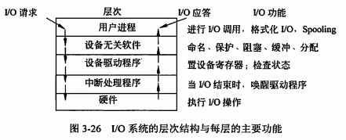

filters:: {"索引" false}
title:: 操作系统知识/设备管理/IO软件
alias:: IO软件

- 设备管理软件的设计水平决定了设备管理的效率。从事I/O设备管理软件的结构，其基本思想是==分层构造==，也就是说把设备管理软件组织成为一系列的层次。其中低层与硬件相关，它把硬件与较高层次的软件隔离开来。而最高层的软件则向应用提供一个友好的、清晰而统一的接口。
- 设计I/O软件的主要目标是==设备独立性==和==统一命名==。I/O软件独立于设备，就可以提高设备管理软件的设计效率。当输入输出设备更新时，没有必要重新编写全部设备驱动程序。在实际应用中也可以看到，在常用操作系统中，只要安装了相对应的设备驱动程序，就可以很方便地安装好新的输入输出设备，甚至不必重新编译就能将设备管理程序移到他处执行。
- I/O设备管理软件一般分为4层：中断处理程序、设备驱动程序、与设备无关的系统软件和用户级软件。至于一些具体分层时细节上的处理，是依赖于系统的，没有严格的划分，只要有利于设备独立这一目标，可以为了提高效率而设计不同的层次结构。
  
- 图中的箭头给出了I/O部分的控制流。举一个读硬盘文件的例子。当用户程序试图读一个硬盘文件时，需要通过操作系统实现这一操作。
  > 1. 与设备无关软件检查高速缓存中有无要读的数据块。若没有，则调用设备驱动程序，向I/O硬件发出一个请求。
  > 2. 然后，用户进程阻塞并等待磁盘操作的完成。
  > 3. 当磁盘操作完成时，硬件产生一个中断，转入中断处理程序。
  > 4. 中断处理程序检查中断的原因，认识到这里磁盘读取操作已经完成，于是唤醒用户进程取回从磁盘读取的信息，从而结束此次I/O请求。用户在得到了所需的硬盘文件内容之后，继续运行。