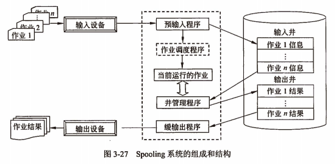

title:: 操作系统知识/设备管理/设备管理采用的相关缓冲技术
alias:: 设备管理采用的相关缓冲技术

- ## 通道技术
	- 引入通道的目的是使数据的传输独立于CPU，使CPU从繁琐的I/O工作中解脱出来。设置通道后，CPU只需向通道发出I/O命令，通道收到命令后，从主存中取出本次I/O要执行的通道程序并执行，仅当通道完成了I/O任务后，才向CPU发出中断信号。
	- 根据==信息交换方式==的不同，将通道分为字节多路通道、数组选择通道和数组多路通道三类。由于通道价格昂贵，导致计算机系统中的通道数是有限的，这会成为输入输出的“瓶颈”问题。一个单通路的I/O系统中主存和设备之间只有一条通路。一旦某通道被设备占用，即使另一通道空闲，连接该通道的其他设备也只有等待。解决“瓶颈”问题最有效方法是增加设备到主机之间的通路，使得主存和设备之间有两条以上的通路。
- ## DMA技术 #直接内存访问(DMA)
	- 直接内存存取Direct Memory Access, DMA：内存与I/O设备间传送一个数据块的过程中，不需要CPU的任何干涉，只需要CPU在过程开始启动（即向设备发出“传送一块数据”的命令）与过程结束（CPU通过轮询或中断得知过程是否结束和下次操作是否准备就绪）时的处理，实际操作由DMA硬件直接执行完成，CPU在此传送过程中可做别的事情）。例如，在非DMA时，打印2048字节至少需要执行2048次输出指令，加上2048次中断处理的代价。而在DMA情况下，若一次DMA可传送512个字节，则只需执行4次输出指令和处理4次打印机中断。若一次DMA可传送字节数大于等于2048个字节，则只需要执行一次输出指令和处理一次打印机中断。
	  title:: 直接内存访问(DMA)
	- 
	- > 1. 外设向DMA控制器（DMAC）提出DMA传送的请求
	  2. DMA控制器向CPU看出请示，其请求信号通常加到CPU的保持请求输入端HOLD上
	  3. CPU在完成当前的总线周期后立即对此请求作出响应，CPU的响应包括两个方面的内容：一方面，CPU将有效的保持响应信号HLDA输出加到DMAC上，告诉DMAC它的请求已得到响应；同时，另一方面CPU将其输出的总线信号置为高阻，这就意味着CPU放弃了对总线的控制权
	  4. 此时DMAC获得了对系统总线的控制权，开始实施对系统总线的控制。同时向提出请求的外设送出DMAC的响应信号，告诉外设其请求已得到响应，现在准备开始进行数据的传送。
	  5. DMAC送出地址信号和控制信号，实现数据的高速传送。
	  6. 当DMAC将规定的字节数传送完时，它就将HOLD信号变为无效并加到CPU上。撤销对CPU的请求。CPU检测到无效的HOLD就知道DMAC已传送结束，CPU就送出无效的HLDA响应信号，同时重新获得系统总线的控制权，接着DMA前的总线周期继续执行下面的总线周期。
	- 在DMA传送过程中无须CPU的干预，整个系统总线完全交给了DMAC，由它控制系统总线完成数据传送。在DMA传送数据时要占用系统总线，根据占用总线的方法不同，DMA可以分为**中央器停止法**、**总线周期分时法**和**总线周期挪用法**等。无论采用哪种方法，在DMA传送数据期间，CPU不能使用总线。
- ## 缓冲技术
	- 缓冲技术可提高外设利用率，尽可能使外设处于忙状态。缓冲技术可以采用硬件缓冲和软件缓冲。**硬件缓冲**是利用专门的硬件寄存器作为缓冲，**软件缓冲**是通过操作系统来管理的。引入缓冲的主要原因：
	  > 1. 缓和CPU与I/O设备间速度不匹配的矛盾。
	  > 2. 减少对CPU的中断频率，放宽对中断响应时间的限制。
	  > 3. 提高CPU和I/O设备之间的并行性。
	- 在所有的I/O设备与处理机（主存）之间都使用了缓冲区来交换数据，所以操作系统必须组织和管理好这些缓冲区。缓冲可分为单缓冲、双缓冲、多缓冲和环形缓冲。
- ## TODO Spooling技术 #Spooling技术
	- Spooling（Simultaneous Peripheral Operations On Line，外围设备联机操作），常简称为Spooling系统或假脱机系统。所谓Spooling技术，实际上是用一类物理设备模拟另一类物理设备的技术，是使独占使用的设备变成多台虚拟设备的一种技术，也是一种速度匹配技术。
	- Spooling系统是由“预输入程序”、“缓输出程序”和“井管理程序”以及输入和输出井组成的。其中，**输入井**和**输出井**是为了存放从输入设备输入的信息以及作业执行的结果，系统在辅助存储器上开辟的存储区域。Spooling系统的组成和结构：
	  