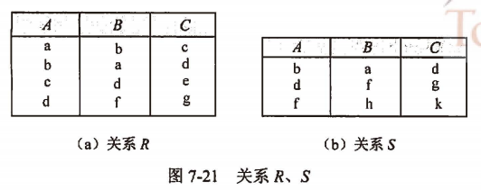
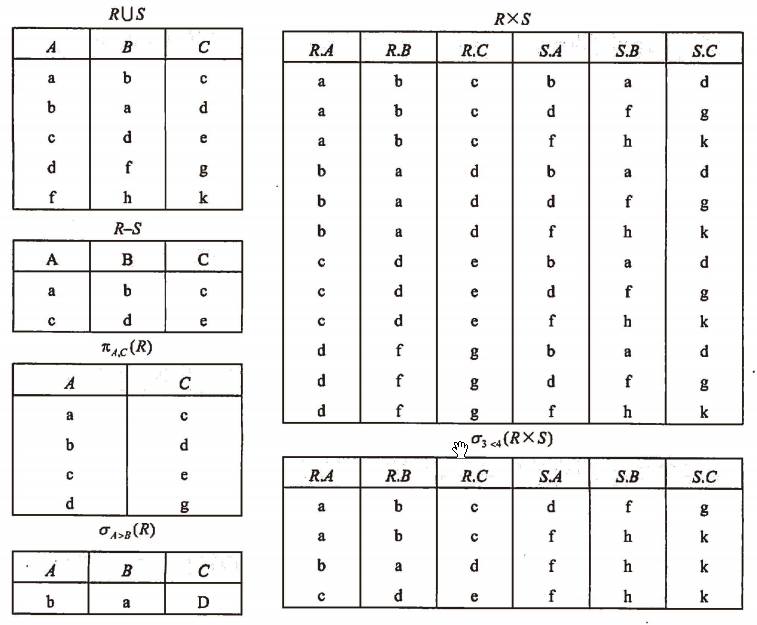

alias:: 5种基本的关系代数运算

- ## 并
	- $$
	  R \cup S = \{t | t \in R \lor t \in S \}
	  $$
- ## 差
	- $$
	  R - S = \{ t| t \in R \land t \in S \}
	  $$
- ## 广义笛卡儿积
	- Extended Cartesian Product
	  $$
	  R \times S = \{t | t = \langle t^n, t^m \rangle \land t^n \in R \land t^m \in S\}
	  $$
	  `<tn, tm>` 意为元组`tn`和`tm`拼接成一个元组。
- ## 投影
	- 投影运算是从关系的垂直方向进行运算，在关系R中选择出若干属性列A组成新的关系
	  $$
	  \pi_A(R) = \{t[A]|t \in R \}
	  $$
- ## 选择
	- 选择运算是从关系的水平方向进行运算，是从关系R中选择满足给定条件的诸元组
	  $$
	  \sigma_F(R) = \{ t | t \in R \land F(t) = True \}
	  $$
	  \( \sigma_{1 \ge 6}(R) \) 表示选取R关系中第1 个属性值大于等于第6个属性值的元组；
	  \( \sigma_{1 \gt ‘6’ }(R) \)表示选取R关系中第1个属性值大于6的元组。
	- {:height 174, :width 424}
	- {:height 502, :width 602}