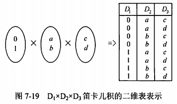
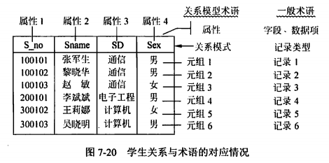
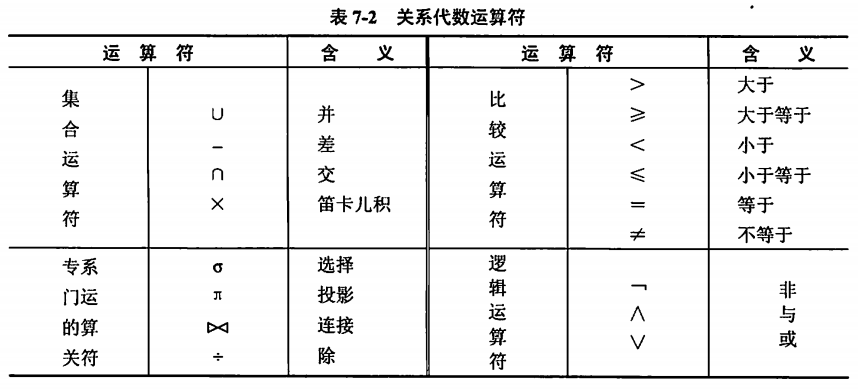

filters:: {"索引" false}
title:: 数据库技术基础/关系代数/关系数据库的基本概念
alias:: 关系数据库的基本概念

- ## 属性和域
	- 在现实世界中，要描述一个事物常常取若干特征来表示，这些特征称为**属性**（Attribute）。例如，用学号、姓名、性别、系别、年龄和籍贯等属性来描述学生。
	  每个属性的取值范围对应一个值的集合，称为该属性的**域**（Domain）。例如，学号的域是6位整型数；姓名的域是10位字符；性别的域为{男，女}等。
	- 在关系数据模型中，通常对域加了一个限制，所有的域都应是**原子数据**（Atomic Data）。例如，整数、字符串是原子数据，而集合、记录、数组是非原子数据。
	  关系数据模型的这种限制称为第一范式（First Normal Form，1NF）条件。但也有些关系数据模型突破了1NF的限制，称为非1NF的关系数据模型。
- ## 笛卡儿积与关系
	- 【定义9.1】设 D1, D2, ..., Di, ...,Dn为任意集合，定义D1, D2, ..., Di, ..., Dn的**笛卡儿积**为
	  $$
	  D_1 \times D_2 \times \cdots \times D_i \times D_n = \{(d_1, d_2, \cdots, d_i, \cdots, d_n) | d_i \in D_i, i = 1,2,3,\cdots,n \}
	  $$
	  其中，每一个元素 (d1, d2,...,di,...,dn)称为一个n元组（n-tuple属性的个数），元组的每一个值di称为元组的一个分量，若Di(i=1,2,3,...,n)为有限集，其基数（Cardinal number元组的个数）为mi(i=1,2,3,...,n)，则 D1 x D2 x ... x Di x ... x Dn 的基数M为 \( M = \displaystyle\prod_{i=1}^{n} m_i \)，笛卡尔积可以用二维表来表示。
	- 【例9.3】若D1={0,1}，D2={a,b}，D3={c,d}，求D1 x D2 x D3。
		- 解：根据定义，笛卡儿积中的每一个元素应该是一个三元组，每个分量来自不同的域，因此结果为
		  $$
		  D_1 \times D_2 \times D_3 = \{ (0,a,c), (0,a,d), (0,b,c), (0,b,d), (1,a,c), (1,a,d), (1,b,c), (1,b,d) \}
		  $$
		  用二维表表示如下图。
		- {:height 184, :width 300}
	- 【定义9.2】D1 x D2 x ... x Di x ... x Dn的子集称为在域D1,D2,...,Di,...,Dn上的关系，记为R(D1,D2,...,Di,...,Dn)，称关系R为**n元关系**。
		- 从定义9.2可以得出一个关系也可以用二维表来表示。关系中属性的个数称为“**元数**”，元组的个数称为“**基数**”。关系模型中的术语与一般术语的对应情况可以通过图9-14中的学生关系说明。图中的学生关系模式可表示为学生（S_no,Sname,SD,Sex）。该学生关系的主码为S_no，属性分别为S_no、Sname、SD和Sex，对属性Sex的域为男、女，等等。该学生关系的元数为4，基数为6。
		- {:height 216, :width 421}
- ## 关系的相关名词
	- 目或度（Degree）。这里的R表示关系的名字，n是关系的**目**或**度**。
	- 候选码（Candidate Key）。若关系中的某一属性或属性组的值能值能唯一地标识一个元组，则称该属性或属性组为**候选码**。
	- 主码（Primary Key）。若一个关系有多个候选码，则选定其中一个为**主码**。
	- 主属性（Non-Key Attribute）。包含在任何候选码中的诸属性称为**主属性**。不包含在任何候选码中的属性称为**非码属性**。
	- 外码（Foreign Key）。如果关系模式R中的属性或属性组非该关系的码，但它是其他关系的码，那么该属性集对关系模式R而言是**外码**。
	  例如客户与贷款之间的借贷联系c-l（ <u>c-id</u>， <u>loan-no</u>），属性c-id是客户关系的码，但它是其他关系的码，所以c-id是外码；属性loan-no是贷款关系中的码，所以loan-no也是外码。
	- 全码（All-key）。关系模型的所有属性组是这个关系模式的候选码，称为**全码**。
	  例如关系模式R（T，C，S），属性T表示教师，属性C表示课程，属性S表示学生。假设一个教师可以讲授多门课程，某门课程可以由多个教师讲授，学生可以听不同教师讲授的不同课程，那么，要想区分关系中的每一个元组，这个关系模式R的码应为全属性T、C和S，即All-Key。
- ## 关系的三种类型
	- **基本关系**。通常又称为基本表或基表，它是实际存在的表，它是实际存储数据的逻辑表示。
	- **查询表**。查询表是查询结果对应的表。
	- **视图表**。视图表是由基本表或其他视图表导出的表。由于它本身不独立存储在数据库中，数据库中只存放它的定义，常称为虚表。
- ## 关系数据库模式
	- 在数据库中要区分型和值。关系数据库中的==型==也称为关系数据库模式，是关系数据库结构的描述。它包括若干域的定义以及在这些域上定义的若干关系模式。实际上，关系的概念对应于程序设计语言中变量的概念，而关系模式对应于程序设计语言中类型定义的概念。
	  关系数据库的==值==是这些关系模式在某一时刻对应的关系的集合，通常称之为关系数据库。
	- 【定义9.3】关系的描述称为关系模式（Relation Schema）可以形式化地表示为 $$R(U, D, \mathrm{dom}, F)$$
	  id:: 6274c89c-6dd6-4f14-8212-aca015fe2af7
	  其中，`R`表示关系名；`U`是组成该关系的属性名集合；`D`是属性的域；`dom`是属性向域的映像集合；`F`为属性间数据的依赖关系集合。
	  通常将关系模式简记为：$$R(U) 或 R(A_1,A_2,A_3,\cdots,A_n)$$
	  其中，R为关系名，A1，A2，A3，...，An为属性名或域名，属性向域的映像常常直接说明属性的类型，长度。通常在关系模式主属性上加下划线表示该属性为主码属性。
	- 例如，学生关系S有学号`Sno`、学生姓名`Same`、系名`SD`、年龄`SA`属性；课程关系C有课程号`Cno`、课程名`Cname`、选修课程号`Pcno`属性；学生选课关系SC有学号`Sno`、课程号`Cno`、成绩`Grade`属性。定义关系模式及主码如下（本题未考虑F属性间数据的依赖，该问题将在后面讨论）。
		- > 学生关系模式 $$S(\underline{\mathrm{Sno}}, \mathrm{Sname}, \mathrm{SD}, \mathrm{SA})$$
		  > 课程关系模式 $$C(\underline{\mathrm{Cno}}, \mathrm{Cname}, \mathrm{Pcno}) \mathrm{Dom} (\mathrm{Pcno}) = \mathrm{Cno}$$。这里，`Pcno`是先行课程号，来自`Cno`域，但由于`Pcno`属性名不等于`Cno`值域名，所以要用`Dom`来定义。但是，不能将`Pcno`直接改为`Cno`，因为在关系模型中，各列属性必须取相异的名字。
		  > 学生选课关系模式 $$SC(\underline{\mathrm{Sno}}, \underline{\mathrm{Cno}}, \mathrm{Grade})$$。SC关系中的`Sno`、`Cno`又分别为外码。因为它们分别是S、C关系中的主码。
- ## 完整性约束
	- 完整性规则提供了一种手段来保证当授权用户对数据库做修改时不会破坏数据的一致性。因此，完整性规则防止的是对数据的意外破坏。关系模型的完整性规则是对关系的某种约束条件。关系的完整性共分为三类：实体完整性、参照完整性（也称引用完整性）和用户定义完整性。
	- ### 实体完整性（Entity Integrity）
		- 规定基本关系R的主属性A不能取空值。
	- ### 参照完整性（Referential Integrity）
		- 现实世界中的实体之间往往存在某种联系，在关系模型中实体及实体间的联系是用关系来描述的，这样自然就存在着关系与关系间的引用。
		- 例如，员工和部门的关系模式的表示如下，其中在关系模式主属性上加下划线表示该属性为主码属性。
			- > 员工（ <u>员工号</u>，姓名，性别，参加工作时间，部门号）
			  > 部门（ <u>部门号</u>，名称，电话，负责人）
			- 这两个关系存在着属性的引用，即员工关系中的“部门号”值必须是确实存在的部门的部门号，即部门关系中有该部门的记录。也就是说，员工关系中的“部门号“属性取值要参照部门关系的”部门号“属性取值。
		- 参照完整性规定，若F是基本关系R的外码，它与基本关系S的主码Ks相对应（基本关系R和S不一定是不同的关系），则对于R中每个元组在F上的值或者取空值（F的每个属性值均为空值），或者等于S中某个元组的主码值。
	- ### 用户定义完整性（User defined Integrity）
		- 用户定义完整性就是针对某一具体的关系数据库的约束条件，反映某一具体应用所涉及的数据必须满足的语义要求，由应用的环境决定。例如，银行的用户账户规定必须大于等于100000，小于999999。
- ## 关系运算
	- 关系操作的特点是操作对象和操作结果都是集合，而非关系数据模型的数据操作方式则为一次一个记录的方式。关系数据语言分为三类：关系代数语言、关系演算语言和具有关系代数和关系演算双重特点的语言（例如SQL）。关系演算语言包含元组关系演算语言（例如Alpha、Quel）和域关系演算语言（例如QBE）。
	- 关系代数语言、元组关系演算和域关系演算是抽象查询语言，它与具体的DBMS中实现的实际语言并不一样，但是可以用它评估实际系统中的查询语言能力的标准。
	- 关系代数运算符有4类：集合运算符、专门的关系运算符、算术比较符和逻辑运算符。
	  根据运算符的不同，关系代数运算可分为传统的集合运算和专门的关系运算。==传统的集合运算==是从关系的水平方向进行的，包括并、交、差及广义笛卡儿积。==专门的关系运算==既可以从关系的水平方向进行运算，又可以向关系的垂直方向运算，包括选择、投影、连接以及除法，如下表所示。
	  并、差、笛卡儿积、投影和选择是5种基本的运算，因为其他运算可以通过基本的运算导出。
	- {:height 277, :width 610}