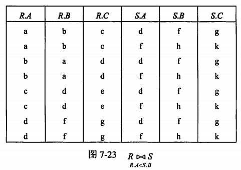
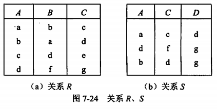
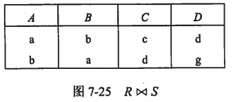
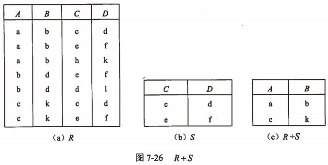
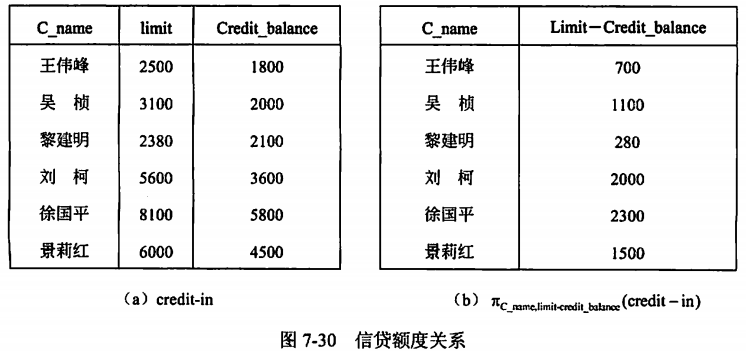

filters:: {"索引" false}
alias:: 扩展的关系代数运算

- 扩展的关系代数运算可以从基本的关系运算中导出，主要包括选择、投影、连接、除法、广义笛卡尔积和外连接。
- ## 1. 交(Intersection)
	- 关系R与S具有相同的关系模式，关系R与S的交是由属于R同时又属于S的元组构成的集合，记作R \cap S，其形式定义如下：
	  $$
	  R \cap S = \{ t | t \in R \land t \in S \}
	  $$
	- 显然，R \cap S = R- (R - S)，或者 R \cap S = S - (S - R)
- ## 2. 连接(Join)
	- 连接分为\theta连接、等值连接和自然连接3种。连接运算是从两个关系R和S的笛卡儿积中选取满足条件的元组。因此，可以认为笛卡儿积是无条件连接，其他的连接操作认为是有条件连接，下面分别介绍。
	- ### \( \theta \) 连接
	  collapsed:: true
		- 从R与S的笛卡儿积中选取属性间满足一定条件的元组。记作
		  $$
		  R \underset{X \theta Y}{\Join} S = \{t | t=\langle t^n, t^m\rangle \land t^n \in R \land t^m \in S \land t^n[X] \theta t^m[Y] \}
		  $$
		  其中，\( X \theta Y \) 为连接的条件，
		  \( \theta \) 是比较运算符，
		  X 和 Y 分别为 R 和 S 上度数相等，且可比的属性组。
		  \( t^n[X] \) 表示 R 中 \( t^n \) 元组的对应于属性 X 的一个分量。
		  \( t^m[Y] \) 表示 S 中 \( t^m \) 元组的对应于属性 Y 的一个分量。
		- \theta连接也可以表示为：
		  $$
		  R \underset{i \theta j}{\Join} S = \{ t| t = \langle t^n, t^m \rangle \land t^n \in R \land t^m \in S \land t^n[i] \theta t^m[j] \}
		  $$
		  其中，i=1,2,3,...,n，j=1,2,3,...,m，i \theta j 的含义为从两个关系 R 和 S 中选取 R 的第 i 列和 S 的第 j 列之间满足 \theta 运算的元组进行连接。
		- \theta 连接可以由基本的关系运算笛卡尔积和选取运算导出。因此，\theta 连接可表示为
		  $$
		  R \underset{X \theta Y}{\Join} S = \sigma_{X \theta Y}(R \times S) \\
		  或 \\
		  R \underset{i \theta j}{\Join} S = \sigma_{i \theta (i + j)}(R \times S)
		  $$
		- 【例9.5】设有关系R、S如图9-16所示，求 \( R \underset{R.A < S.B}{\Join} S \)。
			- {:height 288, :width 399}
	- ### 等值连接
	  collapsed:: true
		- 当 \theta 为“=”时，称之为等值连接，记为 \( R \underset{X=Y}{\Join} S \)，其形式定义如下：
		  $$
		  R \underset{X = Y}{\Join} S = \{ t| t = \langle t^n,t^m \rangle  \land t^n \in R \land t^m \in S \land t^n[X] = t^m[Y] \}
		  $$
	- ### 自然连接
	  collapsed:: true
		- 自然连接是一种特殊的等值连接，它要求 <u>两个关系中进行比较的分量必须是相同的属性组</u>，并且在结果集中将重复属性列去掉。
			- 若 \( t^n \) 表示 R 关系的元组变量，\( t^m \) 表示 S 关系的元组变量；
			  R 和 S 具有相同的属性组 B，且`B=(B1,B2,…,Bk)`；
			  并假定 R 关系的属性为`A1,A2,…,An-k,B1,B2,…,Bk`，S 关系的属性为`B1,B2,…,Bk,Bk+1,BK+2,…,Bm`；
			  为 S 的元组变量 \( t^m \) 去掉重复属性 B 所组成的新的元组变量为 \( t^{m^*} \) 。
			- 自然连接可以记为 \( R \Join S \)，其形式定义如下：
			  $$
			  R \Join S = \{ t | t = \langle t^n,t^m \rangle \land t^n \in R \land t^m \in S \land R.B_1 = S.B_1 \land R.B_2 = S.B_2 \land ... \land R.B_k = S.B_k \}
			  $$
		- 自然连接可以由基本的关系运算**笛卡尔积**和**选取运算**导出：
		  $$
		  R \Join S = \Pi_{A_1,A_2,...,A_{n-k},R.B_1,R.B_2,...,R.B_K,B_K,B_{K+1},B_{K+2},...,B_m}(\sigma_{R.B_1=S.B_1\land R.B_2=S.B_2\land...\land R.B_k=S.B_k}(R \times S))
		  $$
		- 特别需要说明的是，一般连接是从关系的水平方向运算，而自然连接不仅要从关系的水平方向，而且要从关系的垂直方向运算。因为自然连接要去掉重复属性，如果没有重复属性，那么自然连接就转化为笛卡尔积。
		- 【例9.6】设有关系R，S如图9-17所示，求 R \Join S。
			- {:height 175, :width 350}
			- {:height 118, :width 255}
- ## 除(Division)
	- 除运算是同时从关系的水平方向和垂直方向进行运算。给定关系R(X,Y)和S(Y,Z)，X、Y、Z为属性组。\( R \div S \)  应当满足 <u>元组在X上的分量值x的象集Yx</u> 包含 <u>关系S在属性组Y上投影的集合</u>。其形式定义如下：
	  $$
	  R \div S = \{ t^n [X]| t^n \in R \land \pi_y(S) \subseteq Y_x \}
	  $$
	  其中，Yx为x在R中象集，\( x=t^n [X] \)，且 \( R \div S \)的结果集的属性组为X。
	- 【例9.7】设有关系R、S如图9-19所示，求R \div S。
	  collapsed:: true
		- {:height 265, :width 510}
	- 【例9.8】设学生课程数据库中有学生S、课程C和学生选课SC这3个关系，如图9-20所示，请用关系代数表达式表达以下检索问题。
- ## 广义投影(Generalized Projection)
	- 广义投影运算允许在投影列表中使用算术运算，实现了对投影运算的扩充。
	- 若有关系R，条件F1,F2,…,Fn中的每一个都是涉及R中常量和属性的算术表达式，那么广义投影运算的形式定义如下： \( \pi_{F_1,F_2,...,F_n}(R) \)
	- 【例9.9】信贷额度关系模式credit-in（C_name，limit，credit_balance），属性分别表示用户姓名、信贷额度和到目前为止的花费。图9-23（a）表示了关系credit-in的一个具体。若要查询给出每个用户还能花费多少，可以用关系代数表达式 \( \pi_{\mathrm{C\_name,limit-credit_balance}}(\mathrm{credit-in}) \) 来表示，查询结果如图9-23（b）所示。
	  collapsed:: true
		- {:height 289, :width 596}
- ## 外连接(Outer Join)
	- 外连接运算是连接运算的扩展，可以处理由于连接运算而缺失的信息。对于图9-20所示的S和SC关系，当对其进行自然连接S \Join SC时，其结果如图9-24所示。
	- ### 左外连接 Left Outer Join
		- 左外连接（Left Outer Join）⟕。取出左侧关系中所有与右侧关系中任一元组都不匹配的元组，用空值null充填所有来自右侧关系的属性，构成新的元组，将其加入**自然连接**的结果中。
	- ### 右外连接 Right Outer Join
		- 右外连接（Right Outer Join）⟖。取出右侧关系中所有与左侧关系中任一元组都不匹配的元组，用空值null充填所有来自左侧关系的属性，构成新的元组，将其加入**自然连接**的结果中。
	- ### 全外连接 Full Outer Join
		- 全外连接（Full Outer Join）⟗。完成左外连接和右外连接的操作。即填充左侧关系中所有与右侧关系中任一元组都不匹配的元组，并填充右侧关系中所有与左侧关系中任一元组都不匹配的元组，将产生的新元组加入**自然连接**的结果中。