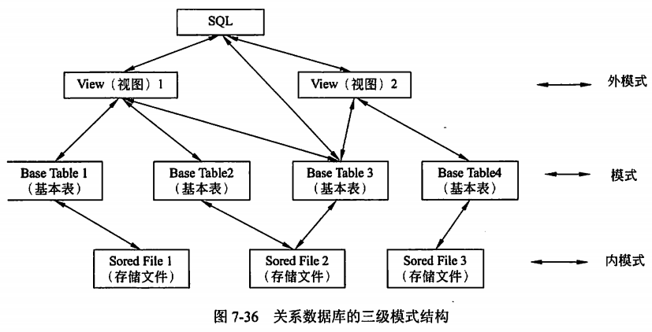

title:: 数据库技术基础/关系数据库SQL语言简介/SQL数据库体系结构
alias:: SQL数据库体系结构

- SQL主要有三个标准：ANSI（美国国家标准机构）SQL；对ANSI SQL进行修改后在1992年采用的标准SQL-92或SQL2；最近的SQL-99标准，也称为SQL3标准。
- ## SQL的特点
	- ==综合统一==。非关系模型的数据语言分为模式定义语言和数据操纵，其缺点是当要修改模式时，必须停止现有数据库的运行，转储数据，修改模式编译后再重装数据库。SQL是集数据定义、数据操纵和数据控制功能于一体，语言风格统一，可独立完成数据库生命周期的所有活动。
	- ==高度非过程化==。非关系数据模型的数据操纵语言是面向过程的，若要完成某项请求时，必须指定存储路径；而SQL语言是高度非过程化语言，当进行数据操作时，只要指出“做什么”，无须指出“怎么做”，存储路径对用户来说是透明的，提高了数据的独立性。
	- ==面向集合的操作方式==。非关系数据模型采用的是面向记录的操作方式，操作对象是一条记录。而SQL语言采用面向集合的操作方式，其操作对象、查找结果可以是元组的集合。
	- ==两种使用方式==。第一种方式，用户可以在终端键盘上输入SQL命令，对数据库进行操作，故称之为自含式语言；第二种方式，将SQL语言嵌入到高级语言程序中，所以又称为嵌入式语言。
	- ==语言简洁、易学易用==。SQL语言功能极强，完成核心功能只用了9个动词，包括如下4类：
		- 数据查询：SELECT
		- 数据定义：CREATE、DROP、ALTER
		- 数据操纵：INSERT、UPDATE、DELETE
		- 数据控制：GRANT、REVOKE
- ## SQL支持三级模式结构
	- {:height 321, :width 614}