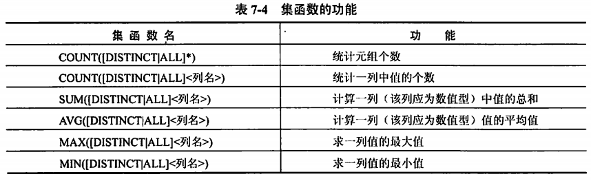
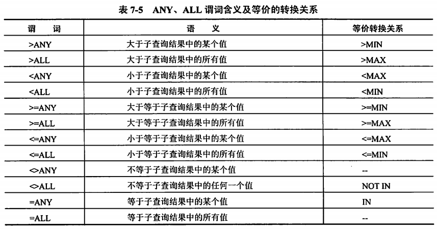

title:: 数据库技术基础/关系数据库SQL语言简介/SQL数据查询
alias:: SQL数据查询

- SQL的数据操纵功能包括SELECT（查询）、INSERT（插入）、DELETE（删除）和UPDATE（修改）这4条语句。SQL语言对数据库的操作十分灵活、方便，原因在于SELECT语句中成分丰富多样的元组，有许多可选形式，尤其是目标列和条件表达式。
- ## Select基本结构
	- 数据库查询是数据库的核心操作，SQL语言提供了SELECT语句进行数据库的查询。
	- ```sql
	  SELECT [ALL|DISTINCT]<目标列表达式>[,<目标列表达式>]...
	  FROM <表名或视图名>[,<表名或视图名>]
	  [WHERE <条件表达式>]
	  [GROUP BY <列名 1>[HAVING <条件表达式>]]
	  [ORDER BY <列名 2>[ASC|DESC]...]
	  ```
	- SQL查询中的子句顺序为SELECT、FROM、WHERE、GROUP BY、HAVING和ORDER BY。其中，SELECT FROM是必需的，HAVING条件子句只能与GROUP BY搭配起来使用。
	- > 1. SELECT子句对应的是关系代数中的 <u>投影运算</u>，用来列出查询结果中的属性。其输出可以是列名、表达式、集函数（AVG、COUNT、MAX、MIN、SUM），DISTINCT选项可以保证查询的结果集中不存在重复元组。
	  > 2. FROM子句对应的是关系代数中的笛卡儿积，它列出的是表达式求值过程中需扫描的关系，即在FROM子句中出现多个基本表或视图时，系统首先执行笛卡儿积操作。
	  > 3. WHERE子句对应的是关系代数中的选择谓词。WHERE子句的条件表达式中可以使用的运算符如下所示。
	- {:height 265, :width 662}
- ## 简单查询
	- SQL最简单的查询是找出关系中满足特定条件的元组，这些查询与关系代数中的选择操作类似。简单查询只需要使用3个保留字，即SELECT、FROM和WHERE。
		- ```sql
		  SELECT Sno,Sname,Age
		  FROM S
		  WHERE SD='CS';
		  ```
	- 注意：为了便于理解查询语句的结构，通常在写SQL语句时要将保留字（如FROM或WHERE）作为每一行的开头。但是，如果一个查询或子查询非常短，可以直接将它们写在一行上，这种风格使得查询语句很紧凑，也具有很好的可读性。
		- ```sql
		  SELECT Sno,Sname,Age FROM S WHERE SD='CS';
		  ```
- ## 连接查询
	- 若查询涉及两个以上的表，则称为连接查询。
		- ```sql
		  SELECT Sno,Sname
		  FROM S,SC
		  WHERE S.Sno=SC.Sno AND SC.Cno='C1';
		  ```
- ## 子查询与聚集函数
	- ### 子查询
		- 子查询也称嵌套查询。嵌套查询是指一个SELECT-FROM-WHERE查询块可以嵌入另一个查询块之中。在SQL中允许多重嵌套。
		- ```sql
		  SELECT Sno, Sname
		  From S
		  WHERE Sno IN (SELECT Sno
		               FROM SC
		               WHERE Cno IN (SELECT Cno
		                            FROM C
		                            WHERE Cname='MS'))
		  ```
	- ### 聚集函数
		- **聚集函数**是以一个值的集合为输入，返回单个值的函数。SQL提供了5个预定义聚集函数：平均值avg、最小值min、最大值max、求和sum以及计数count。
		- {:height 212, :width 676}
		- 使用ANY和ALL谓词必须同时使用比较运算符，其含义及等价的转换关系如表所示。使用聚集函数实现子查询通常比直接用ALL或ANY查询效率要高。
		- {:height 360, :width 684}
- ## 分组查询
	- ### GROUP BY子句
		- 在WHERE子句后面加上GROUP BY子句可以对元组进行分组，保留字GROUP BY后面跟着一个分组属性列表。最简单的情况是FROM子句后面只有一个关系，根据分组属性对它的元组进行分组。SELECT子句中使用的聚集操作符仅用在每个分组上。
		- ```sql
		  SELECT Sno,AVG(Grade)
		  FROM SC
		  GROUP BY Sno;
		  ```
	- ### HAVING子句
		- 假如元组在分组前按照某种方式加上限制，使得不需要的分组为空，可以在GROUP BY子句后面跟一个HAVING子句即可。
		- ```sql
		  SELECT Jno, AVG(Qty)
		  FROM SPJ
		  GROUP BY Jno
		  HAVING COUNT(DISTINCT(Sno)) > 2
		  ORDER BY Jno DESC;
		  ```
		- 注意：当元组含有空值时，应该记住以下两点。
			- > 1. 空值在任何聚集操作中被忽视。它对求和、求平均值和计数都没有影响。它也不能是某列的最大值或最小值。例如，COUNT(*)是某个关系中所有元组数目之和，但COUNT(A)却是A属性非空的元组个数之和。
			  > 2. NULL值又可以在分组属性中看作是一个一般的值。例如，SELECTA, AVG(B) FROM R中，当A的属性值为空时，就会统计A=NULL的所有元组中B的均值。
- ## 更名运算
	- SQL提供了可为关系和属性重新命名的机制，这是通过使用具有如下形式的AS子句来实现的：
	  ```sql
	  Old-name as new-name
	  ```
	- AS子句既可出现在SELECT子句，也可出现在FROM子句中。
	- ```sql
	  SELEcT Sname as 姓名, Age as 年龄
	  FROM S
	  WHERE Age<(SELECT MAX(Age)
	  FROM S
	  WHERE SD='CS')
	  AND SD<>'CS';
	  ```
	- SQL中的元组变量必须和特定的关系相联系。元组变量是通过在FROM子句中使用AS子句来定义的。
	- ```sql
	  SELECT Sname,Grade
	  FROM Students AS x,sc AS y
	  WHERE x.sno=y.sno AND y.cno='C1';
	  ```
	- 元组变量在比较同一关系的两个无组时非常有用。
- ## 字符串操作
	- 对于字符串进行的最通常的操作是使用操作符like的模式匹配。使用两个特殊的字符来描述模式：“`%`”匹配任意字符串；“`_`”匹配任意一个字符。模式是==大小写敏感==的。
	- ```sql
	  SELECT Sname, Age, SD
	  FROM S
	  WHERE Sname LIKE '__晓军';
	  ```
	- 为了使模式中包含特殊模式字符（即`%`和`_`），在SQL中允许使用`escape`关键词来定义转义符。转义符紧靠着特殊字符，并放在它的前面，表示该特殊字符被当成普通字符。
	- 例如，在LIKE比较中使用ESCAPE关键词来定义转义符，例如使用反斜杠 “`\`”作为转义符。
	  ```sql
	  Like 'ab\%cd%'escape'\' -- 匹配所有以 ab%cd开头的字符串
	  Like 'ab\\cd%'escape'\' -- 匹配所有以 ab\cd开头的字符串
	  ```
- ## 视图的查询
	- ```sql
	  CREATE VIEW CS-STUDENT
	  AS SELECT Sno, Sname, Sage, Sex
	  FROM Student
	  WHERE SD='CS'
	  WITH CHECK OPTION;
	  ```
	  ```sql
	  SELECT Sno, Age, FROM CS-STUDENT WHERE SD='CS' AND Age < 20;
	  ```
	- 系统执行该语句时，通常先将其转换成等价的对基本表的查询，然后执行查询语句。即当查询视图表时，系统先从数据字典中取出该视图的定义，然后将定义中的查询语句和对该视图查询语句结合起来，形成一个修正的查询语句。即：
	  ```sql
	  SELECT Sno, Age FROM S WHERE SD='CS' AND Age < 20;
	  ```