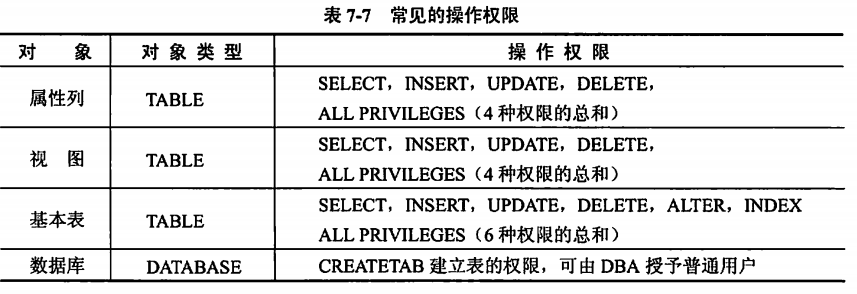

title:: 数据库技术基础/关系数据库SQL语言简介/SQL访问控制
alias:: SQL访问控制

- DBMS数据控制应具有如下功能：
  1. 通过GRANT和REVOKE将授权通知系统，并存入数据字典
  2. 当用户提出请求时，根据授权情况检查是否执行操作请求
- ## 授权的语句格式
	- ```sql
	  GRANT <权限>[,<权限>]...[ON<对象类型><对象名>] TO <用户>[,<用户>]...
	  [WITH GRANT OPTION];
	  ```
	- {:height 226, :width 660}
	- PUBLIC：接受权限的用户可以是单个或多个具体的用户，PUBLIC参数可将权限赋给全体用户
	- WITH GRANT OPTION：若指定了此子句，那么获得了权限的用户还可以将权限赋给其他用户。
- ## 收回权限语句格式
	- ```sql
	  REVOKE <权限>[,<权限>]...[ON <对象类型><>对象名]
	  FROM <用户>[,<用户>]...;
	  ```