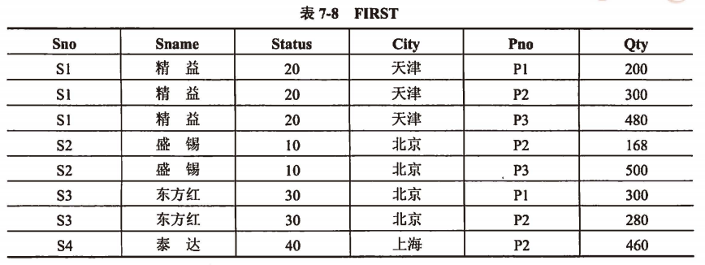

filters:: {"索引" false}
title:: 数据库技术基础/关系数据库的规范化/规范化
alias:: 规范化

- 关系数据库设计的方法之一就是设计满足适当范式的模式，通常可以通过判断分解后的模式达到几范式来评价模式规范化的程序。范式有1NF、2NF、3NF、BCNF、4NF和5NF，其中1NF级别最低。这几种范式之间 $$5NF \subset 4NF \subset BCNF \subset 3NF \subset 2NF \subset 1NF$$ 成立。通过分解，可以将一个低一级范式的关系模式转换成若干个高一级范式的关系模式，这种过程叫做规范化。
- ## 1NF(第一范式)
	- 定义：若关系模式R的每一个分量是不可再分的数据项，则关系模式R属于第一范式。
	- ```
	  关系模式 FIRST(Sno, Sname, Status, City, Pno, Qty)
	  函数依赖集 F={Sno->Sname, Sno->Status, Status->City, (Sno,Pno)->Qty}
	  ```
	- {:height 231, :width 611}
	- 1NF存在如下4个问题：
	  > 1. ==冗余度大==。例如，每个供应者的Sno，Sname，Status，City要与其供应的零件的种类一样多
	  > 2. ==引起修改操作的不一致性==。例如，供应者S1从“天津”搬到“上海”，若稍不注意，就会使一些数据被修改，另一些数据没有被修改，导致数据修改的不一致性。
	  > 3. ==插入异常==。关系模式FIRST的主码为Sno、Pno，按照关系模式实体完整性规定，主码不能取空值或部分取空值。这样，当某个供应者的某些信息未提供时（如Pno），则不能进行插入操作，这就是所谓的插入异常。
	  > 4. ==删除异常==。若供应商S4的P2零件销售完了，并且以后不再销售P2零件，那么应删除该元组。这样，在基本关系FIRST找不到S4，可S4又是客观存在的。
- ## 2NF(第二范式)
	- 定义：若关系模式 $$R \in 1NF$$，且每一个非主属性完全依赖于码，则关系模式 $$R \in 2NF$$。
	- 换句话说，当1NF消除了非主属性对码的==部分函数依赖==，则称为2NF。
	- 例如，FIRST关系中的码是Sno、Pno，而 $$Sno \to Status$$ ，因此非主属性Status部分依赖于码，故非2NF的。
	  若此时将FIRST关系分解为`FIRST1(Sno, Sname, Status, City)`和`FIRST2(Sno, Pno, Qty)`。其中，$$FIRST1 \in 2NF, FIRST2 \in 2NF$$ 。因为分解后的关系模式FIRST1的码为Sno，非主属性Sname、Status、City完全依赖于码Sno，所以属于2NF；关系模式FIRST2的码为Sno、Pno，非主属性Qty完全依赖于码，所以也属于2NF。
- ## 3NF(第三范式)
	- 定义：若关系模式R(U,F)中不存在这样的码X，属性组Y及非主属性Z（$$Z \not\subseteq Y$$）使得 $$X \to Y (Y \not\to X), Y \to Z$$ 成立，则关系模式 $$R \in 3NF$$。
	- 即当2NF消除了非主属性对码的==传递函数依赖==，则称为3NF。
	- 例如，$$FIRST1 \not\in 3NF$$ ，因为分解后的关系模式FIRST1中有 $$Sno \to Status, Status \to City$$，存在着非主属性City传递依赖于码Sno。若此时将FIRST1继续分解为：
	  $$
	  \begin{align}
	  \text{FIRST1}(Sno, Sname, Status) & \in 3NF \\
	  \text{FIRST2}(Status, City) & \in 3NF
	  \end{align}
	  $$
	  通过上述分解，数据库模式FIRST转换为`FIRST1(Sno, Sname, Status)`，`FIRST12(Status，City)`和`FIRST2(Sno, Pno, Qty)`三个子模式。由于这三个子模式都达到了3NF，因此称分解后的数据库模式达到了3NF。
	- 可以证明，3NF的模式必是2NF的模式。产生冗余和异常的两个重要原因是部分依赖和传递依赖。因为3NF模式中不存在非主属性对码的部分函数依赖和传递函数依赖，所以具有较好的性能。对于非3NF的1NF、2NF，其性能弱，一般不宜作为数据库模式，通常要将它们变换成为3NF或更高级别的范式，这种变换过程称为“==关系模式的规范化处理==”。