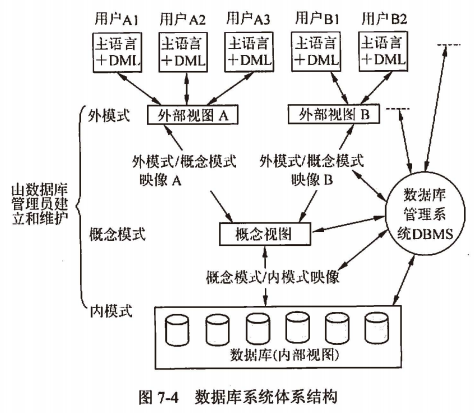

title:: 数据库技术基础/数据库基本概念/数据库的三级模式结构
alias:: 数据库的三级模式结构

- 实际上，数据库的产品很多，它们支持不同的数据模型，使用不同的数据库语言，建立在不同的操作系统上。数据的存储结构也各不相同，但体系结构基本上都具有相同的特征，采用“三级模式和两级映像”。如图7-4所示。
  {:height 361, :width 407}
- 数据库系统采用三级模式结构，这是数据库管理系统内部的系统结构。数据库有“型”和“值”的概念，“==型==”是指对某一数据的结构和属性的说明，“==值==”是型的一个具体赋值。
- 数据库系统设计员可在视图层、逻辑层和物理层对数据抽象，通过外模式、概念模式和内模式来描述不同层次上的数据特性。
- ## 概念模式
	- 概念模式也称模式，是数据库中全部数据的逻辑结构和特征的描述，它由若干个概念记录类型组成，只涉及到型的描述，不涉及到具体的值。概念模式的一个具体值称为模式的一个实例，同一个模式可以有很多实例。
	- 概念模式反映的是数据库的结构及其联系，所以是相对稳定的；而实例反映的是数据库某一时刻的状态，所以是相对变动的。
	- 需要说明的是，概念模式不仅要描述概念记录类型，还要描述记录间的联系、操作、数据的完整性和安全性等要求。但是，概念模式不涉及到存储结构、访问技术等细节。只有这样，概念模式才算做到了“物理数据独立性”。
	- 描述概念模式的数据定义语言称为“模式DDL（Schema Data Definition Language）”。
- ## 外模式
	- 外模式也称用户模式或子模式，是用户与数据库系统的接口，是用户用到的那部分数据的描述。它由若干个外部记录类型组成。用户使用数据操纵语言对数据库进行操作，实际上是对外模式的外部记录进行操作。
	- 描述外模式的数据定义语言称为“外模式DDL”。有了外模式后，程序员不必关心概念模式，只与外模式发生联系，按外模式的结构存储和操纵数据。
- ## 内模式
	- 内模式也称存储模式，是数据物理结构和存储方式的描述，是数据在数据库内部的表示方式。定义所有的内部记录类型、索引和文件的组织方式，以及数据控制方面的细节。
	  例如，记录的存储方式是顺序存储，按照B树结构存储，还是Hash方法存储；索引按照什么方式组织；数据是否压缩存储，是否加密；数据的存储记录结构有何规定。
	- 描述内模式的数据定义语言称为“内模式DDL”。
	- 注意，内部记录并不涉及物理记录，也不涉及设备的约束。它比内模式更接近于物理存储和访问的那些软件机制，是操作系统的一部分（即文件系统）。例如，从磁盘上读、写数据。
- 总之，数据按外模式的描述提供给用户，按内模式的描述存储在磁盘上，而概念模式提供了连接这两级模式的相对稳定的中间层，并使得两级中任意一级的改变都不受另一级影响。
- ## 两级映像
	- 数据库系统在三级模式之间提供了两级映像：模式/内模式映像、外模式/模式映像。正因为这两级映像保证了数据库中的数据具有较高的逻辑独立性和物理独立性。
		- ==模式/内模式映像==。存在于概念级和内部级之间，实现了概念模式和内模式之间的相互转换。
		- ==外模式/模式映像==。存在于外部级和概念级之间，实现了外模式和概念模式之间的相互转换。
	- 数据的独立性是指数据与程序独立，将数据的定义从程序中分离出去，由DBMS负责数据的存储，从而简化应用程序，大大减少应用程序编制的工作量。数据的独立性是由DBMS的二级映像功能来保证的。数据的独立性包括数据的物理独立性和数据的逻辑独立性。
		- 数据的**物理独立性**。数据的物理独立性是指当数据库的内模式发生改变时，数据的逻辑结构不变。由于应用程序处理的只是数据的逻辑结构，这样物理独立性可以保证，当数据的物理结构改变时，应用程序不用改变。但是，为了保证应用程序能够正确执行，需要修改概念模式和内模式之间的映像。
		- 数据的**逻辑独立性**。数据的逻辑独立性是指用户的应用程序与数据库的逻辑结构是相互独立的。数据的逻辑结构发生变化后，用户程序也可以不修改。但是，为了保证应用程序能够正确执行，需要修改外模式和概念模式之间的映像。