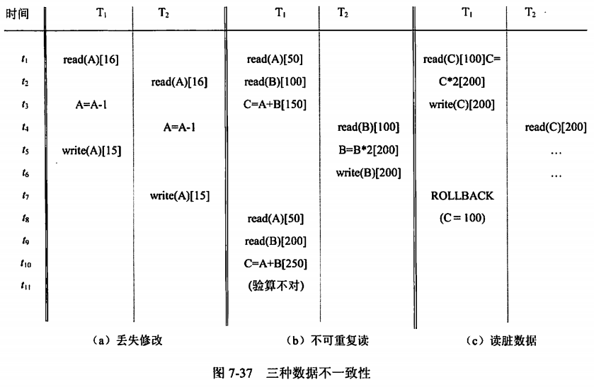

title:: 数据库技术基础/数据库的控制功能/并发控制
alias:: 并发控制

- 并发技术 #并发技术
- 所谓**并发**操作，是指在多用户共享的系统中，许多用户可能同时对同一数据进行操作。并发操作带来的问题是数据的不一致性，主要有三类：丢失更新、不可重复读和读脏数据。其主要原因是事务的并发操作破坏了事务的==隔离性==。DBMS的并发控制子系统负责协调并发事务的执行，保证数据库的完整性不受破坏，避免用户得到不正确的数据。
- ## 并发操作带来的问题
	- 并发操作带来的数据不一致性有三类：丢失修改、不可重复读和读脏数据。
	- {:height 415, :width 627}
	- ### 丢失修改(Lost Update)
	  collapsed:: true
		- 如图，事务T1、T2都是对数据A做减1操作。事务T1在时刻t6把A修改后的值15定稿数据库，但事务T2在时刻t7再把它对A减1后的值15写入。两个事务都是对A的值进行减1 操作并且都执行成功，但A中的值却只减了1。例如火车售票系统，T1与T2各售出了一张票，但数据库时的存票却只减了一张，造成数据的不一致。原因在于T1事务对数据库的修改被T2事务覆盖而丢失了，破坏了事务的隔离性。
		- > 1. 第一类：当两个事务更新相同的数据源，如果第一个事务被提交，第二个却被撤销，那么连同第一个事务做的更新也被撤销。
		  > 2. 第二类：有两个并发事务同时读取同一行数据，然后其中一个对它进行修改提交，而另一个也进行了修改提交。这就会造成第一次写操作失效。
	- ### 不可重复读(Nonrepeatable Read)
	  collapsed:: true
		- 如图，事务T1读取A、B的值后进行运算，事务T2在t6时刻对B的值做了修改以后，事务T1又重新读取A、B的值再运算，同一事务内对同一组数据的相同运算结果不同，显然与事实不相符。同样是事务T2干扰了事务T1的独立性。
		- _一个事务对同一行数据重复读取两次，但是却得到了不同的结果。同一查询在同一事务中多次进行，由于其他提交事务所做的修改或删除，每次返回不同的结果集，此时发生非重复读。_
	- ### 读脏数据(Dirty Read)
	  collapsed:: true
		- 如图，事务T1对数据C修改之后，在t4时刻事务T2读取修改后的C值做处理，之后事务T1回滚，数据C恢复了原来的值，事务T2对C所做的处理是无效的，它读的是被丢掉的垃圾值。
		- _当一个事务读取另一个事务尚未提交的修改时，产生脏读。同一事务内不是脏读。 一个事务开始读取了某行数据，但是另外一个事务已经更新了此数据但没有能够及时提交。这是相当危险的，因为很可能所有的操作都被回滚，也就是说读取出的数据其实是错误的。_
	- 通过以上3个例子，在事务并行处理的过程中对相同数据进行访问导致了数据的不一致性，解决该问题可以从保证事务的==隔离性==入手。
	- 幻像读(Phantom Reads)
	  collapsed:: true
		- 事务在操作过程中进行两次查询，第二次查询的结果包含了第一次查询中未出现的数据（这里并不要求两次查询的SQL语句相同）。这是因为在两次查询过程中有另外一个事务插入数据造成的。对某行执行插入或删除操作，而该行属于某个事务正在读取的行的范围时，会发生幻像读问题。
- ## 并发控制技术
	- 并发控制的主要技术是封锁。基本封锁的类型有排它锁（简称X锁或写锁）和共享锁（简称S锁或读锁）。
	- ### 封锁
		- **排它锁**。若事务T对数据对象A加上**X锁**，则只允许T读取和修改A，其他事务都不能再对A加任何类型的锁，直到T释放A上的锁。
		- **共享锁**。若事务T对数据对象A加上**S锁**，则只允许T读取A，但不能修改A，其他事务只能再对A加S锁，直到T释放A上的S锁。这就保证了其他事务可以读A，但在T释放A上的S锁之前不能对A进行任何修改。
	- ### 三级封锁协议
		- **一级封锁协议**。事务在修改数据R之前必须先对其加X锁，直到事务结束才释放。事务结束包括正常结束（COMMIT）和非正常结束（ROLLBACK）。一级封锁协议可以解决==丢失更新问题==。
		- **二级封锁协议**。在一级封锁协议的基础上，加上事务T在读数据R之前必须先对其加S锁，==读完后==即可释放S锁。二级封锁协议可以解决==读脏数据==的问题。但是，由于二级封锁协议读完了数据后即可释放S锁，所以==不能保证可重复读==。
		- **三级封锁协议**。在一级封锁协议的基础上，加上事务T在读数据R之前必须先对其加S锁，直到==事务结束时==释放S锁。三级封锁协议除了防止丢失修改和不读“脏”数据外，还进一步防止了==不可重复读==。
- ## 活锁与死锁
	- 所谓**活锁**，是指当事务 T1 封锁了数据 R，事务 T2 请求封锁数据 R，于是 T2 等待，当 T1 释放了 R 上的封锁后，系统首先批准了 T3 请求，于是 T2 仍等待，当 T3 释放了 R 上的封锁后，又批准了 T4 请求，依此类推，使得 T2 可能永远等待的现象。
	- 所谓**死锁** #死锁 ，是指两个以上的事务分别请求封锁对方已经封锁的数据，导致长期等待而无法继续运行下去的现象。
- ## 并发调度的可串行性
	- 多个事务的并发执行是正确的，当且仅当其结果与某一次序串行地执行它们时的结果相同，称这种调度策略是==可串行化的调度==。
	- ==可串行性==是并发事务正确性的准则，按这个准则规定，一个给定的并发调度，当且仅当它是可串行化的才认为是正确调度。
- ## 两段封锁协议
	- 所谓两段封锁协议，是指所有事务必须分两个阶段对数据项加锁和解锁。即事务分两个阶段，
	  第一阶段是==获得封锁==，事务可以获得任何数据项上的任何类型的锁，但不能释放；
	  第二阶段是==释放封锁==，事务可以释放任何数据项上的任何类型的锁，但不能申请。
- ## 封锁的粒度
	- 封锁对象的大小称为封锁的粒度。封锁的对象可以是==逻辑单元==（如属性、元组、关系、索引项、整个索引甚至整个数据库），也可以是==物理单元==（如数据页或索引页）。