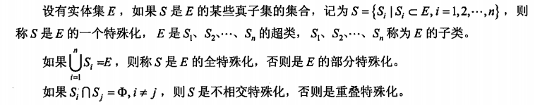

filters:: {"索引" false}
title:: 数据库技术基础/数据模型/E-R模型
alias:: E-R模型

- 概念模型是对信息世界建模，所以概念模型能够方便、准确地表示信息世界中的常用概念。概念模型有很多种表示方法，其中最为常用的是P.P.S.Chen于1976年提出的实体-联系方法（Entity Relationship Approach）。该方法用E-R图来描述现实世界的概念模型，称为实体-联系模型（Entity-Relationship Model，E-R模型）。
- E-R模型是软件工程设计中的一个重要方法，因为它接近于人的思维方式，容易理解并且与计算机无关，所以用户容易接受，是用户和数据库设计人员交流的语言。但是，E-R模型只能说明实体间的语义联系，还不能进一步地详细说明数据结构。在解决实际应用问题时，通常先设计一个E-R模型，然后再把其转换成计算机能接受的数据模型。
- ## 实体
	- 在E-R模型中，实体用矩形表示，通常矩形框内写明实体名。实体是现实世界中可以区别于其他对象的“事件”或“物体”。例如，企业中的每个人都是一个实体。每个实体由一组特性（属性）来表示，其中的某一部分属性可以唯一标识实体，例如职工实体集中的职工号。实体集是具有相同属性的实体集合。例如，学校的所有老师具有相同的属性，因此教师的集合可以定义为一个实体集；学生具有相同的属性，因此学生的集合可以定义为另一个实体集。
- ## 联系
	- 在E-R模型中，联系用菱形表示，通常菱形框内写明联系名，并用无向边分别与有关实体连接起来，同时在无向边旁标注上联系的类型（1:1、1:n 或 m:n）。实体的联系分为实体内部的联系和实体与实体之间的联系。实体内部的联系反映数据在同一记录内部各字段间的联系。
	- 两个不同实体之间的联系
		- 两个不同实体集之间存在以下3种联系类型。
		  > 1. 一对一（1:1）。指实体集E1中的一个实体最多只与实体集E2中的一个实体相联系。
		  > 2. 一对多（1:n）。表示实体集E1中的一个实体可与实体集E2中的多个实体相联系。
		  > 3. 多对多（m:n）。表示实体集E1中的多个实体可与实体集E2中的多个实体相联系。
		- {:height 217, :width 376}
	- 两个以上不同实体集之间的联系
		- 两个以上不同实体集之间存在 1:1:1、1:1:n、1:m:n 和 r:m:n 的联系。
		- {:height 200, :width 371}
		- 注意，3 个实体集之间的多对多联系和3个实体集两两之间的多对多联系的语义是不同的。例如，供应商和项目实体集之间的“合同”联系，表示供应商为哪几个工程签了合同；供应商与零件两个实体集之间的“库存”联系，表示供应商库存零件的数量；项目与零件两个实体集之间的“组成”联系，表示一个项目由哪几种零件组成。
	- 同一实体集内的二元联系
		- 同一实体内的各实体之间也存在 1:1、1:n 和 m:n 的联系。
		- {:height 142, :width 280}
- ## 属性
	- 属性是实体某方面的特性。例如，职工实体集具有职工号、姓名、参加工作时间和通信地址等属性。每个属性都有其取值范围，例如职工号为000001~999999的6位整型数，姓名为10位的字符串，年龄的取值范围为18~60等。在同一实体集中，每个实体的属性及其域是相同的，但可能取不同的值。E-R模型中的属性有以下分类。
	- 简单属性和复合属性。**简单属性**是原子的、不可再分的，复合属性可以细分为更小的部分（即划分为别的属性）。有时用户希望访问整个属性，有时希望访问属性的某个成分，那么在模式设计时可采用**复合属性**。例如，职工实体集的通信地址可以进一步分为邮编、省、市、街道。若不特别声明，通常指的是简单属性。
	- 单值属性和多值属性。在前面所举的例子中，定义的属性对于一个特定的实体都只有单独的一个值。例如，对于一个特定的职工，只对应一个职工号、职工姓名，这样的属性称为**单值属性**。但是，在某些特定情况下，一个属性可能对应一组值。例如，职工可能有0个、1个或多个亲属，那么职工的亲属的姓名可能有多个数目，这样的属性称为**多值属性**。
	- **NULL属性**。当实体在某个属性上没有值或属性值未知时，使用NULL值，表示无意义或不知道。
	- 派生属性。**派生属性**可以从其他属性得来。例如，职工实体集中有“参加工作时间”和“工作年限”属性，那么“工作年限”的值可以由当前时间和参加工作时间得到。这里，“工作年限”就是一个派生属性。
- ## 实体-联系方法
	- 概念模型中最常用的方法为实体-联系方法，简称E-R方法。该方法直接从现实世界中抽象出实体和实体间的联系，然后用非常直观的E-R图来表示数据模型。在E-R图中有如表9-1所示的几个主要构件。
	- {:height 263, :width 645}
	- {:height 365, :width 500}
	- > 1. 说明1：在E-R图中，实体集中作为主码的一部分属性以下划线标明。另外，在实体集与联系的线段上标上联系的类型。
	  > 2. 说明2：在本书中，若不引起误解，实体集有时简称实体，联系集有时简称联系。
	- 需要特别指出的是，E-R模型强调的是语义，与现实世界的问题密切相关。这句话的意思是，尽管都是学校教学管理，但由于不同的学校教学管理的方法可能会有不同的语义，因此会得到不同的E-R模型。
- ## 扩充的E-R模型
	- 尽管基本的E-R模型足以对大多数数据库特征建模，但数据库某些情况下的特殊语义仅用基本E-R模型无法表达清楚。在这一节中将讨论扩充的E-R模型，包括弱实体、特殊化、普遍化等概念。
	- ### 弱实体
		- 在现实世界中有一种特殊的联系，这种联系代表实体间的所有（ownership）关系，例如职工与家属的联系， 家属总是属于某职工的。这种实体对于另一些实体具有很强的依赖关系，即一个实体的存在必须以另一个实体为前提，将这类实体称为**弱实体**。
		  {:height 136, :width 526}
	- ### 特殊化
		- 在现实世界中，某些实体一方面具有一些共性，另一方面还具有各自的特殊性。这样，一个实体集可以按照某些特征区分为几个子实体。例如，学生实体集可以分为研究生、本科生和大专生等子集。将这种普高到特殊的过程叫做**“特殊化**”。
		- 将几个具有共同特性的实体集概括成一个更普遍的实体集的过程叫做“**普遍化**”。例如，可以将大专生、本科生和研究生概括为学生，还可以将学生、教师和职工概括为人。这就是从特殊到一般的过程。
		- {:height 119, :width 577}
		- {:height 452, :width 558}
		- 在扩充的E-R模型中，子类继承超类的所有属性和联系，但是，子类还有自己特殊的属性和联系。例如，研究生除了学习以外，还要参加科研项目。那么，研究生不仅要继承学生的所有属性，还要增加学位类型、导师的属性，并且需要增加与项目的联系。
		- 在扩充的E-R图中，超类-子类关系模型使用特殊化圆圈和连线的一般方式来表示。
			- > 1. 超类到圆圈有一条连线，连线为双线表示全特殊化，连线为单线表示部分特殊化；
			  > 2. 双竖边矩形框表示子类；
			  > 3. 有符号“\cup”的线表示特殊化；
			  > 4. 圆圈中的d表示不相交特殊化；
			  > 5. 圆圈中的o表示重叠特殊化；
			  > 6. 超类与圆圈用单线相连，表示部分特殊化。