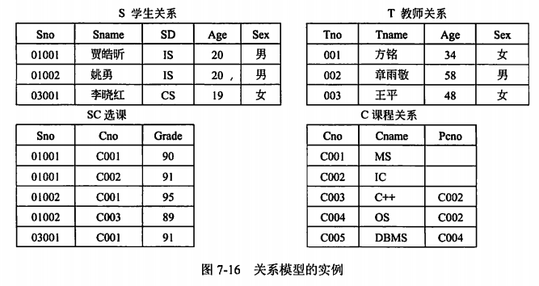

filters:: {"索引" false}
title:: 数据库技术基础/数据模型/关系模型
alias:: 关系模型

- 关系模型（Relation Model）是目前最常用的数据模型之一。关系数据库系统采用关系模型作为数据的组织方式，在关系模型中用表格结构表达实体集以及实体集之间的联系，其最大特色是描述的一致性。关系模型是由若干个关系模式组成的集合。一个关系模式相当于一个记录型，对应于程序设计语言中类型定义的概念。关系是一个实例，也是一张表，对应于程序设计语言中变量的概念。给定变量的值随时间可能发生变化，类似地，当关系被更新时，关系实例的内容也随时间发生了变化。
- {:height 325, :width 612}
- 由于关系模型比网状、层次模型更为简单灵活，因此，数据处理领域中，关系数据库的使用已相当普遍。
  但是，现实世界存在着许多含有更复杂数据结构的实际应用领域，例如CAD数据、图形数据和人工智能研究等，需要有一种数据模型来表达这类信息，这种数据模型就是面向对象的数据模型。