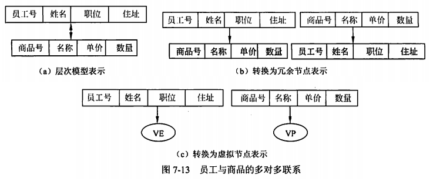

alias:: 基本数据模型

- 在数据库领域中常见的数据模型有层次模型、网状模型、关系模型和面向对象模型。本章重点介绍关系模型。
- **层次模型**（Hierarchical Model）采用树型结构表示数据与数据间的联系。在层次模型中，每一个结点表示一个记录类型（实体），记录之间的联系用结点之间的连线表示，并且根结点以外的其他结点有且仅有一个双亲结点。
- **网状模型**（Network Model）也称DBTG模型，该是一个比层次模型更具有普遍性的数据结构，是层次模型的一个特例。网状模型可以直接地描述现实世界，因为去掉了层次模型的两个限制，允许两个结点之间有多种联系（称之为复合联系）。
- **关系模型**（Relational Model）是目前最常用的数据模型之一。关系数据库系统采用关系模型作为数据的组织方式，在关系模型中用表格结构表达实体集以及实体集之间的联系，其最大特色是描述的一致性。
- **面向对象模型**（Object Oriented Model）采用面向对象的方法来设计数据库。面向对象的数据库存储对象是以对象为单位，每个对象包含对象的属性和方法，具有类和继承等特点。Computer Associates的Jasmine就是面向对象模型的数据库系统。
- 面向对象数据模型比网络、层次、关系数据模型具有更加丰富的表达能力。但正因为面向对象模型的丰富表达能力，模型相对复杂，实现起来较困难。
- ## 层次模型
	- Hierarchical Model
	- PEP模型
	- {:height 129, :width 442}
	- {:height 186, :width 487}
	- 层次模型不能直接表示多对多的联系。若要表示多对多的联系，可采用如下两种方法。
		- 冗余节点法。两个实体的多对多联系转换为两个一对多联系。该方法的优点是节点清晰，允许节点改变存储位置。缺点是需要额外的存储空间，有潜在的不一致性。
		- 虚拟节点分解法。将冗余节点转换为虚拟节点。虚拟节点是一个指引元，指向所代替的节点。该方法的优点是减少对存储空间的浪费，避免数据不一致性。缺点是改变存储位置可能引起虚拟节点中指针的修改。
	- 层次模型的特点是记录宰的联系通过指针实现，比较简单，查询效率高。
	- 层次模型的缺点是只能表示`1：n`的联系，尽管有许多辅助手段实现`m：n`的联系，但较复杂不易掌握；由于层次顺序严格和复杂，插入删除操作的限制比较多，导致应用程序编制比较复杂。1968年，美国IBM公司推出的IMS系统（信息管理系统）是典型的层次模型系统，20世纪70年代在商业上得到了广泛的应用。
	- {:height 259, :width 594}
- ## 网状模型
	- 网状模型（也称DBTG模型）是一个比层次模型更具有普遍性的数据结构，是层次模型的一个特例。网状模型可以直接地描述现实世界，因为去掉了层次模型的两个限制，允许两个节点之间有多种联系（称之为复合联系）。
	- 网状模型中的每个节点表示一个记录类型（实体），每个记录类型可以包含若干个字段（实体的属性），节点间的连线表示记录类型之间一对多的联系。层次模型和网状模型的主要区别如下：
		- 网状模型中子女节点与双亲节点的联系不唯一，因此需要为每个联系命名。
		- 网状模型允许复合链，即两个节点之间有两种以上的联系，如图7-14所示。
		  {:height 163, :width 164}
	- 需要说明的是，网状模型不能表示记录之间的多对多联系，需要引入联结记录来表示多对多联系。
	- {:height 426, :width 606}
	- 通常，网状数据模型没有层次模型那样严格的完整性约束条件，但DBTG在模式DDL中提供了定义DBTG数据库完整性的若干概念和语句，主要有：
		- 支持记录码的概念。码能唯一标识记录的数据项的集合。
		- 保证一个联系中双亲记录和子女记录之间是一对多联系。
		- 以支持双亲记录和子女记录之间的某些约束条件。例如，当插入一条选课记录“010014，100，98”时，只有学生实体中存在学号为“010014”的学生记录，课程实体存在课程号，系统才认为是合法的操作。
	- 网状模型的主要优点是能更为直接地描述现实世界，具有良好的性能，存取效率高。网状模型的主要缺点是结构复杂。例如当应用环境不断扩大时，数据库结构就变得很复杂，不利于最终用户掌握。编制应用程序难度比较大。DBTG模型的DDL、DML语言复杂，记录之间的联系是通过存取路径来实现的，因此程序员必须系统结构的细节，增加了编写应用程序的负担。
- ## 关系模型
	- 关系模型（Relational Model）是目前最常用的数据模型之一。关系数据库系统采用关系模型作为数据的组织方式，在关系模型中用==表格结构==表达实体集以及实体集之间的联系，其最大特色是==描述的一致性==。
- ## 面向对象模型
	- 采用面向对象的方法来设计数据库。面向对象的数据库存储对象是以对象为单位，每个对象包含对象的属性和方法，具有类和继承等特点。Computer Associates的Jasmine就是面向对象模型的数据库系统。
	- 面向对象数据模型比网络、层次、关系数据模型具有更加丰富的表达能力。但正因为面向对象模型的丰富表达能力，模型相对复杂，实现起来较困难。
	- **对象和对象标识（OID）**。对象是现实世界中实体的模型化，与记录、元组的概念相似，但远比它们复杂。每一个对象都有一个唯一的标识，称为对象标识。对象标识不等于关系模式中的记录标识，OID是独立于值的，全系统唯一的。
	- **封装**。每一个对象是状态（state）和行为（behavior）的封装。对象的状态是在该对象属性的集合，对象的行为是在该对象状态上操作的方法（程序代码）的集合。被封装的状态和行为在对象外部是看不见的，只能通过显式定义的消息传递来访问。
	- **对象的属性**。对象的属性描述对象的状态、组成和特性，对象的某个属性可以是单值或值的集合。对象的一个属性值本身在该属性看来也是一个对象。
	- **类和类层次**。
		- 类。所有具有相同属性和方法的对象构成了一个对象类。任何一个对象都是某个对象类的一个实例（instance）。对象类中属性的定义域可以是任何类，包括基本类，如整型、实型和字串等；一般类，包含自身属性和方法类本身。
		- 类层次。所有的类组成了一个有根有向无环图，称为类层次（结构）。一个类可以从直接/间接祖先（超类）中继承所有的属性和方法，该类称为子类。
	- **继承**。子类可以从其超类中继承所有属性和方法。类继承可分为单继承（即一个类只能有一个超类）和多重继承（即一个类可以有多个超类）
	- {:height 405, :width 526}