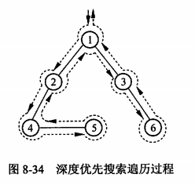
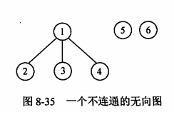

- 与树的遍历相似，图的遍历也是从某个顶点出发，沿着某条搜索路径对图中所有顶点进行访问且只访问一次。图的遍历算法是求解图的连通性问题、拓扑排序及求关键路径等算法的基础。
- 图的遍历要比树的遍历复杂的多。因为图的任一个节点都可能与其余顶点相邻接，所以在访问了某个顶点之后，可能沿着某路径又回到该节点上，为了避免顶点的重复访问，在图的遍历过程中，必须记下每个已访问过的顶点。深度优先遍历和广度优先遍历是两种遍历图的基本方法。
- ## 深度优先搜索
	- Depth First Search, DFS
	- 此种方法类似于树的先根遍历，在第一次经过一个顶点时就进行访问操作。从图G中任一节点v出发按深度优先搜索法进行遍历的步骤如下。
	  > 1. 设置搜索指针p，使p指向顶点v；
	  > 2. 访问p所指顶点，并使p指向与其相邻接的且尚未被访问过的顶点。
	  > 3. 若p所指顶点存在，则重复步骤(2)，否则执行步骤(4)。
	  > 4. 沿着刚才访问的次序和方向回溯到一个尚有邻接顶点且未被访问过的顶点，并使p指向这个未被访问的顶点，然后重复步骤(2)，直至所有的顶点均被访问为止。
	- 该算法的特点是尽可能先对纵深方向搜索，因此可以得到其递归遍历算法。
	- 【函数】以邻接链表表示图的深度优先搜索算法。
	  ```c
	  int visited[MaxN] = {0}; /**/
	  void Dfs(Graph G, int i) {
	    EdgeNode *t; int j;
	    printf("%d", i);
	    visited[i] = 1;
	    t = G.Vertices[i].firstarc; /* 取顶点i的第一个邻接顶点 */
	    while(t != NULL) {
	      j = t->adjvex; /* 检查所有与顶点i相邻接的顶点 */
	      if(visited[j] == 0) /* 若顶点j未被访问过 */
	        Dfs(g, j); /* 从顶点j出发进行深度优先搜索 */
	      t = t->nextarc; /* 取顶点i的下一个邻接顶点 */
	    }
	  }
	  ```
	- 从函数Dfs()之外调用Dfs可以访问到所有与一个指定顶点有路径相通的其他顶点。若图是不连通的，则下一次应从另一个未被访问过的顶点出发，再次调用Dfs进行遍历，直到将图中所有顶点都访问到为止。深度优先的搜索过程如图8-34所示。
	  
	- 深度优先遍历图的过程实质上是对某个顶点查找其邻接点的过程，其耗费的时间取决于所采用的存储结构，则需要O(e)的时间复杂度查找所有顶点的邻接点。因此，当以邻接表作为存储结构时，深度优先搜索遍历图的时间复杂度为O(n+e)。
- ## 广度优先搜索
	- Breadth First Search, BFS
	- 图的广度优先搜索方法为：从图中某个顶点v出发，在访问了v之后依次访问v个各个未被访问过的邻接点，然后分别从这些邻接点出发依次访问它们的邻接点，并使“先被访问的顶点的邻接点”先于“后被访问的顶点的邻接点”被访问，直至图中所有已被访问的顶点的邻接点都被访问到。若此时还有未被访问的顶点，则另选图中的一个未被访问的顶点作为起点，重复上述过程，直至图中所有的顶点都被访问到为止。对图8-35所示的图进行广度优先搜索，得到的序列为1，2，3，4，5，6。
	  
	- 广度优先遍历图的特点是尽可能先进行横向搜索，即最先访问的顶点的邻接点也先被访问。为此，引入队列来保存已访问过的顶点序列，即每当一个顶点被访问后，就将其放入队中，当队头顶点出队时，就访问其未被访问的邻接点并令这些邻接顶点入队。
	- 【算法】以邻接链表表示图的广度优先搜索算法。
	  ```c
	  void Bfs(Graph G)
	  {
	    EdgeNode *t; int i, j, k;
	    int visited[G.Vnum] = {0};
	    InitQueue(Q);
	    for(i = 0; i< G.Vnum; i++) {
	      if(!visited[i]) {
	        EnQueue(Q,i); printf("%d", i); visited[i] = i; /* 访问顶点i */
	        while(!Empty(Q)) {
	          DeQueue(Q, k);
	          t = G.Vertices[k].firstarc;
	          for(;t;t = t->nextarc) { /* 检查所有与顶点k相邻接的顶点 */
	            j = t->adjvex;
	            if(visited[j] == 0) {
	              EnQueue(Q, j);
	              printf("%d", j);
	              visited[j] = 1;
	            }
	          } /*for*/
	        } /*while*/
	      }/*if*/
	    }/*for i*/
	  }
	  ```
	- 在广度优先遍历算法中，每个顶点至多进一次队列。
	- 遍历图的过程实质上是通过边或弧找邻接点的过程，因此广度优先搜索遍历图和深度优先搜索遍历图的时间复杂度相同，其不同之处仅仅在于对顶点访问的次序不同。