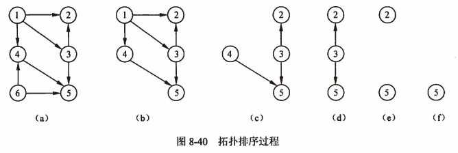
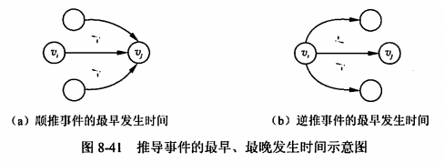

filters:: {"索引" false}
title:: 数据结构/图/拓扑排序和关键路径
alias:: 拓扑排序和关键路径

- ## AOV网
	- 在工程领域，一个大的工程项目通常被划分为许多较小的子工程（称为活动）。显然，当这些子工程都完成时，整个工程也就完成了。在==有向图==中， _若以顶点表示**活动**，用有向边表示==活动之间的优先关系==_ ，则称这样的有向图为以顶点表示活动的网(Activity On Vertex network, **AOV网**)。在网中，若从顶点vi到顶点vj有一条有向路径，则顶点vi是vj的**前驱**，顶点vj是vi的**后继**。AOV网中的弧表示了活动之间的优先关系，也可以说是一种活动进行时的制约关系。
	- 在AOV网中==不应出现有向环==，若存在的话，则意味着某项活动必须以自身任务的完成为先决条件，显然这是荒谬的。因此，若要检测一个工程是否可靠，首先就应检查对应的AOV网是否存在回路。不存在回路的AOV网称为**有向无环图**，或**DAG**(Directed Acycline Graph)图。检测的方法是对有向图构造其顶点的**拓扑有序序列**。若图中所有顶点都在它的拓扑有序序列中，则该AOV网中必定不存在环。
- ## 拓扑排序及其算法
  collapsed:: true
	- **拓扑排序**是将AOV网中所有顶点排成一个线性序列的过程，并且该序列满足：若在AOV网中从顶点vi到vj有一条路径，则在该线性序列中，顶点vi必然在顶点vj之前。
	- 拓扑排序即指对AOV网构造拓扑序列的操作。一般情况下，假设AOV图代表一个工程计划，则AOV网的一个拓扑排序就是一个工程顺利完成的可行方案。
	- 对AOV网进行拓扑排序的方法如下：
	  > 1. 在AOV网中选择一个入度为0（没有前驱）的顶点且输出它。
	  > 2. 从网中删除该顶点及其与该顶点有关的所有边。
	  > 3. 重复上述两步，直至网中不存在入度为0 的顶点为止。
	- 执行的结果会有两种情况：一种是所有顶点已输出，此时整个拓扑排序完成，说明网中不存在回路；另一种是尚有未输出的顶点，剩余的顶点均有前驱顶点，表明网中存在回路，拓扑排序无法进行下去。图8-40所示的是拓扑排序过程，得到的拓扑序列为6,1,4,3,2,5。
	  {:height 199, :width 579}
	- 当有向图中无环时，也可以利用深度优先遍历进行**逆拓扑排序**。由于图中无环，从图中某点出发进行深度优先搜索遍历时，最先退出DFS函数的顶点即是出度为0的顶点，它是拓扑有序序列中最后的一个顶点。由此，按退出DFS函数的先后记录下来的顶点序列即为逆向的拓扑有序序列。拓扑排序算法的时间复杂度为O(n+e)。
- ## AOE网
	- 若在==带权有向图==G中 _以顶点表示**事件**，以有向边表示活动，边上的权值表示该活动持续的时间_ ，则这种带权有向图称为用边表示活动的网(Activity On Edge network, **AOE网**)。通常在AOE网中列出了完成预定工程计划所需进行的活动、每项活动的计划完成时间、要发生哪些事件以及这些事件和活动间的关系，从而可以分析该项工程是否实际可行并估计工程完成的最短时间，以及影响工程进度的关键活动；进一步可以进行人力、物力的高度和分配，以达到缩短工期的目的。
	- 用AOE网表示一项工程计划时，顶点所表示的事件实际上就是某些活动已经完成、某些子活动可以动工的标志。具体地说，顶点所表示的事件是指该顶点所有进入边所表示的活动均已完成、从它出发的边所表示的活动均可以开始的一种状态。
	- 一般情况下，每项工程都有一个开始状态和一个结束状态，所以在AOE网中至少有一个入度为0的开始顶点，称为**源点**。另外，应有一个出度为0的结束顶点，称为**汇点**。AOE网中==不应存在有向回路==，否则整个工程无法完成。
	- 与AOV网不同，AOE网所关心的问题如下：
	  > 1. 完成该工程至少需要多少时间
	  > 2. 哪些活动是影响整个工程进度的关键
	- 由于AOE网中的某些活动能够并行地进行，因此完成整个工程所需的时间是从开始顶点到结束顶点的最长路径的长度。这里的路径长度是指该路径上的权值之和。
- ## 关键路径和关键活动
	- 从源点到汇点的路径中，长度最长的路径称为**关键路径**。关键路径上的所有活动均是**关键活动**。如果任何一项关键活动没有按期完成，则会影响整个工程的进度，而提高关键活动的速度通常可以缩短整个工程的工期。假设在n个顶点的AOE网中，顶点v0表示源点、顶点vn-1表示汇点，则引入顶点事件的最早、最晚发生时间，活动的最早、最晚开始时间等术语。
	- ==顶点事件的最早发生时间==ve(j)。ve(j)是指从源点v0到vj的最长路径长度(时间)。这个时间决定了所有从vj发出的弧所表示的活动能够开工的最早时间。
	  $$
	  \begin{cases}
	  ve(0) = 0 \\
	  ve(j) = max\{ve(i) + dut(\langle i,j \rangle)\} & \langle i,j \rangle \in T, 1 \le j\le n - 1
	  \end{cases}
	  $$
		- 其中，T是所有到达顶点j的弧的集合，dut(<i,j>)是弧<i,j>上的权值，n是网中的顶点数，如图8-41(a)所示。
		- 显然，上式是一个从源点开始的递推公式。必须在vj的所有前驱顶点事件的最早发生时间全部得出后才能计算ve(j)。这样必须对AOE网进行拓扑排序，然后按拓扑有序序列逐个求出各顶点事件的最早发生时间。
	- ==顶点事件的最晚发生时间==vl(i)。vl(i)是指在不推迟整个工期的前提下，事件vi的最晚发生时间。对一个工程来说，计划用几天时间完成是可以从AOE网求得的，其数值就是汇点vn-1的最早发生时间ve(n-1),而这个时间也就是vl(n-1)。其他顶点事件的vl应从汇点开始，逐步向源点方向递推才能求得，所以vl(i)的计算公式为
	  $$
	  \begin{cases}
	  vl(n-1) = ve(n-1) \\
	  vl(i) = min\{vl(j) - dut(\langle i,j \rangle)\} & \langle i,j \rangle \in S, 1 \le i \le n - 2
	  \end{cases}
	  $$
		- 其中，S是所有从顶点i发出的弧的集合，如图8-41(b)所示。
		  {:height 166, :width 448}
		- 显然，必须在顶点vi的所有后继顶点事件的最晚发生时间全部得出后才能计算vl(i)。这样必须对AOE网逆拓扑排序，由逆拓扑序列递推计算各顶点的vl值。
	- ==活动ak的最早开始时间==e(k)。e(k)是指弧`<i,j>`所表示的活动ak最早可开工时间。
	  $$
	  e(k) = ve(i)
	  $$
		- 这说明活动ak的最早开始时间等于事件vi的最早发生时间。
	- ==活动ak的最晚开始时间==l(k)。l(k)是指在不推迟整个工期的前提下，该活动的最晚开始时间。若活动ak由弧`<i,j>`表示，则
	  $$
	  l(k) = vl(j) - dut(\langle i,j \rangle)
	  $$
		- 对于活动ak来说，若e(k) = l(k)，则表示活动ak是==关键活动==，它说明该活动最早可开工时间与整个工程计划允许该活动最晚的开工时间一致，施工期一点也不能拖延。若活动ak不能按期完成，则工程将延期；若活动ak提前完成，则可能使整个工程提前完工。
	- 由关键活动组成的路径是关键路径。依照上述计算关键活动的方法，就可形成求AOE网的关键路径。