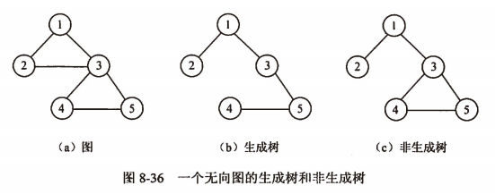
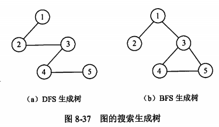
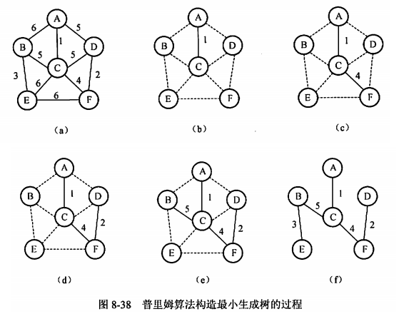

title:: 数据结构/图/生成树及最小生成树
alias:: 生成树及最小生成树

- ## 生成树的概念
	- 一个连通图的生成树是一个==极小连通子图==，它包含图中的全部顶点，但只有构成一棵树的n-1条边。图8-36所示的是图及其生成树和非生成树。
	  {:height 203, :width 507}
	- 按深度和广度优先搜索进行遍历将得到不同的生成树，分别称为深度优先和广度优先生成树。例如，图8-37所示的是图的一棵深度优先生成树和一棵广度优先生成树。
	- 对于有n个顶点的连通图，至少有n-1条边，而生成树中恰好有n-1条边，所以连通图的生成树是该图的极小连通子图。若在图的生成树中任意加一条边，则必然形成回路。
	  {:height 192, :width 322}
	- 图的生成树不是唯一的。从不同的顶点出发，选择不同的存储方式，可以得到不同的生成树。对于非连通图而言，每个连通分量中的顶点集和遍历时走过的边集一起构成若干棵生成树，把它们称为非连通图的生成树森林。
- ## 最小生成树
	- 一个图的生成树不唯一，从不同的顶点出发可得到不同的生成树。对于连通网来说，边是带权值的，生成树的各边也带权值，因此把生成树各边的权值总和称为生成树的权，把权值最小的生成树称为最小生成树。求解最小生成树有许多实际的应用。
	- 常用的最小生成树算法有普里姆(Prim)算法和克鲁卡尔(Kruskal)算法。
	- ### 普里姆(Prim)算法
		- 假设N=(V,E)是连通网，TE是N上最小生成树中边的集合。算法从顶点集合U={u0}(u0属于V)、边的集合TE={}开始，重复执行下述操作：在所有u属于U，v属于V-U的边(u,v)属于E中找一条代价最小的边(u0,v0)，把这条边并入集合TE，同时将v0并入集合U，直至U=V时为止。此时TE中必有n-1条边，T=(V,{TE})为N的最小生成树。
		- 由此可知，普里姆算法构造最小生成树的过程是以一个顶点集合U={u0}作初态，不断寻找与U中顶点相邻且代价最小的边的另一个顶点，扩充U集合直至U=V时为止。
		- 用普里姆算法构造最小生成树的过程如图8-38所示。
		  {:height 420, :width 530}
		- 普里姆算法的时间复杂度为O(n2)，与图中的边数无关，因此该算法适合于求边稠密的网的最小生成树。
	- ### 克鲁斯卡尔(Kruskal)算法
		- 克鲁斯卡尔求最小生成树的算法思想为：假设连通网N=(V,E)，令最小生成树的初始状态为只有n个顶点而无边的非连通图T=(V,{})，图中每个顶点自成一个连通分量。在E中选择代价最小的边，若该边依附的顶点落在T中不同的连通分量上，则将此边加入到T中，否则舍去此边而选择下一条代价最小的边。依此类推，直至T中所有顶点都在同一连通分量上为止。
		- 用克鲁斯卡尔算法构造最小生成树的过程如图8-39所示。
		  {:height 206, :width 628}
		- 克鲁斯卡尔算法的时间复杂度为O(edge)，与图中的顶点数无关，因此该算法适合于求==边稀疏==的网的最小生成树。