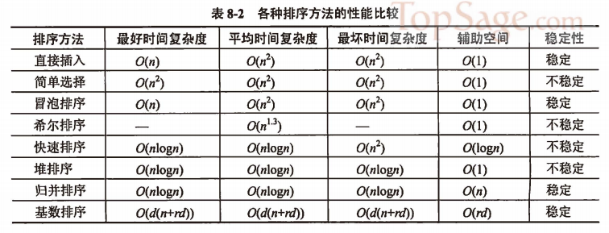

title:: 数据结构/排序/内部排序方法小结

- 综合比较所讨论的各种排序方法，大致结果如表8-2所示。
  {:height 246, :width 642}
- 迄今为止，已有的排序方法远远不止上述几种，人们之所以热衷于研究各种排序方法，不仅是由于排序在计算机运算中所处的重要位置，而且还因为不同的方法各有优缺点，可根据需要运用到不同的场合。选取排序方法时需要考虑的因素有待排序的记录个数n；记录本身的大小；关键字的分布情况；对排序稳定性的要求；语言工具的条件和辅助空间的大小。
- 依据这些因素，可以得到以下几点结论。
	- 若待排序的记录数目n较小时，可采用插入排序和选择排序。由于直接插入排序所需的记录移动操作较简单选择排序多，因而当记录本身信息量较大时，用简单选择排序方法较好。
	- 若待排序记录按关键字基本有序，若待排序记录按关键字基本有序，则宜采用直接插入排序或冒泡排序。
	- 当n很大且关键字的位数较少时，采用链式基数排序较好。
	- 若n较大，则应采用时间复杂度为 \( O(n \log n) \) 的排序方法，例如快速排序、堆排序或归并排序。快速排序目前被认为是内部排序方法中最好的方法，当待排序的关键字为随机分布时，快速排序的平均运行时间最短；但堆排序只需1个辅助存储空间，并且不会出现在快速排序中可能出现的最坏情况。这两种方法都是不稳定的排序方法。若要求排序稳定，可选择归并排序。通常可将归并排序和直接插入排序结合起来使用。先利用直接插入排序求得较长的有序子序列，然后再两两归并。因为直接插入排序是稳定的，所以改进的归并排序是稳定的。
- 前面讨论的内部排序算法（除基数排序外）都是在一维数组上实现的。当记录本身信息量较大时，为避免耗费大量的时间移动记录，可以采用链表作为存储结构，在这种情况下，希尔排序、快速排序和堆排序就不适用了。