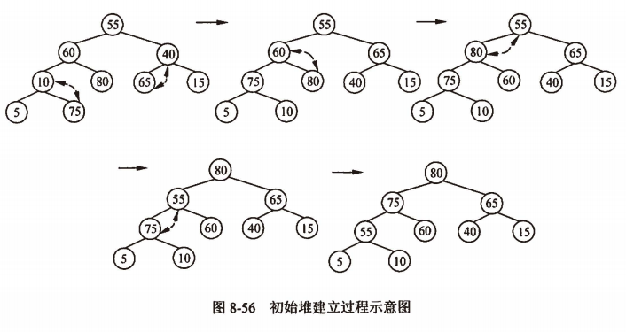

title:: 数据结构/排序/堆排序
alias:: 堆排序

- 对于n个元素的关键字序列{K1,K2,…,Kn}，当且仅当满足下列关系时称其为堆。
  $$
  \begin{cases}
  K_{i} \le K_{2i} \\
  K_{i} \le K_{2i+1}
  \end{cases}
  $$
  或
  $$
  \begin{cases}
  K_{i} \ge K_{2i} \\
  K_{i} \ge K_{2i+1}
  \end{cases}
  $$
- 若将此序列对应的一维数组（即以一维数组作为序列的存储结构）看成是一个 **完全二叉树** ，则堆的含义表明，完全二叉树中所有非终端节点的值均不小于（或不大于）其左、右孩子节点的值。因此，在一个堆中，堆顶元素（即完全二叉树的根节点）必为序列中的最大元素（或最小元素），并且堆中任一棵子树也都是堆。若堆顶为最小元素，则称为小根堆；若堆顶为最大元素，则称为大根堆。
- 堆排序的基本思想是：对一组待排序记录的关键字，首先按堆的定义排成一个序列（即建立初始堆），从而输出堆顶的最大关键字（对于大根堆而言），然后将剩余的关键字再调整成新堆，便得到次大的关键字，如此反复，直到全部关键字排成有序序列为止。
- 初始堆的建立方法是：将待排序的关键字分放到一棵完全二叉树的各个节点中（此时完全二叉树并不一定具备堆的特性），显然，所有 \( i> \lfloor n/2 \rfloor \) 的节点Ki都没有子节点，以这样的Ki为根的子树已经是堆，因此初始建堆可从完全二叉树的第 \( i(i=\lfloor n/2 \rfloor ) \) 个节点Ki开始，通过调整，逐步使以 \( K_{\lfloor n/2 \rfloor } \)、\( K_{\lfloor n/2 \rfloor -1} \)、\( K_{\lfloor n/2 \rfloor -2} \)、…、K2、K1为根的子树满足堆的定义。
- 在对Ki为根的子树建堆的过程中，可能需要交换Ki和K2i（或K2i+1）的值，如此一来，以K2i（或K2i+1）为根的子树可能不再满足堆的定义，则应继续以K2i（或K2i+1）为根进行调整，如此层层地递推下去，可能会一直延伸到树叶时为止。这种方法就像过筛子一样，把最大的关键字一层一层地筛选出来，最后输出堆顶的最大元素。
- 【函数】将一整型数组中的元素调整成大根堆。
  ```c
  void HeapAdjust(int data[], int s, int m)
  /* data[s..m]所构成的一个元素序列中，除了data[s]外，其余元素均满足堆的定义 */
  /* 调整元素data[s]的位置，使data[s..m]成为一个大根堆 */
  { int t,j;
    t = data[s]; /* 备份元素data[s]，为其找到适当位置后再插入 */
   for(j=2*s+1;j<=m;j=j*2+1) { /* 沿值较大的孩子节点向下筛选 */
     if(j<m && data[j] < data[j+1]) ++j; /* j是值较大的元素的下标 */
     if (!(t < data[j])) break; 
     data[s] = data[j]; s=j; /* 用s记录行为插入元素的位置（下标） */
   }
   data[s] = t; /* 将备份元素插入由s所指出的插入位置 */
  }
  ```
- 调整成新堆：假设输出堆顶元素之后，以堆中最后一个元素替代，那么根节点的左、右子树均为堆，此时只需自上至下进行调整即可。
- 【函数】用堆排序方法对整型数组进行非递减排序。
  ```c
  void HeapSort(int data[], int n) /* 数组data[0..n-1]中的n个元素进行堆排序 */
  { int i;
    int t;
   for(i = n/2-1;i>=0;--i) /* 把data[0..n-1]调整为大根堆 */
     HeapAdjust(data, i, n-1);
   for(i=n-1;i>0;--i)
   {
     t = data[0]; data[0] = data[i];
     data[i] = t; /* 堆顶元素data[0]与序列的最后元素data[i]交换 */
     HeapAdjust(data,0,i-1); /* 待排元素的个数减1，将data[0..i-1]重新调整为大根堆 */
   }
  }
  ```
- 序列(55,60,40,10,80,65,15,5,75)建立初始堆的过程如图8-56所示，调整为新堆的过程如图8-57所示。
  {:height 318, :width 590} 
  {:height 174, :width 598}
- 对于记录数较少的文件来说，堆排序的优越性并不明显，但对大量的记录来说堆排序是很有效的。堆排序的整个算法时间是由建立堆和不断调整堆这两部分时间代价构成的。可以证明，堆排序算法的时间复杂度为\( O(n \log n) \) 。此外，堆排序只需要一个记录大小的辅助空间。堆排序是一种不稳定的排序方法。