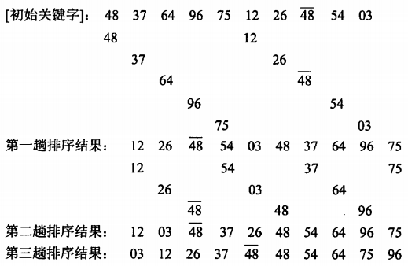

filters:: {"索引" false}
title:: 数据结构/排序/希尔排序
alias:: 希尔排序

- 希尔排序又称“缩小增量排序”，是对直接插入排序方法的改进。
- 希尔排序的基本思想是：先将整个待排记录序列分割成若干序列，然后分别进行直接插入排序，待整个序列中的记录基本有序时，再对全体记录进行一次直接插入排序。具体要求做法是：先取一个小于n的整数d1作为第一个增量，把文件的全部记录分成d1个组，即将所有距离为d1倍数的记录放在同一个组中，在各组内进行直接插入排序；然后取第二个增量d2<d1，重复上述分组和排序工作，依此类推，直至所取的增量di=1(di<di-1<….<d2<d1)，即所有记录放在同一组进行直接插入排序为止。
- 当增量序列为5，3，1时，希尔插入排序过程如下所示。
  {:height 289, :width 442}
- 【函数】用希尔排序方法对整型数组进行非递减排序。
  ```c
  void ShellSort(int data[], int n)
  {
    int *delta, k, i, t, dk, j;
    k = n;
    /* 从k=n开始，重复k=k/2运算，直到k等于0，所得k值的序列作为增量序列存入delta */
    delta = (int *)malloc(sizeof(int)*(n/2));
    i = 0;
    do {
      k = k/2; delta[i++] = k;
    } while(k>0);
    i = 0;
    while ((dk = delta[i]) > 0) {
      for(k = delta[i]; k <n; ++k)
        if(data[k]<data[k-dk]) { /* 将元素data[k]插入到有序增量子表中 */
          t = data[k]; /* 备份待插入的元素，空出一个元素位置 */
          for(j = k-dk; j >= 0 && t < data[j]; j -= dk)
            data[j+dk] = data[j]; /* 寻找插入位置的同时元素后移 */
          data[j+dk] = t; /* 找到插入位置，插入元素 */
        }
      ++i;
    } /*while*/
  }
  ```
- 希尔排序是一种==不稳定==的排序方法，据统计分析其时间复杂度为 \( O(n^{1.3}) \)，排序过程中仅需要一个元素的辅助空间用于数组元素值的交换，空间复杂度为O(1)。