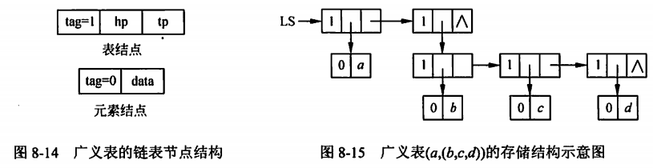

alias:: 广义表

- ## 广义表的定义
	- 广义表是线性表的推广，是由0个或多个单元素或子表组成的有限序列。
	- 广义表与线性表的区别在于：**线性表**的元素都是结构上不可分的单元素，而**广义表**的元素既可以是单元素，也可以是有结构的表。
	- 广义表一般记为 LS = (a1,a2,…,an)
	- 其中，ai(1<=i<=n)既可以是单个元素，又可以是广义表，分别称为原子和子表。
	- 广义表的长度是指广义表中元素的个数。广义表的深度是指广义表展开后所含的括号的最大层数。
- ## 广义表的基本操作
	- 与线性表类似，广义表也有查找、插入和删除等操作。由于广义表的结构较，其各种运算的实现也不如线性表简单，这里只讨论两个重要的运算。
	- 1. 取**表头**head(LS)。非空广义表LS的第一个元素称为表头，它可以是一个单元素，也可以是一个子表。
	  2. 取**表尾**tail(LS)。在非空广义表中，除表头元素之外，由其余元素所构成的表称为表尾。非空广义表的表尾必定是一个尾。
- ## 广义表的特点
	- 广义表可以是多层次的结构，因为广义表的元素可以是子表，而子表的元素还可以是子表。
	- 广义表中的元素可以是已经定义的广义表的名字，所以一个广义表可被其他广义表所共享。
	- 广义表可以是一个递归的表，即广义表中的元素也可以是本广义表的名字。
- ## 广义表的存储结构
	- 由于广义表中的元素本身又可以具有结构，它是一种带有层次的非线性结构，因此难以用顺序存储结构表示，通常采用链式存储结构。由上面讨论可知，若广义表不空，则可分解为表头和表尾两部分。反之，一对勾股定理的表头和表尾可唯一确定一个广义表。针对原子和子表可分别设计不同的节点结构，如图8-14所示。对于广义表LS=(a,(b,c,d))，其链式存储结构如图8-15所示。
	- {:height 190, :width 710}