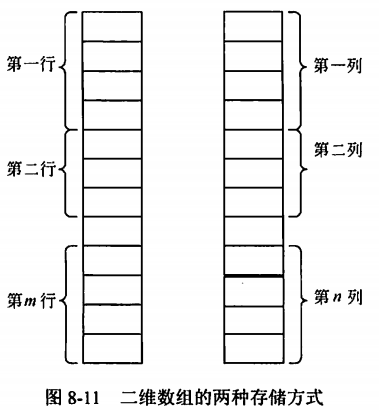

filters:: {"索引" false}

- ## 数组的定义及基本运算
	- ### 数组的定义
		- $$
		  A_{m \times n} = 
		  \begin{bmatrix}
		  a_{11} & a_{12} & a_{13} & \cdots & a_{1n} \\
		  a_{21} & a_{22} & a_{23} & \cdots & a_{2n} \\
		  \vdots & \vdots & \vdots & \ddots & \vdots \\
		  a_{m1} & a_{m2} & a_{m3} & \cdots & a_{mn} \\
		  \end{bmatrix}
		  $$
		- A可看成一个行向量形式的线性表
		  $$
		  A_{m,n} = [[a_{11}a_{12}\cdots a_{1n}], [a_{21}a_{22}\cdots a_{2n}],\cdots,[a_{m1}a_{m2}\cdots a_{mn}]]
		  $$
		  或列向量形式的线性表
		  $$
		  A_{m,n} = 
		  [[a_{11}a_{21}\cdots a_{m1}], [a_{12}a_{22}\cdots a_{m2}],\cdots,[a_{1n}a_{2n},\cdots a_{mn}]]
		  $$
		- 数组结构的特点如下：
		  > 1. 数据元素数目固定。一旦定义了一个数组结构，就不再有元素个数的增减变化
		  > 2. 数据元素具有相同的类型
		  > 3. 数据元素的下标关系具有上下界的约束且下标有序
	- 数组的两个基本运算：
	  > 1. 给定一组下标，存取相应的数据元素
	  > 2. 给定一组下标，修改相应的数据元素中的某个数据项的值
- ## 数组的顺序存储
	- 数组一般不作插入和删除运算，一旦定义了数组，则结构中的数据元素个数和元素之间的关系就不再发生变动，因此数组适合于采用顺序存储结构。
	- 由于计算机的内存结构是一维线性的，因此存储多维数组时必须按某种方式进行降维处理，即将数组元素排成一个线性序列，这就产生了<u>次序约定</u>问题。因为多维数组是由较低一维的数组来定义的，依此类推，通过这种递推关系将多维数组的数据元素排成一个线性序列。
	- 对于数组，一旦确定了其维数和各维的长度，便可为它分配存储空间。反之，只要给出一组下标便可求得相应数组元素的存储位置，即在数据的顺序存储结构中，数据元素的位置是其下标的线性函数。
	- 二维数组的存储结构可分为以行为主序和以列为主序的两种方法
	  {:height 313, :width 282} 
	  以行为主序优先存储的地址计算公式为
	  $$
	  \mathrm{Loc}(a_{ij}) = \mathrm{Loc}(a_{11}) + ((i-1) \times n + (j-1)) \times L
	  $$
	  以列为主序优先存储的地址计算公式为
	  $$
	  \mathrm{Loc}(a_{ij}) = \mathrm{Loc}(a_{11}) + ((j-1) \times m + (i-1)) \times L
	  $$