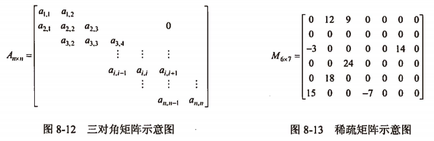

filters:: {"索引" false}
title:: 数据结构/数组&矩阵&广义表/矩阵
alias:: 矩阵

- 在数据结构中，主要讨论如何在节省存储空间的情况下，使矩阵的各种运算能高效地进行。
- 在一些矩阵中，存在很多值相同的元素或者是0元素。为了节省存储空间，可以对这类矩阵进行压缩存储，即为多个值相同的元素只分配一个存储单元，对0元不分配存储单元。假如值相同的元素或0元在矩阵中的分布有一定的规律，则称此类矩阵为特殊矩阵，否则称为稀疏矩阵。
- ## 特殊矩阵
	- 若矩阵中元素（或非0元素）的分布有一定的规律，则称之为特殊矩阵。
	- 若矩阵 A_nxn 中的元素特点为 $$a_{ij}=a_{ji}(1 \le i, j \le n)$$ ，则称之为n阶**对称矩阵**。
	- 若对称矩阵中的每一对元素仅占用一个存储单元，那么就可将 n * n 个元素压缩存储到能存放 n(n+1)/2个元素的存储空间中。不失一般性，以行为主序存储下三角（包括对角线）中的元素。假设以一维数组B[n(n+1)/2]作为n阶对称矩阵A的压缩存储空间，则 $$b[k](1 \le k \le n(n+1)/2)$$ 与矩阵元素 aij 之间存在着一一对应的关系
	  $$
	  k =
	  \begin{cases}
	  \frac{i(i-1)}{2} + j & 当 i \ge j \\
	  \frac{j(j-1)}{2} + i & 当 i \lt j
	  \end{cases}
	  $$
	- **对角矩阵**是指矩阵中的非0元素都集中在以主对角线为中心的带状区域中，即除了主对角线上和直接在对角线上、下方若干条对角线上的元素外，其余的矩阵元素都为0。一个n阶的三对角矩阵如图
	  {:height 196, :width 589}
	- 若以行为主序将n阶三对角矩阵 \( A_{n \times n}  \) 的非0元素存储在一维数组 $$B[k](1 \le k \le 3 \times n - 2)$$ 中，则元素位置之间的对应关系为
	  $$
	  k = 3 \times (i - 1) - 1 + j - i + 1 + 1 = 2i + j - 2 (i \le i, j \le n)
	  $$
- ## 稀疏矩阵
	- 在一个矩阵中，若非0元素的个数远远少于0元素的个数，且非0元素的分布没有规律，则称之为稀疏矩阵。对于稀疏矩阵，存储非0 元素时必须同时存储其位置（即行号和列号），所以三元组(i, j, aij)可唯一确定矩阵A中的一个元素。由此，一个稀疏矩阵可由表示非0元素的三元组及其行、列数唯一确定。如图8-13所示是一个6行7列的稀疏矩阵，其三元组表为((1,2,12),(1,3,9),(3,1,-1),(3,6,14),(4,3,24),(5,2,18),(6,1,15),(6,4,-7))。
	- 稀疏矩阵的三元组表的顺序存储结构称为**三元组顺序表**，常用的三元组表的链式存储结构是**十字链表**。
	- ### TODO 十字链表