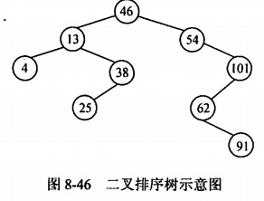
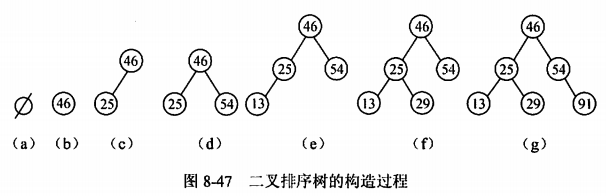
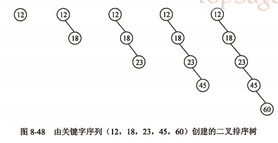
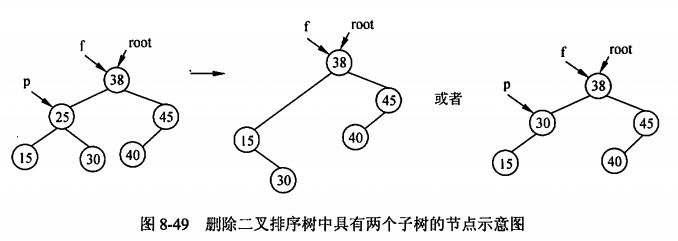
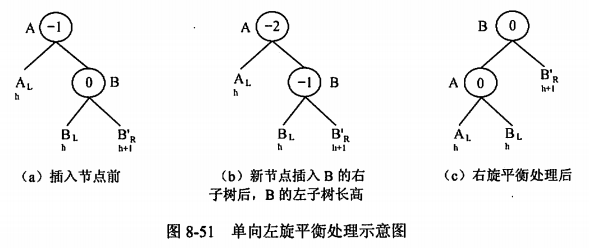
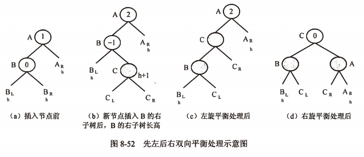
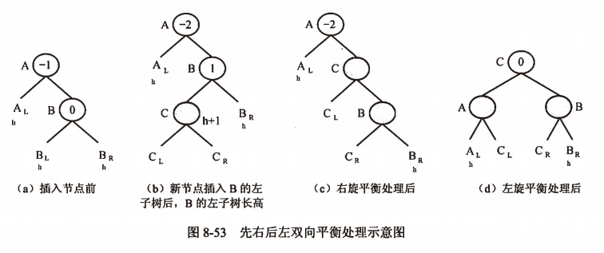

title:: 数据结构/查找/动态查找表
alias:: 动态查找表

- 动态查找表的特点是表结构本身是在查找过程中动态生成的，即对于给定值key，若表中存在关键字等于key的记录，则查找成功返回；否则插入关键字为key的记录。
- ## 二叉排序树
	- ### 二叉排序树的定义
		- 二叉排序树又称二叉查找树，它或者是一棵空树，或者是具有如下性质的二叉树。
		  > 1. 若它的左子树非空，则左子树上所有节点的值均小于根节点的值。
		  > 2. 若它的右子树非空，则右子树上所有节点的值均大于根节点的值。
		  > 3. 左、右子树本身是二叉排序树。
		- 图8-46为二叉排序树的示意图。
		  {:height 201, :width 262}
	- ### 二叉排序树的查找过程
		- 因为二叉排序树中左子树上所有节点的关键字均小于根节点的关键字，右子树上所有节点的关键字均大于根节点的关键字，所以在二叉排序树上进行查找的过程为：二叉排序树非空时，将给定值与根节点的关键字值相比较，若相等，则查找成功；若不等，当根节点的关键字值大于给定值时，下一步到根的左子树中进行查找，否则到根的右子树中进行查找。若查找成功，则查找过程是走了一条从树根到所找到节点的路径；否则查找过程终止于一棵空的子树。
		- 设二叉排序树采用二叉链表存储，节点的类型定义如下：
		  ```c
		  typedef struct Tnode {
		    int data; /* 节点关键字值 */
		    struct Tnode *lchild, *rchild; /* 指向左、右子树的指针 */
		  } Tnode, *Bitree;
		  ```
		- 【函数】二叉排序树的查找算法。
		  ```c
		  Bitree SearchBST(Bitree root, int key, Bitree *father)
		  /* 在root指向根的二叉排序树中查找键值为key的节点 */
		  /* 若找到，则返回该节点的指针；否则返回空指针NULL */
		  {
		    Bitree p = root; *father = NULL;
		    while (p & p->data!=key) {
		      *father = p;
		      if (key < p->data) p = p->lchild;
		      else p = p->rchild;
		    }
		    return p;
		  }
		  ```
	- ### 二叉排序树中插入节点的操作
		- 二叉排序树是通过依次输入数据元素并把它们插入到二叉树的适当位置上构造起来的，具体的过程是：每读入一个元素，建立一个新节点。若二叉排序树非空，则将新节点的值与根节点的值相比较，如果小于根节点的值，则插入到左子树中，否则插入到右子树中；若二叉排序树为空，则新节点作为二叉排序树的根节点。设关键字序列为{46,25,54,13,29,91}，则整个二叉排序树的构造过程如图8-47所示。
		  {:height 185, :width 575}
		- 【函数】二叉排序树的插入算法。
		  ```c
		  int InsertBST(Bitree *root, int e)
		  /* 在 *root指向根的二叉排序树中插入一个键值为e的节点，若插入成功返回0，否则返回-1 */
		  {
		    Bitree s,p,f;
		    s = (Bitree)malloc(sizeof(Tnode));
		    if(s == NULL) return -1;
		    s->data = e; s->lchild = NULL; s->rchild = NULL;
		    p = SearchBST(*root, e &f); /* 寻找插入位置 */
		    if(p != NULL) return -1; /* 键值为e的节点已在树中，不再插入 */
		    if (f == NULL) *root = s; /* 若为空树，键值为e的节点为树根 */
		    else if(e < f->data) f->lchild = s; /* 作为父节点的左孩子插入 */
		    else f->rchild = s;
		    return 0;
		  }
		  ```
		- 从上面的插入过程还可以看到，每次插入的新节点都是二叉树上新的叶子节点，因此插入节点时不必移动其他节点，仅需改动某个节点的孩子指针。这就相当于在一个有序序列上插入一个记录而不需要移动其他记录。它表明，二叉排序树具有类似于折半查找的特性，可采用链表存储结构，因此是动态查找表的一种适宜表示。
		- 另外，由于一棵二叉排序树的形态完全由输入序列决定，所以在输入序列已经有序的情况下，所构造的二叉排序树是一棵单枝树。例如，对于关键字序列(12, 18, 23, 45, 60)，建立的二叉排序树如图8-48所示，这种情况下的查找效率与顺序查找的效率相同。
		  {:height 244, :width 472}
	- ### 二叉排序树中删除节点的操作
		- 在二叉排序树中删除一个节点，不能把以该节点为根的子树都删除，只能删除这个节点并仍旧保持二叉树的特性。也就是说，删除二叉排序树上一个节点相当于删除有序序列中的一个元素。
		- 假设在二叉排序树删除节点\*p(p指向被删除节点)，\*f为其双亲节点，则该操作可分为三种情况：\*p节点为叶子节点；\*p节点只有左子树或者只有右子树；\*p节点的左子树、右子树均存在。
		  1. 若\*p节点为叶子节点，即 p->lchild 及 p->rchild均为空，则由于删去叶子节点后不破坏整棵树的结构，因此只需修改\*p节点的双亲节点\*f的相应指针即可。f->lchild(或 f->rchild) = NULL;
		  2. 若\*p节点只有左子树或者只有右子树，此时，只要将\*p的左子树或右子树接成其双亲节点\*f的左子树（或右子树），即令 f->lchild(或 f->rchild) = p->lchild; 或 f->lchild(或 f->rchild) = p->rchild;
		  3. 若\*p节点的左、右子树均不空，则删除\*p节点时应将其左子树、右子树连接到适当的位置，并保持二叉排序树的特性。可采用如下两种方法进行处理：一是令\*p的左子树为\*f的左子树（若\*p是\*f的左子树，否则为右子树），而将\*p的右子树下接到\*p的中序遍历的直接前驱节点\*s（\*s节点是\*p的左子树中最右下方的节点）的右孩子指针上；二是用\*p的中序直接前驱（或后继）节点\*s代替\*p节点，然后删除\*s节点。如图8-49所示。
		  {:height 229, :width 627}
		- 从二叉排序树的定义可知，中序遍历二叉树可得到一个关键字有序的序列。这也说明，一个无序序列可以通过构造一棵二叉排序树而变成一个有序序列，构造树的过程就是对无序序列进行排序的过程。
- ## 平衡二叉树
	- 平衡二叉树又称为**AVL**树，它或者是一棵空树，或者是具有下列性质的二叉树。它的左子树和右子树都是平衡二叉树，且左子树和右子树的高度之差的绝对值不超过1。若将二叉树节点的**平衡因子**（Balance Factor，BF）定义为该节点左子树的高度减去其右子树的高度，则平衡二叉上所有节点平衡因子只可能是-1、0和1。只要树上有一个节点的平衡因子的绝对值大于1，则该二叉树就是不平衡的。
	- 分析二叉排序树的查找过程可知，只有在树的形态比较均匀的情况下，查找效率才能达到最佳。因此，希望在构造二叉排序树的过程中，保持其为一棵平衡二叉树。
	- 使二叉排序树保持平衡的基本思想是：每当在二叉排序树中插入一个节点时，首先检查是否因插入而破坏了平衡。若是，则找出其中的最小不平衡二叉树，在保持二叉树特性的情况下，调整最小不平衡子树中节点之间的关系，以达到新的平衡。所谓**最小不平衡子树**，是指离插入节点最近且以平衡因子的绝对值大于1的节点作为根的子树。
	- ### 平衡二叉树上的插入操作
		- 一般情况下，假设由于在二叉排序树上插入节点而失去平衡的最小子树根节点的指针为a，也就是说，a所指节点是离插入节点最近的且平衡因子的绝对值超过1的祖先节点，那么，失去平衡后进行调整的规律可归纳为以下4种情况
		- ==单向右旋==平衡处理。由于在\*a的左子树上插入新节点，使\*a的平衡因子由1增至2，导致以\*a为根的子树失去平衡，因此需进行一次向右的顺时针旋转操作，如图8-50所示。
		  {:height 230, :width 540}
		- ==单向左旋==平衡处理。由于在\*a的右子树的右子树上插入新节点，使\*a的平衡因子由-1变为-2，导致以\*a为根的子树失去平衡，因此需进行一次向左的逆时针旋转操作，如图8-51所示。
		  {:height 232, :width 540}
		- ==先左后右双向旋转==平衡处理。由于在\*a的左子树上插入新节点，使\*a的平衡因子由1增至2，导致以\*a为根节点的子树失去平衡，因此需进行两次旋转（先左旋后右旋）如图8-52所示。
		  {:height 288, :width 649}
		- ==先右后左双向旋转==平衡处理。由于在\*a的右子树的左子树上插入新节点，使\*a的平衡因子由-1变为-2，导致以\*a为根节点的子树失去平衡，因此需进行两次旋转（先右旋后左旋），如图8-53所示。
		  {:height 270, :width 663}
- ## B_树
	- 一棵m阶的B_树，或为空树，或为满足下列特性的m叉树。
	  > 1. 树中每个节点至多有m棵子树。
	  > 2. 若根节点不是叶子节点，则至少有两棵子树。
	  > 3. 除根之外的所有非终端节点至少有 \( \lceil m/2 \rceil \) 棵子树。
	  > 4. 所有的非终端节点中包含下列数据信息 (n, A0, K1, A1, K2, A2, …, Kn, An)
	- 其中，Ki(i=1,2,…,n)为关键字，且Ki<Ki+1(i=1, 2, …, n-1)；Ai(i=0, 1, …, n)为指向子树根节点的指针，且指针Ai-1所指子树中所有节点的关键字均小于Ki(i=1,2,…,n)，An所指子树中所有节点的关键字均大于Kn，\( n(\lceil m/2 \rceil -1 \le n \le m-1)\) 为节点中关键字的个数。
	- 所有的叶子节点都出现在同一层次上，并且不带信息（可以看作是外部节点或查找失败的节点，实际上这些节点不存在，指向这些节点的指针为空）。
	- 一棵4阶的B_树如图8-54所示。
	  
	- 由B\_树的定义可知，在B\_树上进行查找的过程是：首先在根节点所包含的关键字中查找给定的关键字，若找到则成功返回；否则确定待查找的关键字所在的子树并继续进行查找，直到查找成功或查找失败（指针为空）时为止。
	- B\_树上的插入和删除运算较为复杂，因为要保证运算后节点中关键字的个数大于等于 \( \lceil m/2 \rceil 1 \) ，因此涉及到节点的“分裂”及“合并”问题。
	- B\_树上插入一个关键字时，不是在树中增加一个叶子节点，而是首先在低层的某个非终端节点中添加一个关键字，若该节点中关键字的个数不超过m-1，则完成插入；否则，要进行节点的“分裂”处理。所谓“分裂”，就是把节点中处于中间位置上的关键字取出来插入到其父节点中，并以该关键字为分界线，把原节点分成两个节点。“分裂”过程可能会一直持续到树根。
	- 同样，在B\_树中删除一个节点时，首先找到关键字所在的节点，若该节点在含有信息的最后一层，且其中关键字的数目不少于 \( \lceil m/2 \rceil -1 \)，则完成删除；否则需进行节点的“合并”运算。
	- 若待删除的关键字所在节点不在含有信息的最后一层上，则将该关键字用其在B\_树中的后继替代，然后再删除其后继元素，即将需要处理的情况统一转化为在含有信息的最后一层再进行删除运算。