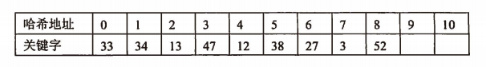
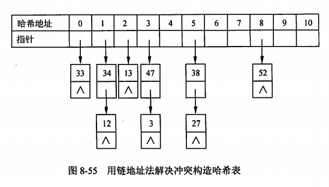

filters:: {"索引" false}
title:: 数据结构/查找/哈希表
alias:: 哈希表

- ## 哈希表的定义
	- _哈希表（Hash Table，也叫散列表），是根据关键码值 (Key-Value) 而直接进行访问的数据结构。也就是说，它通过把关键码值映射到表中一个位置来访问记录，以加快查找的速度。哈希表的实现主要需要解决两个问题，哈希函数和冲突解决。_
	- 前面讨论的几种查找方法，由于记录在存储结构中的相对位置是随机的，所以查找时都要通过一系列的关键字的比较才能确定被查记录在表中的位置。也就是说，这类查找都是以关键字的比较为基础的，而哈希表则通过一个以记录的关键字为自变量的函数（称为==哈希函数==）得到该记录的存储地址查找，所以在哈希表中进行查找操作时，须用同一哈希函数计算得到待查记录的存储地址，然后到相应的存储单元去获得有关信息再判定查找是否成功。
	- _哈希函数也叫散列函数，它对不同的输出值得到一个固定长度的消息摘要。理想的哈希函数对于不同的输入应该产生不同的结构，同时散列结果应当具有同一性（输出值尽量均匀）和雪崩效应（微小的输入值变化使得输出值发生巨大的变化）。_
	- 根据设定的==哈希函数==H(key)和处理冲突的方法，将一组关键字映射到一个有限的连续的地址集（区间）上，并以关键字在地址集中的“像”作为记录在表中的存储位置，这种表称为**哈希表**，这一映射过程称为**哈希造表**或**散列**，所得的存储位置称为**哈希地址**或**散列地址**。
	- 对于某个哈希函数H和两个关键字K1和K2，如果 K1 \ne K2 ，而 H(K1)=H(K2)，则称为冲突。具有相同哈希函数值的关键字对该哈希函数来说称为**同义词**。
		- _现实中的哈希函数不是完美的，当两个不同的输入值对应一个输出值时，就会产生“碰撞”，这个时候便需要解决冲突。_
	- 一般情况下，冲突只能尽可能减少而不能完全避免，因为哈希函数是从关键字集合到地址集合的映像。通常关键字集合比较大，它的元素包含所有可能的关键字，而地址集合的元素仅为哈希表中的地址值。假设关键字集合为某种高级语言的所有标识符，如果一个标识符对应一个存储地址，那就不会发生冲突了，但这是不可能也没有必要的，因为存储空间难以满足，而且任何一个源程序都不会使用这么多标识符。因此在一般情况下，哈希函数是一个压缩映像，冲突是不可避免的。
	- 对哈希表，主要考虑两个问题：一是如何构造哈希函数，二是如何解决冲突。
- ## 哈希函数的构造方法
	- 常用的哈希函数构造方法有直接定址法、数字分析法、平方取中法、折叠法、随机数法和除留取余数法。
	- 常用的哈希函数的构造，就解决好两个主要问题。
	  > 1. 哈希函数应是一个压缩映像函数，它应具有较大的压缩性，以节省存储空间。
	  > 2. 哈希函数应具有较好的==散列性==，虽然冲突是不可避免的，但就尽量减少。
	- 要减少冲突，就要高潮使哈希函数尽可能均匀地把关键字映射到符号表存储区的各个存储地址上，这样就可以提高查找效率。构造哈希函数时，一般都要对关键字进行计算，且使关键字的所有组成部分都能起作用。
- ## 处理冲突的方法
	- _常见的冲突解决方法有开放定址法，链地址法，建立公共溢出区等。实际的哈希表实现中，使用最多的是链地址法_
	- 解决冲突就是为出现冲突的关键字找到另一个“空”的哈希地址。在处理冲突的过程中，可能得到一个地址序列Hi(i=1,2,…,k)。常见的处理冲突的方法有如下几种。
	- ### 开放定址法
		- $$
		  H_{i} = (H(key) + d_{i})\%m ;\space i=1,2,...,k(k \le m-1)
		  $$
		  其中，H(key)为哈希函数；m为哈希表表长；di为**增量序列**。
		- 常见的增量序列有如下三种。
		  > 1. di=1,2,3,…,m-1，称为==线性探测再散列==
		  > 2. di=1\^2, -1\^2, 2\^2, -2\^2, 3\^2, …, \pm k\^2(k <= m/2)，称为==二次探测再散列==。
		  > 3. di=伪随机序列，称为==随机探测再散列==。
		- 最简单的产生探测序列的方法是进行**线性探测**。也就是发生冲突时，顺序地到存储区的下一个单元进行探测。
		- 例如，某记录的关键字为key，哈希函数值H(key)=j。若在哈希地址j发生了冲突（即此位置已存放了其他记录），则对哈希地址j+1进行探测，若仍然有冲突，再对地址j+2进行探测，依此类推，直到找到一个“空”的单元将元素存入哈希表。
		- 例如，设关键码序列为47，34，13，12，52，38，33，27，3，哈希表表长为11，哈希函数为Hash(key)=key mod 11，则
		  Hash(47) = 47 MOD 11 = 3，Hash(34) = 34 MOD 11 = 1，
		  Hash(13) = 13 MOD 11 = 2，Hash(12) = 12 MOD 11 = 1，
		  Hash(52) = 52 MOD 11 = 8，Hash(38) = 38 MOD 11 = 5，
		  Hash(3) = 3 MOD 11 = 3。
		- 使用线性探测法解决冲突构造的哈希表如下：
		  {:height 70, :width 509}
		- 由哈希函数得到的关键字47，34，13，52，38，33的哈希地址没有冲突，元素直接存入。
		- 对于元素12，其哈希地址为1，但是该地址中已经存入34，因此由H1=(Hash(12)+1) mod 11 = 2，再试探哈希地址2，但该地址已被元素13占用，发生冲突；再计算H2=(Hash(12)+2) mod 11 = 3，发生冲突（地址3被元素47占用）；再计算H3=(Hash(12)+3) mod 11 = 4，空闲，因此将元素12存入哈希地址为4 的单元。元素27和3也是通过解决冲突后存入的。
		- 线性探测法可能使第i个哈希地址的同义词存入第i+1个哈希地址，这样本就应存入第i+1个哈希地址的元素变成了第i+2个哈希地址的同义词，…，因此，可能出现很多元素在相邻的哈希地址上“聚集”起来的现象，大大降低了查找效率。为此，可采用二次探测法或随机探测再散列法，以改善“聚集”问题。
		- 那么在查找时就有3种可能：第一种情况是在某一位置上查到了关键字等于key的记录，查找成功；第二种情况是按探测序列查不到关键字为key的记录而又遇到了空单元，这里表明元素不在表中，表示查找失败；第三种情况是查遍全表，未查到指定关键字且符号表存储区已满，需进行溢出处理。
		- 线性探测法思路清楚，算法简单，但也存在以下缺点。
		  > 1. 溢出处理需另编程序。一般可另外设立一个溢出表，专门用来存放上述哈希表中放不下的记录。实现溢出表最简单的结构是顺序表，查找方法可用顺序查找。
		  > 2. 线性探测法很容易产生==聚集现象==。所谓聚集现象，就是存入哈希表的记录在表中连成一片。当哈希函数不能把关键字很均匀地散列到哈希表中时，尤其容易产生聚集现象。产生聚集现象后，会增加探测的次数，从而降低了查找效率。
		- 可以采取多种方法减少聚集现象的产生，二次探测再散列和随机探测再散列是两种有效的方法。
	- ### 链地址法
		- _链地址法的基本思想是，为每个 Hash 值建立一个单链表，当发生冲突时，将记录插入到链表中。_
		- 链地址法（或拉链法）是一种经常使用且很有效的方法。它在查找表的每一个记录中增加一个**链域**，链域中存放下一个具有相同哈希函数值的记录的存储地址。利用链域，就把若干个发生冲突的记录链接在一个链表内。当链域的值为NULL时，表示已没有后继记录了。因此，对于发生冲突时的查找和插入操作就跟线性表一样了。
		- 例如，哈希表表长为11、哈希函数为Hash(key)=key mod 11，对于关键码序列47，34，13，12，52，38，33，27，3，使用链地址法构造的哈希表如图8-55所示。
		  {:height 273, :width 495}
		- 在图8-55所示的哈希表中进行成功查找的平均查找长度ASL为
		  $$
		  \mathrm{ASL}=(6 \times 1 + 3 \times 2) / 9 \approx 1.34
		  $$
	- ### 再哈希法
		- $$
		  H_{i} = RH_{i}(key) \quad  (i = 1, 2, ..., k)
		  $$
		  RHi均是不同的哈希函数，即在同义词发生地址冲突时计算另一个哈希函数地址，直到冲突不再发生。这种方法不易产生聚集现象，但增加了计算时间。
	- ### 公共溢出区
		- 无论由哈希函数得到的哈希地址是什么，一旦发生冲突，都填入到公共溢出区中。
- ## 哈希表的查找
	- 在哈希表中进行查找操作时，用与存入元素时相同的哈希函数和冲突处理方法计算得到待查记录的存储地址，然后到相应的存储单元里去获得有关信息再判定查找是否成功。因此，哈希查找的特点如下。
	  > 1. 虽然哈希表在关键字与记录的存储位置之间建立了直接映像，但由于“冲突”的产生，使得哈希表的查找过程仍然是一个给定值和关键字进行比较的过程。因此，仍需以平均查找长度衡量哈希表的查找效率。
	  > 2. 查找过程中需和给定值进行比较的关键字的个数取决于下列三个因素：哈希函数、处理冲突的方法和哈希表的装填因子。
	- 在一般情况下，冲突处理方法相同的哈希表，其平均查找长度依赖于哈希表的装填因子。**哈希表的装填因子**定义为
	  $$
	  a = \frac{表中装入的记录数}{哈希表的长度}
	  $$
	  a标志着哈希表的装满程度。直观地看，a越小，发生冲突的可能性就越小；反之，a越大，表中已填入的记录越多，再填记录时，发生冲突的可能性就越大，则查找时，给定值需与之进行比较的关键字的个数也就越多。