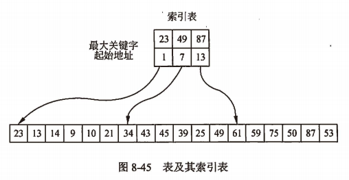

filters:: {"索引" false}
title:: 数据结构/查找/静态查找表的查找方法
alias:: 静态查找表的查找方法

- ## 顺序查找
	- 顺序查找的基本思想是：从表中的一端开始，逐个进行记录的关键字和给定值的比较，若找到一个记录的关键字与给定值相等，则查找成功；若整个表中的记录均比较过，仍未找到关键字等于给定值的记录，则查找失败。
	- 顺序查找的方法对于顺序存储方式和链式存储方式的查找表都适用。
	- 从顺序查找的过程可见，Ci取决于所查记录在表中的位置。若需查找的记录正好是表中的第一个记录时，仅需比较一次；若查找成功时找到的是表中的最后一个记录，则需比较n次。从表尾开始查找时则正好相反，一般情况下，Ci=n-i+1，因此在等概率情况下，顺序查找成功的平均查找长度为
	  $$
	  \begin{align}
	  ASL_{SS} & = \sum_{i=1}^{n}P_{i}C_{i} \\
	  	& = \frac{1}{n}\sum_{i=1}^{n}(n-i+1) \\
	  	& = \frac{n+1}{2}
	  \end{align}
	  $$
	- 也就是说，成功查找的平均比较次数约为表长的一半。若所查记录不在表中，则必须进行n次（不设监视哨，设置监视哨时为n+1次）比较才能确定失败。**监视哨**是指查找表用一维数组存储时，将待查找的记录放置在查找表的第一个记录之前或最后一个记录之后，从而在查找过程中避免对数组元素的下标合法性进行检查。
	- 与其他查找方法相比，顺序查找方法在n值较大时，其平均查找长度较大，查找效率较低。但这种方法也有**优点**，那就是算法简单且适应面广，对查找表的结构没有要求，无论记录是否按关键字有序排列均可应用。
- ## 折半查找(二分法查找)
	- 设查找表的元素存储在一维数组r[1..n]中，在表中的元素已经按关键字递增（或递减）方式排序的情况下，进行折半查找的方法是：首先将待查元素的关键字（key）值与表r中间位置上（下标为mid）记录的关键字进行比较，若相等，则查找成功；若key>r[mid].key，则说明待查记录只可能在后半个子表r[mid+1..n]中，下一步应在后半个子表中进行查找，若key<r[mid].key，说明待查记录只可能在前半个子表r[1..mid-1]中，下一步应在前半个子表中进行查找，这样通过逐步缩小范围，直到查找成功或子表为空时失败为止。
	- 【函数】设有一个整型数组中的元素是按非递减的方式排列的，在其中进行折半查找的算法为：
	  ```c
	  int Bsearch(int r[], int low, int high, int key)
	  /* 元素存储在数组r[low..high]，用折半查找的方法在数组r中找值为key的元素 */
	  {
	    int mid;
	    while(lwo <= high) {
	      mid = (low <= high)/2;
	      if(key == r[mid]) return mid;
	      else if (key < r[mid]) high = mid -1;
	      else low = mid + 1;
	    }
	    return -1;
	  }
	  ```
	- 【函数】设有一个整型数组中的元素是按非递减的方式排列的，在其中进行折半查找的递归算法如下：
	  ```c
	  int Bsearch_rec(int r[], int low, int high, int key)
	  {
	    int mid;
	    if (low <= high) {
	      mid = (low+high)/2;
	      if (key == r[mid]) return mid;
	      else if (key < r[mid]) return Bsearch_rec(r, low, mid-1, key);
	      else return Bsearch_rec(r, mid+1, high, key);
	    }
	    return -1;
	  }
	  ```
	- 折半查找的性能分析如下。
		- 折半查找的过程可以用一棵二叉树描述，方法是以当前查找区间的中间位置序号作为根，左半个子表和右半个子表中的记录序号分别作为根的左子树和右子树上的节点，这样构造的二叉树称为**折半查找判定树**。例如，具有11个节点的折半查找判定树如图8-43所示。
		  
		- 从折半查找判定树可以看出，查找成功时，折半查找的过程恰好走了一条从根节点到被查找节点的路径，与关键字进行比较的次数即为被查找节点在树中的层数。因此，折半查找在查找成功时，进行比较的关键字数最多不超过树的深度，而具有n个节点的判定树的深度为 \( \lfloor \log_{2}n \rfloor +1 \)，所以折半查找在查找成功时和给定值进行比较的关键字个数至多为 \( \lfloor \log_{2}n \rfloor +1 \)。
		- 给判定树中所有节点的空指针域加一个指向方型节点的指针，称这些方型节点为==判定树的外部节点==（与之相对，称那些圆形节点为内部节点），如图8-44所示。那么折半查找不成功的过程就是走了一条从根节点到外部节点的路径。与给定值进行比较的关键字个数等于该路径上内部节点个数，因此折半查找在查找不成功时和给定值进行比较的关键字个数最多也不会超过 \( \lfloor \log_{2}n \rfloor +1\)。
		  
		- 那么折半查找的平均查找长度是多少呢？为了方便起见，不妨设节点总数为n=2^{h}-1，则判定树是深度为h=log_{2}(n+1)的满二叉树。在等概率情况下，折半查找的平均查找长度为
		  $$
		  \begin{align}
		  \mathrm{ASL}_{bs} &= \sum_{j=1}^{n} P_{i}C_{i} \\
		  	&= \frac{1}{n}\sum_{j=1}^{n}j\times 2^{j-1} \\
		  	&= \frac{n+1}{n}\log_{2}(n+1) - 1
		  \end{align}
		  $$
		  当n值较大时，\( \mathrm{ASL}_{bs} \approx \log_{2}(n+1) - 1 \)。
	- 折半查找比顺序查找效率要高，但它要求查找表进行顺序存储并且按关键字有序排列。因此，当需要对表进行元素的插入或删除操作时，需要移动大量的元素。所以折半查找适用于表不易变动，且又经常进行查找的情况。
- ## 分块查找
	- 分块查找又称**索引顺序查找**，是对顺序查找方法的一种改进，其效率介于顺序查找与折半查找之间。
	- 在分块查找过程中，首先将表分成若干块，每一块的关键字不一定有序，但块之间是有序的，即后一块中所有记录的关键字均大于前一个块中最大的关键字。此外，还建立了一个“索引表”，索引表按关键字有序，如图8-45所示。
	  {:height 242, :width 469}
	- 因此，分块查找过程分为两步：第一步在索引表中确定待查记录所在的块；第二步在块内顺序查找。
	- 由于分块查找实际上是两次查找的过程，因此其平均查找长度应该是两次查找的平均查找长度（块内查找与索引查找）之和，即
	  $$
	  \mathrm{ASL}_{bs} = L_{b} + L_{W}
	  $$
	  其中，Lb为查找索引表的平均查找长度，Lw为块内查找的平均查找长度。
	- 分块查找时，可将长度为n的表均匀地分成b块，每块含有s个记录，即有 \( b = \displaystyle{\lceil \frac{n}{s} \rceil} \)。在等概率查找的情况下，块内查找的概率为1/s，每块的查找概率为1/b，若用顺序查找确定元素所在的块，则分块查找的平均查找长度为
	  $$
	  \begin{align}
	  \mathrm{ASL}_{bs} & = L_{b} + L_{w} \\
	  	            & = \frac{1}{b} \sum_{j=1}^{b}j + \frac{1}{s}\sum_{i=1}^{s} i \\
	  	            & = \frac{b+1}{2} + \frac{s+1}{2} \\
	  	            & = \frac{1}{2}(\frac{n}{s} + s) + 1 \\
	  \end{align}
	  $$
	- 可见，其平均查找长度不仅与表长n有关，而且与每一块中的记录数s有关。可以证明，当s取 \( \sqrt{n} \) 时，\( \mathrm{ASL}_{bs} \) 取最小值 \( \sqrt{n} + 1 \) ，此时的查找效率较顺序查找要好的多，但远不及折半查找。考虑到索引表是一个有序表，因此可以用折半查找确定元素所在的块。