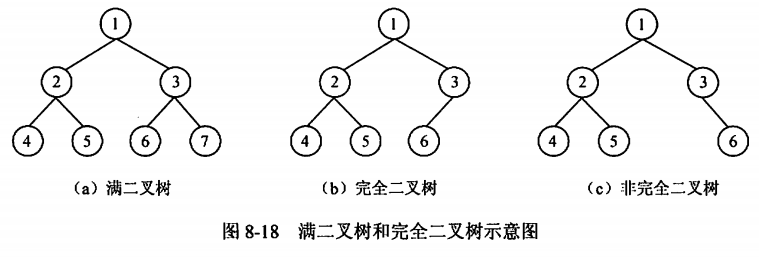
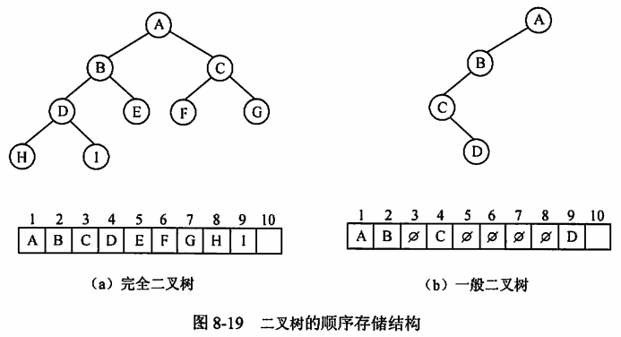
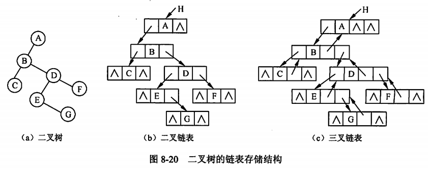

title:: 数据结构/树/二叉树的性质与存储结构
alias:: 二叉树的性质与存储结构

- ## 二叉树的性质
	- 二叉树第i层(i>=1)上至多有2^{i-1} 个节点
	- 高度为k的二叉树至多有==2^k - 1==个节点(k>=1)
	- 对任何一棵二叉树，若其终端节点数为n0，度为2的节点数为n2，则n0=n2+1
	- 具有n个节点的完全二叉树的深度为 $$\lfloor log_2 n \rfloor + 1$$
	- 对一棵有n个节点的<u>完全二叉树</u>的节点按层次自左至右进行编号，则对任一节点i(1<=i<=n)有：
		- 若i=1，则节点i是二叉树的根，无双亲；若i>1，则其双亲为 \floor i/2
		- 若 2i>n，则节点i没有左孩子，否则其左孩子为2i
		- 若2i+1 > n ，则节点i没有右孩子，否则其右孩子为2i + 1
	- 若深度为k的二叉树有2^k - 1 个节点，则称其为**满二叉树**。可以对满二叉树中的节点进行连续编号：约定编号从根节点起，自上而下、自左至右依次进行。深度为k、有n个节点的二叉树，当且仅当其每一个节点都与深度为k的满二叉树中编号从1至n的节点一一对应时，称之为**完全二叉树**。
	- {:height 204, :width 600}
- ## 二叉树的存储结构
	- ### 二叉树的顺序存储结构
		- 对于深度为k的完全二 叉树，除第k层外，其余各层中含有最大的节点数，即每一层的节点数恰为其上一层节点数的两倍，由此从一个节点的编号可推知其双亲、左孩子和右孩子的编号。
		- 假设有编号为i的节点，则有：
			- 若i=1，该节点为根节点，无双亲
			- 若i>1，该节点的双亲节点为(i+1)/2（取整数）
			- 若2i <= n，则该节点的左孩子编号为2i，否则无左孩子
			- 若2i+1 <= n，则该节点右孩子编号为2i + 1，否则无右孩子
			- 若i为奇数且不为1，则该节点左兄弟的编号为i-1，否则无左兄弟
			- 或i为偶数且小于n，则该节点右兄弟的编号为i+1，否则无右兄弟
		- 完全二叉树的顺序存储结构如图8-19
		  {:height 333, :width 605}
		- 显然，完全二叉树采用顺序存储结构既简单又节省空间，对于一般的二叉树，则不宜采用顺序存储结构。因为一般的二叉树也必须按照完全二叉树的形式存储，也就是要添上一些实际并不存在的“**虚节点**”，这将造成空间的浪费。
		- 在最坏情况下，一个深度为k且只有k个节点的二叉树（单支树）却需要\( 2^k - 1 \)个存储单元
	- ### 二叉树的链式存储结构
		- 由于二叉树的节点中包含有数据元素、左子树的根、右子树的根及双亲等信息，因此可以用三叉链表或二叉链表（即一个节点含有三个指针或两个指针）来存储二叉树，链表的头指针指向二叉树的根节点。
		- {:height 269, :width 668}
		- 设节点中的数据元素为整型，则二叉链表的节点类型定义如下
		  ```c
		  typedef struct BiTnode {
		    int data;
		    struct BiTnode *lchild, *rchild;
		  } BiTnode, *BiTree;
		  ```