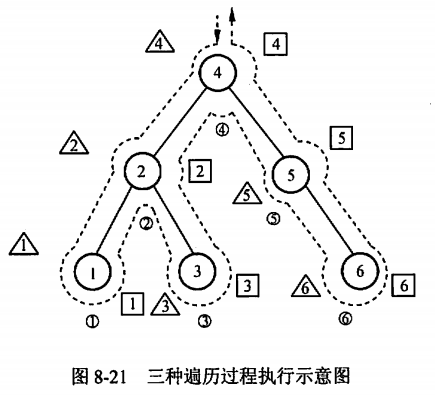

title:: 数据结构/树/二叉树的遍历
alias:: 二叉树的遍历

- ### 二叉树的先序遍历
  ```c
  void PreOrder(BiTree root) {
    if (root != NULL) {
      printf ("%d", root->data);
      PreOrder(root->lchild);
      PreOrder(root->rchild);
    }
  }
  ```
- ### 二叉树的中序遍历
  ```c
  void InOrder(BiTree root) {
    if (root != NULL) {
      InOrder(root->lchild);
      printf("%d", root->data);
      InOrder(root->rchild);
    }
  }
  ```
- ### 二叉树的后序遍历
  ```c
  void PostOrder(BiTree root) {
    if (root != NULL) {
      PostOrder(root->lchild);
      PostOrder(root->rchild);
      printf("%d", root->data);
    }
  }
  ```
- {:height 340, :width 371}
- 遍历二叉树的基本操作就是访问节点，不论按照哪种次序遍历，对含有n个节点的二叉树，遍历算法的时间复杂度都为O(n)。因为在遍历的过程中，每进行一次递归调用，都是将函数的“活动记录”压入栈中，因此，栈的最大长度恰为树的高度。所以，在最坏情况下，二叉树是有n个节点且高度为n的单枝树，遍历算法的空间复杂度也为O(n)。
- 借助于一个栈，可将二叉树的递归遍历算法转换为**非递归算法**。下面以中序遍历为例给出中序遍历的非递归算法。
  ```c
  int InOrderTraverse(BiTree root) {
    Bitree p;
    InitStack(Str);
    p = root; /* p指向树根节点 */
    while(p != NULL || !StackEmpty(St)) {
      if (P != NULL) { /* 不是空树 */
        Push(St, p); /* 根节点指针入栈 */
        p = p->lchild; /* 进入根的左子树 */
      } else {
        q = Top(St); Pop(St); /* 栈顶元素出栈 */
        printf("%d", q->data); /* 访问根节点 */
        p = q->rchild; /* 进入根的右子树 */
      }
    }
  }
  ```
- 遍历二叉树的过程实质上是按一定规则将树中的节点排成一个线性序列的过程，因此遍历操作得到的是树中节点的一个线性序列。在每一种序列中，有且仅有一个起始点和一个终节点，其余节点有且仅有唯一的直接前驱和直接后继。显然，关于节点的前驱和后继的讨论是针对某一个遍历序列而言的。
- 对二叉树还可以进行层序遍历。设二叉树的根节点所在层数为1，层序遍历就是从树的根节点出发，首先访问第1层的树根节点，然后从左到右依次访问第二层上的节点，其次是第层上的节点，依此类推，自上而下、自左至右逐层访问树中各节点的过程就是**层序遍历**。
  ```c
  void LevelOrder(BiTree root) {
    Bitree p;
    InitQueue(Q); /* 创建一个空队列 */
    EnQueue(Q,root); /* 将根指针加入队列 */
    while (!Empty(Q)) { /* 队列不空 */
      DeQueue(Q, p); /* 队头元素出队，并使p取队头元素的值 */
      printf("%d", p->data); /* 访问节点 */
      if (p->lchild) EnQueue(p->lchild);
      if (p->rchild) EnQUeue(p->rchild);
    } 
  }
  ```