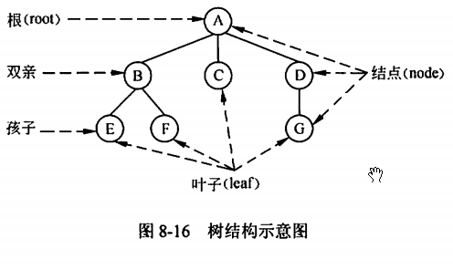
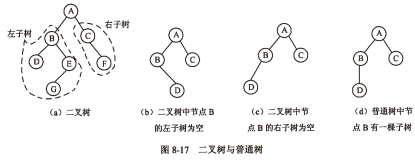

filters:: {"索引" false}
title:: 数据结构/树/树与二叉树的定义
alias:: 树与二叉树的定义

- ## 树的定义
	- 树是n(n>=0)个节点的有限集合，当n=0时称为**空树**。在任一非空树(n>0)中，有且仅有一个称为**根**的节点；其余节点可分为m(m>=0)个互不相交的有限集T1,T2,…,Tm，其中每个Ti又都是一棵树，并且称为根节点的子树。
	- 树的定义是递归的，它表明了树本身的固有特性，也就是一棵树由若干棵子树构成，而子树又由更小的子树构成。
	- 该定义只给出了树的组成特点，若从数据结构的逻辑关系角度来看，树中元素之间有明显的层次关系。对树中的某个节点，它最多只和上一层的一个节点（即其双亲节点）有直接的关系，而与其下一层的多个节点（即其孩子节点）有直接关系，如图8-16所示。通常，凡是分等级的分类方案都可以用具有严格层次关系的树结构来描述。
	  {:height 221, :width 387}
- ## 树的基本概念
	- 双亲孩子和兄弟：节点的子树的根称为该节点的**孩子**；相应的，该节点称为其子节点的**双亲**。具有相同双亲的节点互为**兄弟**。
	- 节点的**度**：一个节点的子树的个数记为该节点的度
	- **叶子**节点：也称为终端节点，指度为0的节点
	- 内部节点：度不为0的节点称为**分支节点**或非终端节点。除根节点之外，分支节点也称为内部节点
	- 节点的**层次**：根为第一层，根的孩子为第二层，依此类推，若某节点在第i层，则其孩子节点在第i+1层
	- 树的**高度**：一棵树的最大层次数记为树的高度（或深度）
	- 有序（无序）树：若将树中结点的各子树看成是从左到右具有次序的，即不能交换，则称该树为**有序树**，否则称为无序树。
- ## 二叉树的定义
	- 二叉树是n(n>=0)个节点的有限集合，它是空树(n=0)，或者是由一个根节点及两棵不相交的且分别称为左右子树的二叉树所组成。可见，二叉树同样具有递归性质。
	- 特别需要注意的是，尽管树和二叉树的概念之间有许多联系，但它们是两个不同的概念。树和二叉树之间最主要的区别是：二叉树节点的子树要区分**左子树**和**右子树**，即使在节点只有一棵子树的情况下，也要明确指出该子树是左子树还是右子树。另外，二叉树节点最大度为2，而树中不限制节点的度数，如图8-17所示：
	  {:height 255, :width 640}