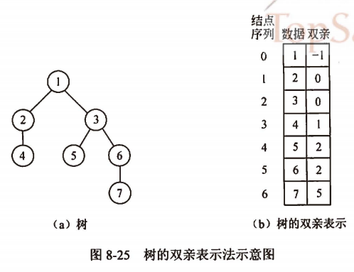
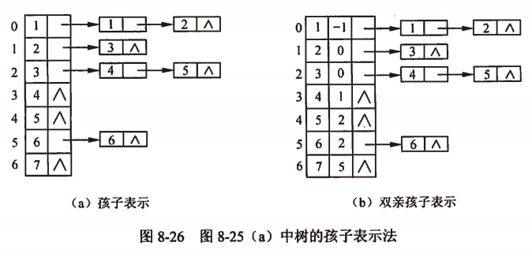
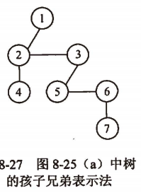
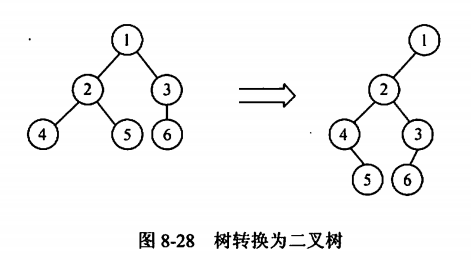
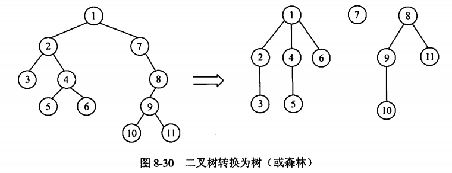

title:: 数据结构/树/树和森林
alias:: 树和森林

- ## 树的存储结构
	- ### 树的双亲表示法
		- 用一组地址连续的单元存储树的节点，并在每个节点中附设一个指示器，指出其双亲节点在该存储结构中的位置（节点所在数组元素的下标）。显然，这种表示对于求指定节点的双亲或祖先都十分方便，但对于求指定节点的孩子及后代则需要遍历整个数组。
		  {:height 332, :width 433}
	- ### 树的孩子表示法
		- 在存储结构中用指针指示出节点的每个孩子，由于树中每个节点的子树数目不尽相同，因此在采用链式存储结构时可以考虑多重链表。因为每个节点的指针数目不好确定，对于定长的节点可依据树的度来设置节点中的指针，显然会造成极大的浪费；若设置节点中的指针数目不相等，则运算时又不方便，为此可以考虑为树中每个节点的孩子建立一个链表，即令每个节点的所有孩子节点构成一个用单链表表示的线性表，则n个节点的树具有n个单链表。将这n个单链表的头指针又排成一个线性表，如图8-26（a）所示。
		  {:height 276, :width 574}
		- 也可以将双亲表示法和孩子表示法结合起来，形成树的双亲孩子表示结构，如图8-26（b）所示。
	- ### 孩子兄弟表示法
		- 又称为二叉链表表示法。在链表的节点中设置两个指针域分别指向该节点的第一个孩子和下一个兄弟，如图8-27所示。
		  {:height 227, :width 160} 
		  树的孩子兄弟表示法为实现树、森林与二叉树之间的转换提供了基础，充分利用二叉树的有关算法来实现树及森林的操作，对难于把握规律的树和森林有着重要的现实意义。
- ## 树和森林的遍历
	- ### 树的遍历
		- 由于树中的每个节点可以有两棵以上的子树，因此遍历树 的方法有两种：先根遍历和后根遍历。
			- 树的先根遍历：树的先根遍历是先访问树的根节点，然后依次先根遍历根的各棵子树。对树的先序遍历等同于对转换所得的二叉树进行先序遍历。
			- 树的后根遍历：树的后根遍历是先依次后根遍历树根的各棵子树，然后访问树根节点。树的后根遍历等同于对转换所得的二叉树进行中序遍历。
	- ### 森林的遍历
		- 按照森林和树的相互递归定义，可以得出森林的两种遍历方法
			- 先序遍历森林：若森林非空，访问森林中第一棵树的根节点，先序遍历第一棵树的根节点，先序遍历第一棵子树根节点的子树森林，再先序遍历除第一棵树之外剩余的树所构成的森林。
			- 中序遍历森林：若森林非空，先中序遍历森林中第一棵树的子树森林，然后访问第一棵树的根节点，最后中序遍历除第一棵树之外剩余的树所构成的森林。
- ## 树、森林和二叉树之间的相互转换
	- 树、森林和二叉树之间可以互相进行转换，即任何一个森林或一棵树可以对应一棵二叉树，而任一棵二叉树也能对应到一个森林或一棵树上。
	- ### 树、森林转换为二叉树
		- 利用树的孩子兄弟表示法可导出树与二叉树的对应关系，在树的孩子兄弟表示法中，从物理结构上看与二叉树的二叉链表表示法相同，因此可以用这种同一存储结构的不同解释将一棵树转换为一棵二叉树，如图8-28所示。一棵树可转换成唯一的一棵二叉树。
		  {:height 224, :width 401}
		- 由于树根没有兄弟，所以树转换为二叉树后，二叉树的根一定没有右子树。这样，将一个森林转换为一棵二叉树的方法是：先将森林中的每一棵树转换为二叉树，再将第一棵树的根作为后的二叉树的根，第一棵树的左子树作为转换后二叉树根的左子树，第二棵树作为后二叉树的右子树，第三棵树作为转换后二叉树根的右子树的右子树，依此类推，森林就可以转换为一棵二叉树，如图8-29所示。
		  {:height 210, :width 435}
	- ### 二叉树转换为树和森林
		- 二叉树可以转换为唯一的树或森林，如图8-30所示。
		  {:height 221, :width 570}