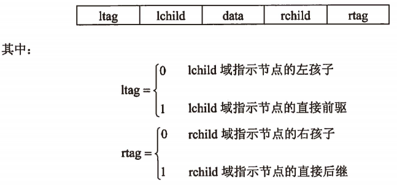
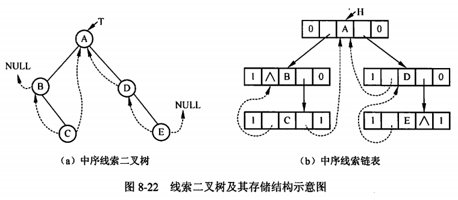

filters:: {"索引" false}
title:: 数据结构/树/线索二叉树
alias:: 线索二叉树

- ## 线索二叉树的定义
	- 二叉树的遍历实质上是对一个非线性结构进行线性化的过程，它使得每个节点（除第一个和最后一个外）在这些线性序列中有且仅有一个直接前驱和直接后继。但在二叉链表存储结构中，只能找到一个节点的左右孩子，而不能直接得到节点在任一遍历序列中的**前驱**和**后继**，这些信息只有在遍历的动态过程中才能得到，因此，引入线索二叉树来保存这些动态过程得到的信息。
- ## 建立线索二叉树
	- 为了保存节点在任一序列中的前驱和后继信息，可以考虑在每个节点中增加两个指针域来存放遍历时得到的前驱和后继信息，这样就可以为以后的访问带来方便。但增加指针信息会降低存储空间的利用率，因此可考虑采用其他方法。
	- 若n个节点的二叉树采用二叉链表作存储结构，则链表中必然有n+1个空指针域，可以利用这些空指针域来存放节点的前驱和后继信息。线索链表的节点结构如下所示。
	  {:height 239, :width 495}
	- 若二叉树的二叉链表采用以上所示的节点结构，则相应的链表称为**线索链表**，其中指向节点前驱、后继的指针称为**线索**。加上线索的二叉树称为**线索二叉树**。对二叉树以某种次序遍历使其成为线索二叉树的过程称为**线索化**。中序线索二叉树及其存储结构如图8-22所示：
	  {:height 269, :width 599}
	- 那么如何进行线索化呢？按某种次序将二叉树线索化，实质上是在遍历过程中用线索取代空指针。因此，若设指针p指向正在访问的节点，则遍历时设立一个指针pre，使其始终指向刚刚访问过的节点，这样就记下了遍历过程中节点被访问的先后关系。
	  > 1. 若p所指向的节点有空指针域，则将相应的标志域置为1
	  > 2. 若pre != NULL且pre所指节点的rtag等于1，则令pre->rchild=p
	  > 3. 若p所指向节点的ltag等于1，则令p->lchild=pre
	  > 4. 使pre指向刚刚访问过的节点，即令pre=p
	- 需要说明的是，用这种方法得到的线索二叉树，其线索并不完整，也就是说，部分节点的前驱或后继信息还不能从其存储结构中直接得到。
		- _比如：A节点的直接前驱需要通过进一步的运算来得到_
- ## 访问线索二叉树
	- 以中序线索二叉树为例，令p指向树中的某个节点，查找p所指节点的后继节点的方法如下。
		- > 1. 若p->rtag == 1，则p->rchild 即指向其后继节点
		  > 2. 若p->rtag == 0，则p所指节点的中序后继必然是其右子树中进行中序遍历得到的第一个节点。也就是说，从p所指节点的右子树的根节点出发，沿左孩子指针链向下查找，直到找到一个没有左孩子的节点时为止，这个节点就是p所指节点的直接后继节点，也称其为p的右子树中“==最左下==”的节点。
	- 令p指向中序线索树中的某个节点，则查找p所指节点的直接前驱的方法如下。
		- > 1. 若p->ltag == 1，则p->lchild即指向其前驱节点
		  > 2. 若p->ltag == 0，则p所指节点的中序前驱必然是其左子树中进行中序遍历得到的最后一个节点。也就是说，从p所指节点的左子树的根节点出发，沿右孩子指针链向下查找，直到找到一个没有右孩子节点时为止，这个节点就是p所指节点的直接前驱节点，也称其为p的左子树中“==最右下==”的节点。