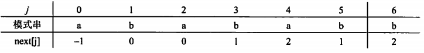

filters:: {"索引" false}
title:: 数据结构/线性结构/串
alias:: 串

- ## 串的定义及基本运算
	- ### 串的定义
		- 串是仅由字符构成的有限序列，是取值范围受限的线性表。一般记为S=‘a1a2…an’，其中S是串名，单引号括起来的字符序列是串值。
	- ### 串的几个基本概念
		- **空串**：长度为零的串，空串不包含任何字符
		- **空格串**：由一个或多个空格组成的串。虽然空格是一个空白字符，但它也是一个字符，计算串长度时要将其计算在内。
		- **子串**：由串中任意长度的连续字符构成的序列称为子串。含有子串的串称为主串。子串在主串中的位置是指子串首次出现时，该子串的第一个字符在主串中的位置。空串是任意串的子串。
		- **串相等**：指两个串长度相等且对应位置上的字符也相同
		- **串比较**：两个串比较大小时以字符的ASCII码值（或其他字符编码集合）作为依据。实质上，比较操作从两个串的第一个字符开始进行，字符的码值大者所在的串为大；若其中一个串先结束，则以串长较大者为大。
	- ### 串的基本操作
		- 赋值操作StrAssign(s,t)：将串s的值赋给串t
		- 联接操作Concat(s,t)：将串t接续在串s的尾部，形成一个新串
		- 求串长StrLength(s)：返回串s的长度
		- 串比较StrCompare(s,t)：比较两个串的大小。返回值-1、0和1分别表示s<t、s=t、s>t三种情况
		- 求子串SubString(s,start,len)：返回串中从start开始的、长度为len的字符序列
- ## 串的存储结构
	- 串的定长存储结构。串的静态存储结构就是串的顺序存储结构，用一组地址连续的存储单元来存储串值的字符序列。由于串中的元素为字符，所以可通过程序语言提供的字符数组定义串的存储空间，也可以根据串长的需要动态申请字符串的空间。
	- 串的链式存储。字符串也可以采用链表作为存储结构，当用链表存储串中的字符时，每个节点中可以存储一个字符，也可以存储多个字符，此时要考虑存储密度问题。
	  在链式存储结构中，节点大小的选择和顺序存储方法中数组空间大小的选择一样重要，它直接影响对串的处理效率。
- ## 串的模式匹配
	- ### 朴素的模式匹配算法
		- 该算法也称为布鲁特-福斯算法，其基本思想是从主串的第一个字符起与模式串的第一个字符比较，若相等，则继续逐对字符进行后续的比较，否则从主串第二个字符起与模式串的第一个字符重新比较，直至模式串中每个字符依次和主串中一个连续的字符序列相等时为止，此时称为匹配成功。如果不能在主串中找到与模式串相同的子串，则匹配失败。
		- ```c
		  int Index(char S[], char T[], intpos)
		  {
		    int i, j, slen, tlen;
		    i = pos; j = 0;
		    slen = strlen(S); tlen = strlen(T);
		    while(i < slen && j < tlen) {
		      if (S[i] == T[j]) { i++; j++; }
		      else {
		        i = i - j + 1;
		        j = 0;
		      }
		    }
		    if (j >= tlen) return i - tlen;
		    return -1;
		  }
		  ```
		- 假设主串和模式串的长度分别为n和m，位置序号从0开始计算，下面分析朴素模式匹配算法的时间复杂度。设从主串的第i个位置开始与模式串匹配成功，在前i趟匹配中（位置0~i-1），每趟不成功的匹配都是模式串的第一个字符与主串中相应的字符不相同，则在前i趟匹配中，字符的比较共进行了i次，而第i+1趟（从位置i开始）成功匹配的字符比较次数为m，所以总的字符比较次数为i+m（0<=i<=n-m）。若在主串的n-m个起始位置上匹配成功的概率相同
		- 在最好情况下，匹配成功时字符间的平均比较次数为 O(n+m)
		  $$
		  \sum_{i=0}^{n-m} p_i(i+m) = \frac{1}{n-m+1} \sum_{i=0}^{n-m} (i+m) \\
		  = \frac{1}{2}(n + m) 
		  $$
		  而在最坏情况下，每一趟不成功的匹配都是模式串的最后一个字符与主串中相应的字符不相等，则主串中新一趟的起始位置为i-m+2。若设从主串的第i个字符开始匹配时成功，则前i趟不成功的匹配中，每趟都比较了m次，总共比较了i x m 次。因此，最坏情况下的平均比较次数为
		  $$
		  \sum_{i=0}^{n-m} p_i((i+1) \times m) = \frac{m}{n-m+1} \sum_{i=0}^{n-m}(i+1) \\
		  = \frac{1}{2} m (n-m+2)
		  $$
		  由于 n>>m ，所以该算法最坏情况下的时间复杂度为 O(n x m)
	- ### 改进的模式匹配算法
		- 改进的模式匹配算法又称为**KMP算法**，其改进之处在于：每当匹配过程中出现相比较的字符不相等时，不需要回溯主串的字符位置指针，而是利用已经得到的“部分匹配”结果，将模式串向右“滑动”尽可能远的距离，再继续进行比较。
		- 设模式串为“p0…pm-1”，KMP匹配算法的思想是：当模式串中的字符pj与主串中相应的字符Si不相等时，因其前j个字符（“p0…pj-1”）已经获得了匹配，所以若模式串中的“p0…pk-1”与“pj-k…pj-1”相同，这时可令pk与Si进行比较，从而使i无须回退。
		- 在KMP算法中，依据模式串的next函数值实现子串的滑动。若令next[j]=k，则next[j]表示当模式串中的pj与主串中相应字符不相等时，令模式串的pk与主串的相应字符进行比较。
		- next函数的定义如下
		  $$
		  next[j]=
		  \begin{cases}
		  -1 & 当j=0时 \\
		  \max\{k|0<k<j且"p_0...p_{k-1}"="p_{j-k}...p_{j-1}"\} \\
		  0 & 其他情况
		  \end{cases}
		  $$
		- ```c
		  void Get_next(char *p, int next[])
		  {
		    int i, j, slen;
		    slen = strlen(p); i = 0;
		    next[0] = -1; j = -1;
		    while (i < slen) {
		      if (j == -1 || p[i] == p[j]) { ++i; ++j; next[i] = j; }
		      else j = next[j];
		    }
		  }
		  ```
		- ```c
		  int Index_KMP(char *s, char *p, int pos, int next[]) 
		  {
		    int i, j, slen, plen;
		    i = pos - 1;
		    j = -1;
		    slen = strlen(s); plen = strlen(p);
		    while (i < slen && j < plen) {
		      if (j == -1 || s[i] == p[j]) { ++i; ++j; }
		      else j = next[j];
		    }
		    if (j >= plen) return i - plen;
		    else return -1;
		  }
		  ```
		- {:height 77, :width 558}