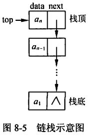
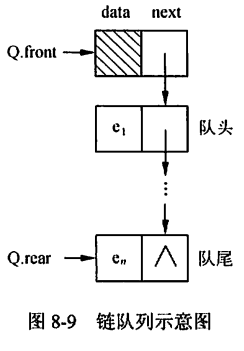

title:: 数据结构/线性结构/栈和队列
alias:: 栈和队列

- 栈和队列是软件设计中常用的两种数据结构，它们的逻辑结构和线性表相同。其特点在于运算有所限制：栈按”后进先出”的规则进行操作，队列按“先进先出”的规则进行操作，故称运算受限的线性表。
- ## 栈
	- ### 栈的定义及基本运算
		- 栈的定义：栈是只能通过访问它的一端来实现数据存储和检索的一种线性数据结构。换句话说，栈的修改是按先进后出的原则进行的。因此，栈又称为==后进先出==（Last In First Out，LIFO）的线性表。在栈中进行插入和删除操作的一端称为栈顶（top），相应地，另一端称为栈底（bottom）。不含数据元素的栈称为空栈。
		- 栈的基本运算：
			- 初始化栈InitStack(S)：创建一个空栈S
			- 判栈空StackEmpty(S)：当栈S为空时返回“真”值，否则返回“假”值
			- 入栈Push(S,x)：将栈顶元素x加入栈顶，并更新栈顶指针
			- 出栈Pop(S)：将栈顶元素从栈中删除，并更新栈顶指针。若需要得到栈顶元素的值，可将Pop(S)定义为一个返回栈顶元素值的函数。
			- 读栈顶元素Top(S)：返回栈顶元素的值，但不修改栈顶指针
	- ### 栈的存储结构
		- 顺序存储：栈的顺序存储是指用一组地址连续的存储单元依次存储自栈顶到栈讴的数据元素，同时附设指针top指示栈顶元素的位置。采用顺序存储结构的栈也称为顺序栈。在该在存储方式下，需要预先定义（或申请）栈的存储空间，也就是说，栈空间的容量是有限的。因此，在顺序栈中，当一个元素入栈时，需要判断是不栈满（栈空间中没有空闲单元），若栈满，则元素入栈会发生上溢现象。
		- 链式存储：为了克服顺序存储的栈可能存在上溢的不足，可以链表存储栈中的元素。用链表作为存储结构的栈也称为链栈。由于栈中元素的插入和删除仅在栈顶一端进行，因此不必设置头节点，链表的头指针就是栈顶指针。
		  {:height 236, :width 151}
		- 栈的应用：栈的典型应用包括表达式求值、括号匹配等，在计算机语言的实现以及将递归过程转变为非递归过程的处理中，栈有重要的作用。
- ## 队列
	- ### 队列的定义及基本运算
		- 队列的定义：队列是一种先进先出（First In First Out，FIFO）的线性表，它只允许在表的一端插入元素，而在表的另一端删除元素。在队列中，允许插入元素的一端称为队尾（rear），允许删除元素的一端称为队头（front）。
		- 队列的基本运算：
			- 初始化队InitQueue(Q)：创建一个空的队列Q
			- 判队空Empty(Q)：当队列为空时返回“真”值，否则返回“假”值
			- 入队EnQueue(Q,x)：将元素x加入到队列Q的队尾，并更新队尾指针
			- 出队DeQueue(Q)：将队头元素从队列Q中删除，并更新队头指针
			- 读队头元素FrontQue(Q)：返回队头元素的值，但不更新队头指针
	- ### 队列的存储结构
		- 队列的顺序存储：
		  collapsed:: true
			- 在顺序队列中，为了降低运算的复杂度，元素入队时只修改队尾指针，元素出队时只修改队头指针。由于顺序队列的存储空间是提前设定的，所以队尾指针会有一个上限值，当队尾指针达到该上限时，就不能只通过修改队尾指针来实现新元素的入队操作了。此时，可通过整除取余运算将顺序队列假想成一个环状结构，称之为循环队列。
			- 
			  
			- ```c
			  #define MAXQSIZE 100
			  typedef struct {
			    int *base; /* 循环队列的存储空间 */
			    int front; /* 指示队头元素 */
			    int rear; /* 指示队尾元素 */
			  } SqQueue;
			  ```
			- ```c
			  int InitQueue(SqQueue *Q)
			  {
			    Q->base = (int *)malloc(MAXQSIZE*sizeof(int));
			    if (!Q->base)return -1;
			    Q->front=0;Q->rear=0;return 0;
			  }
			  ```
			- ```c
			  int EnQueue(SqQueue *Q, int e)
			  {
			    if((Q->rear+1)%MAXQSIZE == Q->front) return -1;
			    Q->base[Q->rear]=e;
			    Q->rear=(Q->rear+1)%MAXQSIZE;
			    return 0;
			  }
			  ```
			- ```c
			  int DeQueue(SqQueue *Q, int *e)
			  {
			    if (Q->rear == Q->front) return -1;
			    *e = Q->base[Q->front];
			    Q->front = (Q->front+1)%MAXQSIZE;
			    return 0;
			  }
			  ```
		- 队列的链式存储：
			- 队列的链式存储也称为链队列。这里为了便于操作，给链队列添加一个头节点，并令头指针指向头节点。因此，队列为空的判定条件是：头指针和尾指针的值相同，且均指向头节点。队列的链式存储结构如图。
			- {:height 290, :width 198}
		- 队列的应用：队列结构常用于处理需要排队的场合，如操作系统中处理打印任务的打印队列、离散事件的计算机模拟等。