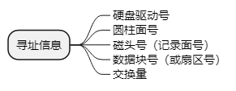
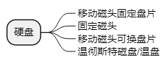

- ## 组成
	- ### 盘片& 盘片组
	- ### 磁头
	- ### 磁道
		- 从外到里编号，最外一圈为0道。
		- **扇区**：每条磁道上的扇区数相同。每个扇区的大小一样，每条磁道都记录同样多的信息。
		- **位密度**：磁道上单位距离可记录的位数称为位密度，单位为bpi（每英寸位数）。
		- **道密度**：单位为tpi，每英寸位数。 里圈磁道的位密度要比外圈磁道的位密度高。
- 硬盘的寻址信息由 硬盘驱动号、圆柱面号、磁头号（记录面号）、数据块号（或扇区号）以及交换量组成。
  
- 磁盘容量有两种指标：
	- `非格式化容量=面数∗（磁道数/面）∗内圆周长∗最大位密度`
	- `格式化容量=面数∗（磁道数/面）∗（扇区数/道）∗（字节数/扇区）`
- 盘片是否固定、磁头是否移动： 
  