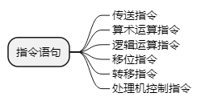

filters:: {"索引" false}
title:: 程序设计语言基础知识/语言处理程序基础/汇编程序基本原理
alias:: 汇编程序基本原理

- ## 汇编语言
	- 汇编语言是为特定的计算机或计算机系统设计的面向机器的符号化的程序设计语言。用汇编语言编写的程序称为汇编语言源程序。因为计算机不能直接识别和运行符号语言程序，所以要用专门的翻译程序——汇编程序进行翻译。用汇编语言编写程序要遵循所用语言的规范和约定。
	- 汇编语言源程序由若干条语句组成，一个程序中可以有三类语句：指令语句、伪指令语句和宏指令语句。
	- ### 指令语句
		- 指令语句又称为机器指令语句，将其汇编后能产生相应的机器代码，这些代码能被CPU直接识别并执行相应的操作。指令语句可分为**传送指令**、**算术运算指令**、**逻辑运算指令**、**移位指令**、**转移指令**和**处理机控制指令**等类型。
		- 
	- ### 伪指令语句
		- 伪指令语句指示汇编程序在汇编源程序时完成某些工作，例如给变量分配存储单元地址，给某个符号赋一个值等。
		- 伪指令语句与指令语句的区别是：伪指令语句经汇编后**【不】**产生机器代码。而指令语句经汇编后要产生相应的机器代码。
		- 另外，伪指令语句所指示的操作是在源程序被汇编时完成的，而指令语句的操作必须在程序运行时完成。
	- ### 宏指令语句
		- 宏的定义必须按照相应的规定进行，每个宏都有相应的宏名。在程序的任意位置，若需要使用这段程序，只要在相应的位置使用宏名，即相当于使用了这段程序。因此，宏指令语句就是宏的引用。
- ## 汇编程序
	- 由于汇编指令中形成操作数地址的部分可能出现后面才会有定义的符号，所以汇编程序一般需要两次扫描源程序才能完成翻译过程。
	- ==第一次扫描的主要工作==是定义符号的值并创建一个**符号表**ST，ST记录了汇编时所遇到的符号的值。另外，有一个固定的**机器指令表**MOT1，其中记录了每条机器指令的记忆码和指令的长度。
	- 在汇编程序翻译源程序的过程中，为了计算各汇编语句标号的地址，需要设立一个**位置计数器**或**单元地址计数器LC**（Location Counter），其初值一般为0。在扫描源程序时，每处理完一条机器指令或与存储分配有关的伪指令（如定义常数语句、定义储存语句），LC的值就增加相应的长度。这样，在汇编过程中，LC的内容就是下一条被汇编的指令的偏移地址。若正在汇编的语句是有标号的，则该标号的值就取LC的当前值。
	- 此外，在第一次扫描中，还需要对与定义符号值有关的伪指令进行处理。**伪指令表**POT1的每一个元素只有两个域：**伪指令助记符**和相应的**子程序入口**。
	- 第一次扫描源程序的过程：
	  > 1. 单元计数器LC置初值0
	  2. 打开源程序文件
	  3. 从源程序中计入第一条语句
	  4. 
	  ```c
	     while (若当前语句不是END语句) {
	     	if (当前语句有标号) 则将标号和单元计数器LC的当前值填入符号表ST;
	     	if (当前语句是可执行的汇编指令语句) 则查找MOT1表获得当前指令的长度K，并令LC=LC+K;
	     	if (当前指令是伪指令) 则查找POT1表并调用相应的子程序;
	     	if (当前指令的操作码是非法记忆码) 则调用出错处理子程序;
	     	从源程序中计入下一条语句;
	     }
	     ```
	  5. 关闭源程序文件
	- ==第二次扫描的任务是产生目标程序==。
		- 除使用前一次扫描所生成的符号表外，还要使用**机器指令表**MOT2，该表中的元素有机器指令助记符、机器指令的二进制操作码(binary-code)、格式(type)和长度(length)。此外，还要设立一个**伪指令表**POT2，供第二次扫描时使用。POT2的每一个元素仍有两个域：伪指令记忆码和相应的子程序入口。与第一次扫描的不同之处是：在第二次扫描中，伪指令有着完全不同的处理。
		- 在第二次扫描中，可执行汇编语句应被翻译成对应的二进制代码机器指令。这一过程涉及两个方面的工作：一是把**机器指令助记符**转换成二进制**机器指令操作码**，这可通过查找MOT2表来实现；二是求出操作数区各操作数的值（用二进制表示）。在此基础上，就可以装配出用二进制代码表示的机器指令。
	-
	- 从求值的角度看，第二部分工作并不复杂。由于形成操作数地址的各个部分都以表达式的形式出现，只要定义一个过程eval-expr(index,value)，其功能是通过index给定一个表达区S的开始位置，该过程就用value返回此表达式的的值。
	- 例如，虚拟计算机COMET的机器指令可归属于X型指令，其汇编语句为：
	  ```
	  OP R1,N2,X2
	  OP R1,N2
	  ```
	- 可以写出下面处理X型指令的程序段（假定index已指向操作数在缓冲区S的首地址）：
	  ```
	  eval-expr(index,R1);
	  index:=index+1;
	  eval-expr(index,N2);
	  if S[index]=',' then
	  	begin
	  		index:=index+1;
	  		eval-expr(index,X2);
	  	end
	  else
	  	X2:=0;
	  ```
	- 类似地，可以写出其他类型指令处理操作数的程序段。设当前可执行汇编语句的操作助记符在MOT2表的索引值为i，则整个可执行汇编语句的处理可以描述如下：
	  ```assembly
	  OP:=MOT2[i].binary-code;
	  TYPE:=MOT2[i].type;
	  case TYPE of
	  	'X': 求X型指令操作数各个部分值，然后按规定字节形成指令；
	  	...
	  end;
	  ```
	- 将形成的指令送往输出区；
	- 在第二次扫描中，根据伪指令助记符，调用POT2表相应元素所规定的子程序。DS伪指令的主要目的是预留存储空间。不妨设一个工作单元K（初值为0），用于累计以字节为单位的存储空间大小。从DS伪指令的操作数区求出K的大小后，就向输出区送K个空格以达到保留所规定存储单元的目的。DC伪指令处理的结果是向输出区送出转换得到的常量。开始伪指令工作是输出目标程序开始的标准信息，而结束伪指令则是输出目标程序结束的标准信息，这些信息都是为==装配程序==提供的。